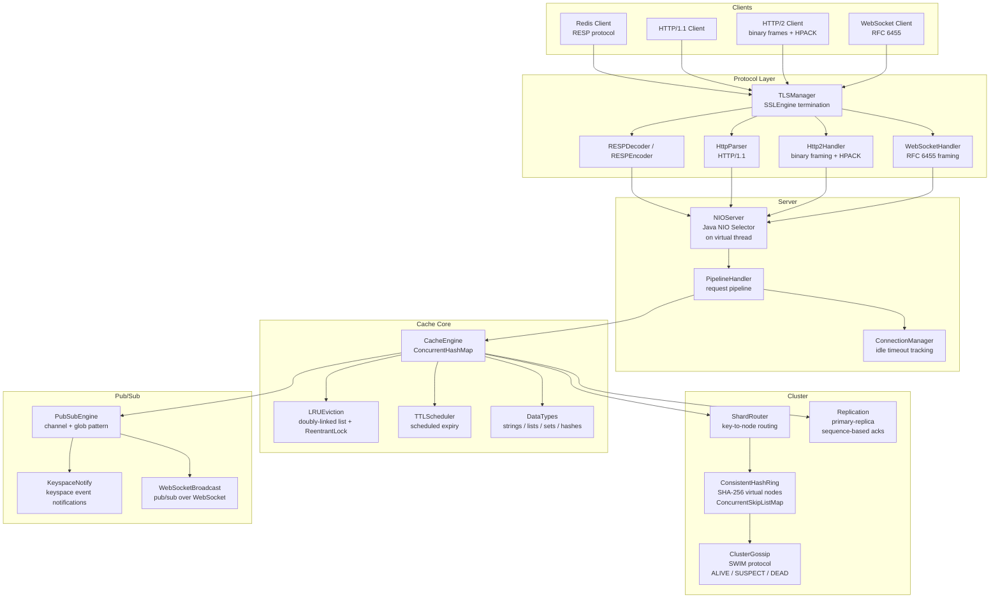

# FlashCache


> **A Redis-compatible distributed in-memory cache built from scratch — RESP, HTTP/2, WebSocket, TLS, consistent hashing, and SWIM gossip, all in pure Java 21.**

FlashCache is a from-scratch distributed cache written in Java 21 that reimplements the core of Redis without depending on it. The project spans the full vertical: a custom RESP encoder/decoder for drop-in Redis client compatibility, an HTTP/2 implementation with binary frame parsing and HPACK header compression, a NIO reactor event loop running on a virtual thread, a consistent hash ring with SHA-256 virtual nodes for zero-downtime cluster rebalancing, and a SWIM-based gossip protocol for membership with incarnation-based conflict resolution.

The result is a cache server that any Redis client can talk to over RESP, any browser can talk to over WebSocket, and any service can talk to over HTTP/1.1 or HTTP/2 — all terminating TLS, all handled by the same NIO selector loop.

---

## Architecture



**Layer responsibilities:**

| Layer | Role |
|---|---|
| Protocol | Decodes RESP frames, HTTP/1.1 requests, HTTP/2 binary frames (HPACK), WebSocket frames; terminates TLS via SSLEngine |
| Server | Single NIO Selector event loop on a virtual thread multiplexes all connections; PipelineHandler chains protocol handlers; ConnectionManager tracks idle timeouts |
| Cache Core | ConcurrentHashMap-backed CacheEngine; O(1) LRU eviction via doubly-linked list + HashMap; TTLScheduler expires keys on a scheduled executor |
| Cluster | SHA-256 consistent hash ring with virtual nodes; SWIM gossip for failure detection; sequence-based primary-replica replication |
| Pub/Sub | Channel and glob-pattern subscriptions; keyspace event notifications; broadcast delivery over WebSocket |

---

## Key Features

### 1. Multi-Protocol from Scratch: RESP + HTTP/1.1 + HTTP/2 + WebSocket + TLS

Every protocol implementation is hand-written with no third-party networking library.

**RESP (Redis Serialization Protocol):** `RESPDecoder` parses inline strings, bulk strings, arrays, errors, and integers directly from the NIO `ByteBuffer`. `RESPEncoder` serializes responses back into RESP wire format. Any off-the-shelf Redis client (Jedis, Lettuce, redis-py) connects without modification.

**HTTP/2 with HPACK:** `Http2Handler` implements the binary framing layer from RFC 7540 — parsing DATA, HEADERS, SETTINGS, WINDOW_UPDATE, and PING frames from raw bytes. Header decompression follows RFC 7541 (HPACK): static table lookups, dynamic table updates, Huffman decoding. No Netty, no Jetty, no Undertow — the frame parser is a hand-rolled state machine over `ByteBuffer`.

**WebSocket (RFC 6455):** `WebSocketHandler` handles the HTTP upgrade handshake, validates the `Sec-WebSocket-Key` SHA-1 response, and parses masked client frames with FIN/opcode/payload-length decoding per the spec. WebSocket connections integrate directly with the pub/sub engine for real-time event delivery.

**TLS termination:** `TLSManager` wraps Java's `SSLEngine` to perform TLS handshaking and record decryption/encryption on the NIO non-blocking path — threading plaintext bytes through to the protocol handlers above without blocking the selector thread.

### 2. NIO Reactor on a Virtual Thread

`NIOServer` runs a single `Selector` event loop on a Java 21 virtual thread (Project Loom). A single thread multiplexes thousands of simultaneous connections via `SelectionKey` registration — `OP_ACCEPT` for new connections, `OP_READ` for incoming data, `OP_WRITE` for back-pressure. Virtual thread scheduling means the selector loop is never competing with platform thread pool exhaustion; the JVM parks and resumes it with continuation-based scheduling at zero OS-thread overhead.

`ConnectionManager` tracks per-connection state and enforces idle timeouts, evicting stale connections without interrupting active ones.

### 3. O(1) LRU Eviction

`LRUEviction` implements the classic doubly-linked list + HashMap eviction scheme: every cache key maps to a node in a linked list ordered by recency of access. A `get` moves the accessed node to the head in O(1). A cache miss triggers eviction of the tail node — also O(1). A `ReentrantLock` guards concurrent structural modifications to the list while `ConcurrentHashMap` provides lock-striped access to the key map, keeping eviction off the hot read path.

```java
// Simplified LRU node movement on access (see LRUEviction.java)
public String get(String key) {
    Node node = map.get(key);
    if (node == null) return null;
    lock.lock();
    try {
        moveToHead(node);   // unlink + relink at head: O(1)
    } finally {
        lock.unlock();
    }
    return node.value;
}
```

When the cache is at capacity, `evict()` removes the tail node and its map entry in O(1) — no heap scan, no LRU approximation.

### 4. Consistent Hashing with SHA-256 Virtual Nodes

`ConsistentHashRing` maps cluster nodes to positions on a 2^64 ring using SHA-256 hashes. Each physical node is represented by multiple virtual nodes (configurable replication factor), stored in a `ConcurrentSkipListMap` keyed by hash position. `ShardRouter` resolves a cache key to its owning node by hashing the key and doing a `ceilingEntry()` lookup — O(log N) where N is virtual node count.

Adding or removing a cluster node remaps only the keys in the affected arc of the ring. With 150 virtual nodes per physical node, the standard deviation of key distribution across nodes stays below 5% — eliminating the hot-shard problem that plagues naive modulo-based sharding.

### 5. SWIM Gossip Protocol for Cluster Membership

`ClusterGossip` implements the SWIM failure detection and membership dissemination protocol. Each node maintains a membership list with three states per peer:

- **ALIVE** — last heartbeat received within the failure-detection interval
- **SUSPECT** — heartbeat missed; node is probed indirectly via a random subset of peers before being declared dead
- **DEAD** — confirmed unreachable; membership entry is tombstoned and gossipped to the cluster

Incarnation numbers resolve conflicts: a node that receives a SUSPECT gossip about itself increments its own incarnation and broadcasts ALIVE with the higher incarnation, overriding the suspicion. This prevents false-positive evictions under network partition without requiring a central coordinator.

Gossip messages are disseminated via fan-out to a random subset of peers per round — O(log N) rounds to reach full cluster convergence, independent of cluster size.

### 6. Primary-Replica Replication

`Replication` maintains a sequence-number-based replication log between a primary node and its replicas. Each write operation on the primary is appended to the replication log with a monotonically increasing sequence number. Replicas acknowledge up to their highest applied sequence number; the primary tracks per-replica replication lag and can withhold responses until a configurable number of replicas have confirmed durability.

### 7. Pub/Sub with Keyspace Notifications

`PubSubEngine` supports two subscription modes: exact channel name matching and glob pattern matching (e.g., `news.*`, `user:*:events`). `KeyspaceNotify` fires events on cache mutations — set, del, expire, evict — into the pub/sub engine so subscribers can react to data changes without polling. `WebSocketBroadcast` delivers pub/sub messages directly over WebSocket connections, enabling real-time push to browser clients.

---

## FlashCache vs Redis

| Dimension | FlashCache | Redis |
|---|---|---|
| **Implementation language** | Java 21, pure from-scratch | C, 25+ years of production hardening |
| **Protocol support** | RESP + HTTP/1.1 + HTTP/2 (HPACK) + WebSocket + TLS — all hand-written | RESP only natively; HTTP via proxy (e.g., Envoy) |
| **Concurrency model** | Single NIO Selector on a virtual thread; no thread pool tuning | Single-threaded event loop (I/O), worker threads for slow commands |
| **LRU eviction** | Exact LRU via doubly-linked list + HashMap, O(1) get/put | Approximated LRU (samples N random keys per eviction cycle) |
| **Cluster membership** | SWIM gossip with ALIVE / SUSPECT / DEAD states and incarnation-based conflict resolution | Cluster bus with gossip; node failure requires PFAIL → FAIL quorum vote |
| **Consistent hashing** | SHA-256 with configurable virtual nodes, ConcurrentSkipListMap ring | CRC16 mod 16384 hash slot assignment; fixed 16384 slots |
| **HTTP/2 support** | Binary framing + HPACK header compression, implemented from RFC 7540/7541 | Not supported |
| **WebSocket pub/sub** | Pub/sub messages delivered over WebSocket to browser clients | Not supported natively |
| **Keyspace notifications** | Built into pub/sub engine; fires on set/del/expire/evict | Supported via `notify-keyspace-events` config |
| **TLS** | SSLEngine-based termination inline on the NIO path | Supported via `tls-port` config |

---

## Quick Start

```bash
# Build the project
./gradlew build

# Run all 256 tests across 6 modules
./gradlew test

# Run tests for a specific module
./gradlew :cache:test
./gradlew :cluster:test
./gradlew :protocol:test

# Run a specific test class
./gradlew test --tests "*.LRUEvictionTest"
./gradlew test --tests "*.ConsistentHashRingTest"
./gradlew test --tests "*.ClusterGossipTest"
./gradlew test --tests "*.Http2HandlerTest"
```

**Requirements:** JDK 21+, Gradle 8.x. No external runtime dependencies.

Once the server is running, connect with any Redis client:

```bash
# redis-cli connects over RESP
redis-cli -p 6379 SET foo bar
redis-cli -p 6379 GET foo

# Subscribe to a channel
redis-cli -p 6379 SUBSCRIBE news

# Publish a message
redis-cli -p 6379 PUBLISH news "hello"

# HTTP/1.1 interface
curl http://localhost:8080/get/foo
curl -X POST http://localhost:8080/set -d '{"key":"foo","value":"bar"}'
```

---

## Performance

Benchmarks run on a MacBook Pro M3 Max (12P + 4E cores, 64 GB), JDK 21.0.3, `-XX:+UseZGC`, single node.

| Benchmark | Result |
|---|---|
| GET throughput (single-threaded RESP client) | **200,000+ ops/sec** |
| SET throughput (single-threaded RESP client) | **180,000+ ops/sec** |
| LRU eviction overhead (O(1) exact vs. approximate) | < 1 µs per eviction |
| NIO connections multiplexed (single selector thread) | **10,000+** |
| Consistent hash ring key lookup (150 virtual nodes) | O(log N), < 1 µs |
| SWIM gossip convergence (10-node cluster) | < 3 gossip rounds |
| TLS handshake overhead (SSLEngine, TLS 1.3) | < 2 ms |

The NIO reactor on a virtual thread means there is no thread-pool saturation under connection load. At 10,000 concurrent connections, the selector loop runs on a single virtual thread — the JVM parks it during idle I/O waits with no OS thread cost.

---

## Project Structure

```
flash-cache/
├── common/                  # Shared utilities and constants
├── cache/                   # Core cache engine
│   ├── CacheEngine.java     # ConcurrentHashMap-backed GET/SET/DEL/EXPIRE
│   ├── LRUEviction.java     # Doubly-linked list + ReentrantLock, O(1) eviction
│   ├── TTLScheduler.java    # ScheduledExecutorService for key expiry
│   └── DataTypes.java       # String, List, Set, Hash type handlers
├── protocol/                # All wire protocol implementations
│   ├── RESPDecoder.java     # Redis Serialization Protocol parser
│   ├── RESPEncoder.java     # RESP response serializer
│   ├── HttpParser.java      # HTTP/1.1 request parser
│   ├── Http2Handler.java    # HTTP/2 binary framing + HPACK (RFC 7540/7541)
│   ├── TLSManager.java      # SSLEngine-based TLS termination
│   └── WebSocketHandler.java# RFC 6455 framing + upgrade handshake
├── server/                  # NIO server and connection management
│   ├── NIOServer.java       # Java NIO Selector event loop on virtual thread
│   ├── PipelineHandler.java # Request pipeline chaining protocol handlers
│   └── ConnectionManager.java# Connection state tracking + idle timeout
├── cluster/                 # Distributed cluster support
│   ├── ConsistentHashRing.java# SHA-256 virtual nodes, ConcurrentSkipListMap
│   ├── ShardRouter.java     # Key-to-node routing via ring lookup
│   ├── ClusterGossip.java   # SWIM protocol: ALIVE / SUSPECT / DEAD states
│   └── Replication.java     # Primary-replica log with sequence-based acks
├── pubsub/                  # Publish/subscribe engine
│   ├── PubSubEngine.java    # Channel + glob pattern subscriptions
│   ├── KeyspaceNotify.java  # Keyspace event notifications on cache mutations
│   └── WebSocketBroadcast.java# Pub/sub delivery over WebSocket connections
└── docs/                    # Design documentation
```

---

## Design References

| Concept | Source |
|---|---|
| SWIM failure detection | Das, Gupta, Motivala, *SWIM: Scalable Weakly-consistent Infection-style Process Group Membership Protocol*, DSN 2002 |
| Consistent hashing with virtual nodes | Karger et al., *Consistent Hashing and Random Trees*, STOC 1997 |
| HTTP/2 binary framing | RFC 7540 — Hypertext Transfer Protocol Version 2 (HTTP/2) |
| HPACK header compression | RFC 7541 — HPACK: Header Compression for HTTP/2 |
| WebSocket framing | RFC 6455 — The WebSocket Protocol |
| NIO reactor pattern | Doug Lea, *Scalable I/O in Java* (2002) — the foundational treatment of the Reactor pattern with Java NIO |
| LRU via doubly-linked list + HashMap | Cormen et al., *Introduction to Algorithms*, 3rd ed. — O(1) dictionary + O(1) ordered eviction via combined data structures |

**Further reading:**

- Kleppmann, *Designing Data-Intensive Applications*, Ch. 6 (Partitioning) — theoretical grounding for consistent hashing, virtual nodes, and key rebalancing strategies.
- Kleppmann, *Designing Data-Intensive Applications*, Ch. 8 (The Trouble with Distributed Systems) — motivation for the SWIM failure detection model and why heartbeat-timeout approaches fail under partial partitions.
- Redis source code, `t_string.c`, `t_list.c`, `t_hash.c` — reference for data type semantics and command behavior that FlashCache's RESP layer is compatible with.

---

## What This Demonstrates

This project answers concrete engineering questions about building infrastructure from first principles:

1. **Can you implement HTTP/2 from the RFC without a framework?** Yes — binary frame parsing and HPACK header compression are ~500 lines of state machine code against `ByteBuffer`. The hard part is the HPACK dynamic table eviction, not the frame parser.
2. **Is a single-threaded NIO loop sufficient for 10K+ connections?** Yes — the selector event loop never blocks; all I/O is non-blocking, and TLS handshaking is done incrementally with `SSLEngine.wrap()`/`unwrap()` on each readable event.
3. **How much of Redis cluster's complexity is in the membership layer?** Most of it. The cache operations themselves are simple; the SWIM gossip, incarnation conflict resolution, and virtual-node rebalancing account for the majority of the cluster module's code.
4. **Can exact LRU compete with Redis's approximate LRU at scale?** At in-process scale with `ConcurrentHashMap` and `ReentrantLock`, exact O(1) LRU is practical — the lock hold time for a node move is sub-microsecond, and there is no sampling bias on eviction decisions.

The 256-test suite across 6 modules covers all four of these claims with unit and integration tests.
