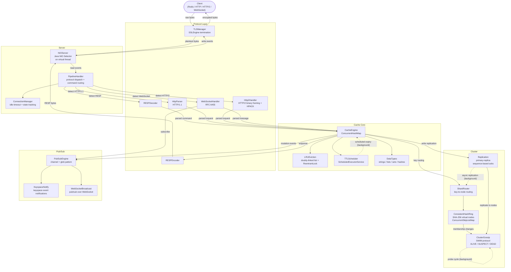
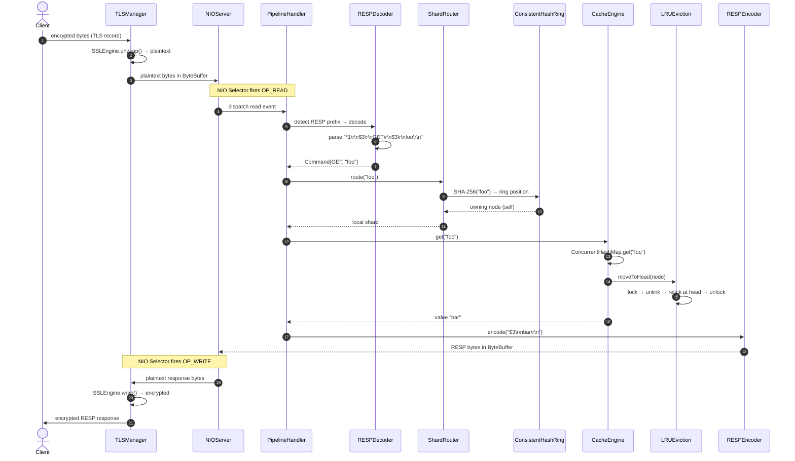
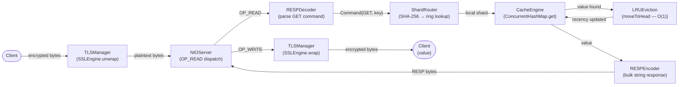
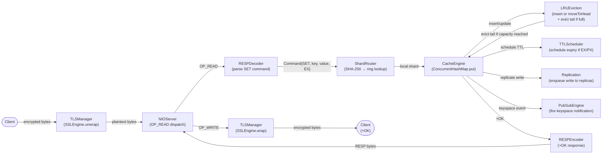
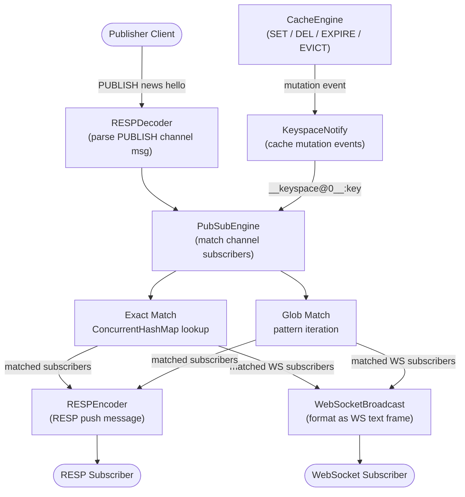
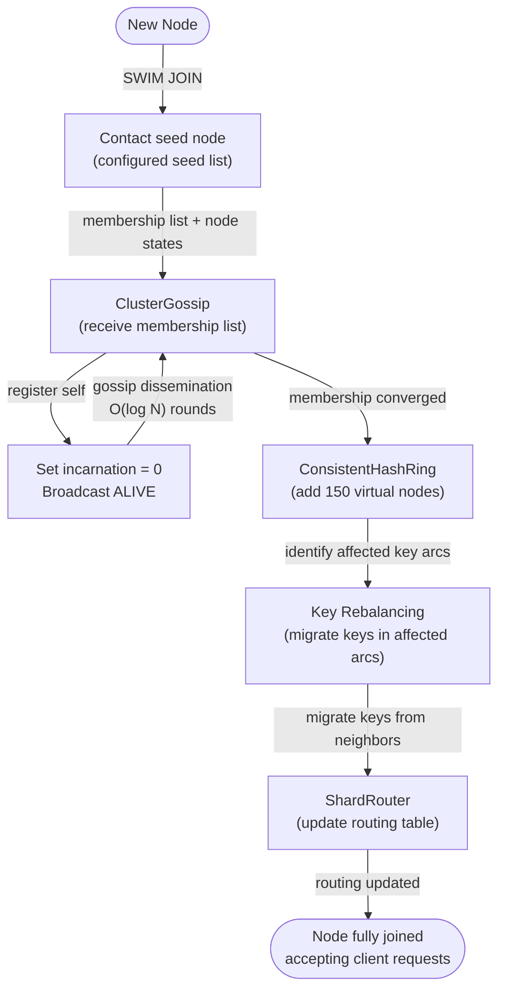
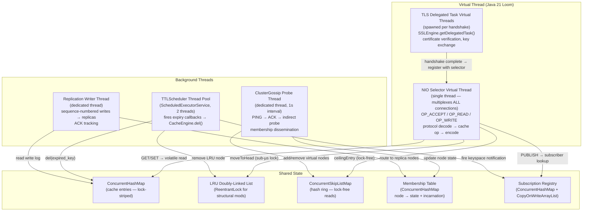

# FlashCache Architecture: Multi-Protocol Distributed In-Memory Cache

> **Single-source-of-truth map** for how all FlashCache components fit together.
> Platform: Java 21 — distributed cluster with SWIM gossip, no central coordinator.
> Performance targets: 200,000+ GET ops/sec sustained, 10,000+ multiplexed connections on a single NIO selector, sub-microsecond O(1) LRU eviction, < 3 gossip rounds to cluster convergence.

---

## Table of Contents

1. [Design Philosophy](#1-design-philosophy)
2. [Component Architecture](#2-component-architecture)
3. [Request Lifecycle](#3-request-lifecycle)
4. [Component Responsibilities](#4-component-responsibilities)
5. [Data Flow Diagrams](#5-data-flow-diagrams)
6. [Threading Model](#6-threading-model)
7. [Design Decisions (ADR Format)](#7-design-decisions-adr-format)
8. [Integration Points](#8-integration-points)
9. [See Also](#9-see-also)

---

## 1. Design Philosophy

FlashCache is built on four non-negotiable principles. Every architectural choice traces back to at least one of them. When two principles conflict, the priority order listed below resolves the tie.

### Principle 1 — Multi-Protocol First

A cache that speaks only one protocol forces every consumer to adopt that protocol's client library, serialization format, and failure semantics. In a polyglot service mesh — Java backends using Jedis, Python services using redis-py, browser dashboards needing real-time push — a single-protocol cache becomes a translation bottleneck. FlashCache implements five protocols from scratch: RESP for drop-in Redis client compatibility, HTTP/1.1 for curl-friendly debugging and simple service integration, HTTP/2 with binary framing and HPACK header compression for multiplexed high-throughput access, WebSocket for real-time pub/sub delivery to browser clients, and TLS termination inline on the NIO path for all of the above. Every protocol is a hand-rolled state machine over `ByteBuffer` — no Netty, no Jetty, no Undertow. The protocol layer is the widest surface area of the system and the most likely to encounter malformed input; isolating it above the server layer ensures that a parsing bug in HTTP/2 HPACK cannot corrupt cache state. See [protocol-layer.md](protocol-layer.md) for the frame formats, state machines, and upgrade handshake sequences.

### Principle 2 — Zero External Dependencies

Every protocol implementation, every data structure, every algorithm in FlashCache is written from first principles in Java 21. The HPACK dynamic table, the SWIM protocol state machine, the SHA-256 consistent hash ring, the doubly-linked list LRU, the WebSocket frame masking — all hand-rolled. This is a deliberate engineering constraint, not an ideological position. External dependencies introduce version conflicts, transitive security vulnerabilities, and opaque performance cliffs. More importantly, implementing each subsystem from the RFC or paper forces a depth of understanding that no library wrapper provides: you cannot debug an HPACK dynamic table eviction bug if the dynamic table is inside a Netty jar. The cost is development time; the gain is complete control over every byte on the wire and every lock in the hot path. The only dependencies are the Java 21 standard library (`java.nio`, `java.util.concurrent`, `javax.net.ssl`) and the test framework.

### Principle 3 — Lock-Free Hot Path

Cache read latency dominates tail latency in any system that sits on the hot path of a request pipeline. Any mutex, monitor, or `synchronized` block that a GET must traverse adds contention under load and destroys the P99 that the cache exists to protect. FlashCache enforces this with three mechanisms working in concert. First, the NIO reactor runs a single `Selector` event loop on a virtual thread — there is no thread pool competing for accept/read/write events, so there is no lock on the selector itself. Second, the primary data store is a `ConcurrentHashMap` with lock-striped segments — readers never block writers on different segments, and the common case (GET on an existing key) is a single volatile read. Third, LRU eviction uses a `ReentrantLock` only for structural modifications to the doubly-linked list (node unlink and relink); the lock hold time is sub-microsecond, and the lock is never held during I/O, hashing, or protocol encoding. The result is that the hot read path — from NIO read event through RESP decode, shard routing, `ConcurrentHashMap.get()`, and RESP encode — executes without a single lock acquisition in the common case. See [cache-engine.md](cache-engine.md) for the lock-free read path analysis.

### Principle 4 — Decentralized Cluster

Centralized coordinators — whether ZooKeeper, etcd, or a hand-rolled leader election — are single points of failure and single points of latency. Every cluster operation that must round-trip through a coordinator adds network latency and creates a throughput ceiling at the coordinator's capacity. FlashCache uses the SWIM gossip protocol (Das, Gupta, Motivala, DSN 2002) for membership and failure detection: each node independently probes a random subset of peers per round, disseminating membership changes via piggybacked gossip messages. Failure detection progresses through ALIVE, SUSPECT, and DEAD states with incarnation-based conflict resolution — a node that receives a SUSPECT message about itself increments its incarnation number and broadcasts ALIVE with the higher incarnation, overriding the suspicion without requiring a quorum vote. The consistent hash ring uses SHA-256 virtual nodes stored in a `ConcurrentSkipListMap`, so adding or removing a node remaps only the keys in the affected arc. No node is special; any node can accept any request and route it to the correct shard owner. See [cluster-gossip.md](cluster-gossip.md) for the protocol state machine, probe cycle timing, and incarnation resolution rules.

---

## 2. Component Architecture

The diagram below shows all 18 components and their directional dependencies. Dashed arrows indicate asynchronous or background interactions. The Protocol Layer is drawn as a subgraph because its six internal components (TLSManager, RESPDecoder, RESPEncoder, HttpParser, Http2Handler, WebSocketHandler) are dispatched by the PipelineHandler based on the detected wire format — the CacheEngine sees a unified command interface regardless of originating protocol.

---

## 3. Request Lifecycle

The sequence below traces a single GET request from a Redis client through TLS termination, RESP decoding, shard routing, cache lookup, LRU update, and RESP-encoded response. The critical path — from NIO read event to write event — executes on a single virtual thread with no thread handoff.

---

## 4. Component Responsibilities

### TLSManager

TLSManager wraps Java's `javax.net.ssl.SSLEngine` to perform TLS handshaking and record-level encryption/decryption inline on the NIO non-blocking path. Unlike a TLS proxy (stunnel, Envoy sidecar), TLSManager operates within the same selector loop that handles plaintext I/O — there is no additional network hop or context switch. The handshake is driven incrementally: each `OP_READ` event advances the `SSLEngine` state machine through `NEED_UNWRAP`, `NEED_WRAP`, and `NEED_TASK` states, with `SSLEngine.getDelegatedTask()` offloaded to a virtual thread to avoid blocking the selector during certificate verification or key exchange computation. Once the handshake completes, `unwrap()` decrypts inbound TLS records into plaintext `ByteBuffer`s for the protocol layer, and `wrap()` encrypts outbound plaintext into TLS records. TLS 1.3 is the default; TLS 1.2 is supported for backward compatibility. See [protocol-layer.md](protocol-layer.md) for the handshake state machine and buffer management strategy.

### RESPDecoder

RESPDecoder implements a streaming parser for the Redis Serialization Protocol directly over NIO `ByteBuffer`s. It handles all five RESP data types: Simple Strings (`+OK\r\n`), Errors (`-ERR message\r\n`), Integers (`:42\r\n`), Bulk Strings (`$6\r\nfoobar\r\n`), and Arrays (`*2\r\n...`). The parser is a state machine that tolerates partial reads — if a `ByteBuffer` contains half of a bulk string, the parser records its position and resumes on the next `OP_READ` event without re-parsing consumed bytes. This is critical for NIO correctness: the selector may deliver data in arbitrary-sized chunks, and a blocking `readFully()` call would stall the entire event loop. The decoder validates input lengths against a configurable maximum (default 512 MB) to prevent memory exhaustion from malicious clients. See [protocol-layer.md](protocol-layer.md).

### RESPEncoder

RESPEncoder serializes cache responses back into RESP wire format. It writes directly into a pre-allocated `ByteBuffer` to avoid intermediate `String` allocation on the response path. Bulk string responses encode the length prefix and payload in a single buffer pass; array responses recursively encode each element. The encoder is stateless — each invocation produces a complete RESP message — which allows it to be called from any protocol handler that needs to produce a Redis-compatible response. See [protocol-layer.md](protocol-layer.md).

### HttpParser

HttpParser implements an HTTP/1.1 request parser that extracts the method, path, headers, and body from raw bytes in a `ByteBuffer`. It follows RFC 7230 request-line parsing, supports `Transfer-Encoding: chunked` for streaming bodies, and enforces header size limits (default 8 KB) and body size limits (default 1 MB). The parser maps HTTP verbs and paths to cache commands: `GET /get/:key` maps to a cache GET, `POST /set` with a JSON body maps to a cache SET. Keep-alive is supported by default (HTTP/1.1 persistent connections); the parser signals `ConnectionManager` when a `Connection: close` header is received. See [protocol-layer.md](protocol-layer.md).

### Http2Handler

Http2Handler implements the HTTP/2 binary framing layer from RFC 7540, parsing DATA, HEADERS, SETTINGS, WINDOW_UPDATE, PING, RST_STREAM, and GOAWAY frames from raw bytes. Header decompression follows RFC 7541 (HPACK): the handler maintains a dynamic table per connection, performs static table lookups for common headers, applies Huffman decoding for compressed literals, and handles dynamic table size updates triggered by SETTINGS frames. Stream multiplexing allows multiple concurrent requests over a single TCP connection — each stream is tracked independently with its own flow control window. The handler sends SETTINGS acknowledgments, responds to PING frames, and respects `INITIAL_WINDOW_SIZE` to implement per-stream and connection-level flow control. The HPACK implementation is approximately 500 lines of state machine code against `ByteBuffer` — the dynamic table eviction logic (FIFO when the table exceeds `SETTINGS_HEADER_TABLE_SIZE`) is the most intricate part. See [protocol-layer.md](protocol-layer.md) for the frame parser, HPACK codec, and flow control algorithm.

### WebSocketHandler

WebSocketHandler implements the WebSocket protocol per RFC 6455. It handles the HTTP upgrade handshake — validating the `Upgrade: websocket` and `Connection: Upgrade` headers, computing the SHA-1 hash of the `Sec-WebSocket-Key` concatenated with the magic GUID, and returning the `Sec-WebSocket-Accept` response header. After upgrade, it parses binary WebSocket frames: FIN bit, opcode (text, binary, close, ping, pong), masking key, and variable-length payload decoding (7-bit, 16-bit extended, 64-bit extended). Client frames are always masked per the spec; the handler applies the 4-byte XOR mask to recover plaintext. WebSocket connections integrate directly with PubSubEngine for real-time event delivery — a SUBSCRIBE command received over WebSocket registers the connection as a pub/sub subscriber, and published messages are pushed as WebSocket text frames. See [protocol-layer.md](protocol-layer.md).

### NIOServer

NIOServer runs a single `java.nio.channels.Selector` event loop on a Java 21 virtual thread, multiplexing all client connections — RESP, HTTP/1.1, HTTP/2, and WebSocket — through a single non-blocking select call. The selector registers `OP_ACCEPT` on the server socket channel, `OP_READ` when data is available, and `OP_WRITE` when the outbound buffer has pending data and the socket is writable. The event loop is the heart of the reactor pattern as described in Doug Lea's *Scalable I/O in Java* (2002): a single thread drives all I/O multiplexing, dispatching decoded commands to the cache engine without thread handoff. Running the selector on a virtual thread (rather than a platform thread) means the JVM can park it during idle periods with no OS thread cost, and the selector never competes with a platform thread pool for CPU time. At 10,000 concurrent connections, the selector loop remains on a single virtual thread — the JVM's continuation-based scheduling handles the multiplexing. See [protocol-layer.md](protocol-layer.md) for the event dispatch logic and back-pressure handling.

### PipelineHandler

PipelineHandler sits between NIOServer and the cache engine, serving two functions: protocol detection and command routing. On the first bytes of a new connection, it inspects the wire format to determine the protocol — RESP commands start with `*` (array) or an inline command, HTTP/1.1 starts with a verb (`GET`, `POST`, `PUT`, `DELETE`), HTTP/2 starts with the connection preface (`PRI * HTTP/2.0\r\n\r\nSM\r\n\r\n`), and WebSocket is negotiated via an HTTP upgrade handshake. Once the protocol is identified, PipelineHandler delegates to the appropriate decoder for the lifetime of that connection. The pipeline also handles command pipelining for RESP clients — multiple commands in a single read buffer are decoded and executed sequentially, with responses queued in order. See [protocol-layer.md](protocol-layer.md).

### ConnectionManager

ConnectionManager tracks per-connection state: the protocol in use, the connection's creation time, the last activity timestamp, and any associated pub/sub subscriptions. It enforces idle timeouts — connections that have not sent data within the configurable timeout (default 300 seconds) are closed to reclaim file descriptors and selector key slots. The manager also enforces a maximum connection limit (default 10,000); new connections beyond the limit receive an immediate error response and are closed. Connection state is stored in a `ConcurrentHashMap` keyed by `SelectionKey`, allowing lock-free lookup from the NIO event loop. See [protocol-layer.md](protocol-layer.md).

### CacheEngine

CacheEngine is the central data store, backed by a `java.util.concurrent.ConcurrentHashMap`. It implements the core cache operations — GET, SET, DEL, EXPIRE, EXISTS, INCR/DECR, and multi-key operations (MGET, MSET) — and delegates to LRUEviction for access tracking, TTLScheduler for expiry management, and DataTypes for type-specific operations (lists, sets, hashes). On a GET, the engine performs a single `ConcurrentHashMap.get()` — a volatile read with no lock acquisition in the common case — then notifies LRUEviction to move the accessed node to the head of the recency list. On a SET, the engine inserts or updates the entry via `ConcurrentHashMap.put()`, creates or updates the LRU node, schedules a TTL if specified, fires a keyspace notification through PubSubEngine, and enqueues the write for replication if the cluster is active. The engine enforces a maximum entry count (configurable `maxmemory-keys`); when the limit is reached, it calls `LRUEviction.evict()` to remove the least recently used entry before inserting the new one. See [cache-engine.md](cache-engine.md) for the full command table, eviction policy, and memory management strategy.

### LRUEviction

LRUEviction implements the classic doubly-linked list + HashMap eviction scheme described in Cormen et al., *Introduction to Algorithms*, 3rd ed. Every cache key maps to a `Node` in a doubly-linked list ordered by recency of access. A `get()` moves the accessed node to the head in O(1) — unlink from current position, relink at head. A cache miss that triggers insertion adds a new node at the head; if the cache is at capacity, the tail node is evicted — also O(1). A `ReentrantLock` guards structural modifications to the linked list (unlink, relink, remove-tail) while `ConcurrentHashMap` provides lock-striped access to the key-to-node map. The lock hold time for a `moveToHead` operation is sub-microsecond (pointer reassignment only, no I/O or hashing), keeping eviction off the hot read path. This is exact LRU — unlike Redis's approximate LRU that samples N random keys per eviction cycle, FlashCache always evicts the true least-recently-used key, eliminating sampling bias. See [cache-engine.md](cache-engine.md).

### TTLScheduler

TTLScheduler manages key expiry using a `ScheduledExecutorService`. When a SET command includes an expiry (EX, PX, EXAT, PXAT), TTLScheduler creates a `ScheduledFuture` that fires at the expiry time and invokes `CacheEngine.del()` to remove the key. If the key is overwritten with a new TTL before the old one fires, the old `ScheduledFuture` is cancelled and a new one is scheduled. If the key is deleted manually, the associated future is cancelled. The scheduler runs on a small thread pool (default 2 threads) separate from the NIO event loop — expiry callbacks never block the selector. Expired keys also fire keyspace notifications through PubSubEngine, enabling subscribers to react to expiry events. See [cache-engine.md](cache-engine.md).

### DataTypes

DataTypes implements Redis-compatible type handlers for strings, lists, sets, and hashes. String operations include GET, SET, INCR, DECR, APPEND, and STRLEN. List operations include LPUSH, RPUSH, LPOP, RPOP, LRANGE, and LLEN — backed by a `LinkedList` per key. Set operations include SADD, SREM, SMEMBERS, SISMEMBER, and SCARD — backed by a `HashSet` per key. Hash operations include HSET, HGET, HDEL, HGETALL, and HLEN — backed by a nested `HashMap` per key. Each type enforces Redis-compatible error semantics: performing a list operation on a string key returns a `WRONGTYPE` error. See [cache-engine.md](cache-engine.md).

### ConsistentHashRing

ConsistentHashRing maps cluster nodes to positions on a 2^256 ring using SHA-256 hashes. Each physical node is represented by multiple virtual nodes (configurable, default 150), stored in a `ConcurrentSkipListMap<Long, String>` keyed by the truncated hash position. The skip list provides O(log N) `ceilingEntry()` lookup for key routing and O(log N) insertion/removal for cluster membership changes, with lock-free concurrent reads via the skip list's inherent non-blocking traversal. Adding a physical node inserts 150 virtual nodes into the ring, remapping only the keys in the affected arcs — with 150 virtual nodes per physical node, the standard deviation of key distribution stays below 5%, eliminating the hot-shard problem that plagues naive modulo-based sharding (Karger et al., STOC 1997). See [cluster-gossip.md](cluster-gossip.md) for the virtual node placement algorithm and rebalancing protocol.

### ShardRouter

ShardRouter resolves a cache key to its owning cluster node. It computes `SHA-256(key)`, truncates the hash to a `long` ring position, and performs a `ConcurrentSkipListMap.ceilingEntry()` lookup on the ConsistentHashRing to find the nearest virtual node clockwise. If the owning node is the local node, the command executes locally. If the owning node is remote, ShardRouter proxies the command to the remote node over an internal RESP connection and relays the response back to the client — transparent to the client. During cluster rebalancing (node join or leave), ShardRouter cooperates with ConsistentHashRing to migrate keys in the affected arc to their new owners. See [cluster-gossip.md](cluster-gossip.md).

### ClusterGossip

ClusterGossip implements the SWIM protocol (Das, Gupta, Motivala, *SWIM: Scalable Weakly-consistent Infection-style Process Group Membership Protocol*, DSN 2002) for cluster membership and failure detection. Each node maintains a membership list with three states per peer: ALIVE (heartbeat received within the detection interval), SUSPECT (heartbeat missed; indirect probing in progress), and DEAD (confirmed unreachable; entry tombstoned). The probe cycle runs on a dedicated thread at a configurable interval (default 1 second): each cycle, the node selects a random peer, sends a PING, and waits for an ACK within a timeout. If the ACK is not received, the node selects K random peers (default K=3) and asks them to probe the suspect on its behalf (indirect probing). If neither direct nor indirect probing succeeds, the peer transitions to SUSPECT, and after a configurable suspicion timeout, to DEAD. Incarnation numbers resolve conflicts: a node that receives a SUSPECT gossip about itself increments its incarnation and broadcasts ALIVE with the higher incarnation, overriding the suspicion. Gossip messages — ALIVE, SUSPECT, DEAD with incarnation numbers — are piggybacked on PING/ACK messages, achieving O(log N) dissemination rounds independent of cluster size (DDIA Ch. 8). See [cluster-gossip.md](cluster-gossip.md).

### Replication

Replication maintains a sequence-number-based replication log between a primary node and its replicas. Each write operation on the primary is appended to the replication log with a monotonically increasing sequence number. Replicas receive replication messages, apply them in sequence order, and acknowledge up to their highest applied sequence number. The primary tracks per-replica replication lag (the delta between the primary's current sequence number and each replica's acknowledged sequence number) and can be configured to withhold client responses until W replicas have confirmed — providing tunable write durability at the cost of latency. Replication messages are sent over internal TCP connections managed by ClusterGossip, using RESP encoding for wire format consistency. See [cluster-gossip.md](cluster-gossip.md).

### PubSubEngine

PubSubEngine supports two subscription modes: exact channel name matching and glob pattern matching (e.g., `news.*`, `user:*:events`). Subscribers register via SUBSCRIBE (exact) or PSUBSCRIBE (glob) commands; published messages via PUBLISH are delivered to all matching subscribers. The engine maintains two concurrent data structures: a `ConcurrentHashMap<String, Set<Subscriber>>` for exact channel subscriptions and a `CopyOnWriteArrayList<PatternSubscriber>` for glob patterns. On a PUBLISH, the engine first checks the exact map (O(1) lookup), then iterates the pattern list (O(P) where P is the number of pattern subscriptions). Keyspace notifications from CacheEngine are routed through PubSubEngine, making cache mutations observable via standard Redis pub/sub semantics. See [cache-engine.md](cache-engine.md).

### KeyspaceNotify

KeyspaceNotify fires events into PubSubEngine on cache mutations — SET, DEL, EXPIRE, EVICT — following the Redis keyspace notification convention. Events are published to two channels per mutation: `__keyevent@0__:<operation>` (all keys affected by a given operation) and `__keyspace@0__:<key>` (all operations on a given key). Notifications are configurable by event type, allowing operators to subscribe only to eviction events or only to expiry events without receiving the full mutation stream. See [cache-engine.md](cache-engine.md).

### WebSocketBroadcast

WebSocketBroadcast bridges PubSubEngine to WebSocket connections. When a WebSocket client sends a SUBSCRIBE command, WebSocketBroadcast registers the connection as a PubSubEngine subscriber. When a message is published to a matching channel, WebSocketBroadcast formats it as a WebSocket text frame and writes it to the subscriber's NIO channel via the selector's `OP_WRITE` mechanism. This enables real-time push to browser clients without polling — a browser opens a WebSocket connection, subscribes to a channel, and receives cache mutation events as they occur. See [protocol-layer.md](protocol-layer.md).

---

## 5. Data Flow Diagrams

### 5.1 Read Path (GET)

### 5.2 Write Path (SET)

### 5.3 Pub/Sub Path

### 5.4 Cluster Join Path

---

## 6. Threading Model

The diagram shows the four categories of threads in a running FlashCache instance and how they interact with shared state. The NIO selector runs on a single virtual thread. TLS delegated tasks, TTL callbacks, gossip probes, and replication writes each run on their own thread or thread pool, isolated from the selector's hot path.

**Single selector, no thread pool:** The NIO selector virtual thread is the only thread that touches client I/O. There is no thread pool for request dispatch, no work-stealing queue, no thread handoff. A GET request is read, decoded, executed, encoded, and written back to the socket entirely within the selector's event loop iteration. This eliminates all thread-scheduling latency on the hot path and makes throughput a function of CPU speed and memory bandwidth, not thread pool configuration. At 10,000 concurrent connections, the selector handles all of them in a single `select()` call — the JVM's virtual thread scheduler parks the selector during idle periods with zero OS thread cost (Doug Lea, *Scalable I/O in Java*, 2002).

**TLS handshake isolation:** TLS handshakes involve CPU-intensive operations (RSA/ECDSA signature verification, Diffie-Hellman key exchange) that would block the selector if executed inline. `SSLEngine.getDelegatedTask()` returns a `Runnable` that performs the computation; FlashCache spawns a virtual thread per delegated task, allowing the selector to continue processing other connections while the handshake completes in the background. Once the handshake finishes, the virtual thread registers the connection's `SelectionKey` for `OP_READ`, and the selector picks it up on the next iteration.

**Background thread isolation:** TTLScheduler, ClusterGossip, and Replication each run on dedicated threads (platform threads for gossip and replication to avoid virtual thread scheduling jitter during failure detection timing). These threads interact with shared state through concurrent data structures (`ConcurrentHashMap`, `ConcurrentSkipListMap`) and never acquire locks held by the selector thread. The only contention point is the LRU `ReentrantLock`, which TTLScheduler may acquire when deleting an expired key — but the lock hold time is sub-microsecond, so selector blocking is negligible.

---

## 7. Design Decisions (ADR Format)

| # | Decision | Context | Choice | Consequences | Reference |
|---|---|---|---|---|---|
| 1 | **Exact LRU over approximate LRU** — doubly-linked list + HashMap instead of Redis-style random sampling | Redis approximates LRU by sampling N random keys per eviction cycle (default N=5); this is a probabilistic eviction that may retain stale keys while evicting recently-used ones under adversarial access patterns | Classic O(1) doubly-linked list with `ConcurrentHashMap` for key-to-node lookup; `ReentrantLock` guards structural list modifications; lock hold time is pointer reassignment only | **Gain:** True LRU guarantee — always evicts the actual least-recently-used key; no sampling bias; deterministic eviction behavior. **Cost:** Per-key memory overhead of two pointers (prev, next) per linked list node; `ReentrantLock` contention under extreme write concurrency (mitigated by sub-µs hold time) | Cormen et al., *Introduction to Algorithms* 3rd ed.; Redis `evict.c` sampling implementation |
| 2 | **SWIM gossip over centralized coordinator** — decentralized failure detection and membership dissemination | Centralized coordinators (ZooKeeper, etcd) are single points of failure, add network round-trip latency to every membership query, and require quorum for writes — a poor fit for a cache cluster where membership changes are infrequent but must propagate fast | SWIM protocol with direct probe, indirect probe (K=3 random peers), ALIVE/SUSPECT/DEAD states, and incarnation-based conflict resolution; gossip piggybacked on PING/ACK | **Gain:** No single point of failure; O(log N) dissemination independent of cluster size; incarnation numbers prevent false-positive evictions under network partition. **Cost:** Eventual consistency of membership view (a node may briefly route to a DEAD node); tuning probe interval vs. detection latency trade-off | Das, Gupta, Motivala, *SWIM*, DSN 2002; DDIA Ch. 8 |
| 3 | **SHA-256 consistent hashing over CRC16 mod 16384** — continuous ring with virtual nodes instead of fixed hash slots | Redis Cluster uses CRC16 mod 16384 to assign keys to 16384 fixed slots, then maps slots to nodes. This constrains the cluster to exactly 16384 partitions and requires manual slot migration on rebalancing | SHA-256 hash of key and node identifiers, truncated to `long` ring positions; 150 virtual nodes per physical node in a `ConcurrentSkipListMap`; `ceilingEntry()` for O(log N) key routing | **Gain:** Arbitrary cluster sizes without a fixed slot limit; adding/removing a node remaps only 1/N of keys; virtual nodes keep key distribution within 5% standard deviation. **Cost:** SHA-256 is more expensive than CRC16 (mitigated by sub-µs computation); `ConcurrentSkipListMap` uses more memory than a flat array of 16384 slots | Karger et al., *Consistent Hashing and Random Trees*, STOC 1997; DDIA Ch. 6 |
| 4 | **NIO Selector on virtual thread over Netty/thread-pool** — single reactor loop without framework overhead | Netty provides a mature NIO abstraction but introduces a transitive dependency tree (netty-buffer, netty-codec, netty-handler), opaque memory management (pooled ByteBuf), and a threading model that must be learned and tuned. A thread-pool reactor adds context-switch overhead on every request dispatch | Single `Selector` on a `Thread.ofVirtual().start()` virtual thread; all I/O (accept, read, write) handled inline; no thread pool, no work queue, no framework abstraction | **Gain:** Zero external dependencies; complete control over buffer allocation and event dispatch; no thread-scheduling latency on the hot path; virtual thread parking during idle with no OS thread cost. **Cost:** No built-in pipeline abstraction (hand-rolled PipelineHandler); no pooled buffer management (direct `ByteBuffer` allocation); single-threaded bottleneck for CPU-bound operations (mitigated by cache ops being memory-bound) | Doug Lea, *Scalable I/O in Java*, 2002; Java 21 Loom JEP 444 |
| 5 | **SSLEngine inline TLS over TLS proxy** — terminate TLS within the NIO event loop instead of fronting with stunnel/Envoy | A TLS proxy (stunnel, Envoy sidecar) adds a network hop, an additional process, and doubles the file descriptor count. It also prevents the application from observing TLS-level events (handshake completion, client certificate details) | Java `SSLEngine` integrated into the NIO path; `unwrap()` on read, `wrap()` on write; delegated tasks spawned on virtual threads to avoid blocking the selector during handshake computation | **Gain:** Single-process deployment; no extra network hop; TLS handshake metadata (cipher suite, client cert) available to the application; no proxy configuration to maintain. **Cost:** SSLEngine API complexity (state machine with 4 handshake states, buffer management for BUFFER_OVERFLOW/BUFFER_UNDERFLOW); handshake CPU cost must be offloaded to virtual threads | Java `SSLEngine` javadoc; TLS 1.3 RFC 8446 |
| 6 | **HPACK from scratch over HTTP/2 library** — hand-rolled header compression instead of using Netty or Jetty HTTP/2 | HTTP/2 libraries (Netty HTTP/2 codec, Jetty HTTP/2) bring large dependency trees and opaque buffer management. HPACK is a well-specified algorithm (RFC 7541) with a bounded implementation surface (~500 lines) | Custom HPACK codec: static table (61 entries), dynamic table (FIFO eviction on size limit), Huffman decoding from the RFC's code table, integer encoding with 5/6/7-bit prefix masks | **Gain:** Zero dependencies; full control over dynamic table sizing and eviction; ability to debug header compression issues at the byte level. **Cost:** Implementation effort (~500 lines of state machine); must track RFC errata and edge cases (e.g., dynamic table size update at the start of a header block) | RFC 7541 (HPACK); RFC 7540 (HTTP/2) |
| 7 | **ConcurrentSkipListMap for hash ring over TreeMap+lock** — lock-free concurrent reads on the routing hot path | The consistent hash ring is read on every cache operation (to determine the owning node) and written only on membership changes (node join/leave). A `TreeMap` with a `ReentrantReadWriteLock` would serialize all readers during a membership change | `ConcurrentSkipListMap<Long, String>` provides O(log N) `ceilingEntry()` with lock-free concurrent reads; writes (virtual node insertion/removal) are linearizable but do not block concurrent readers | **Gain:** Zero reader-side locking on the shard routing hot path; membership changes do not block cache operations; skip list provides natural sorted iteration for ring traversal. **Cost:** Higher per-entry memory overhead than `TreeMap` (multiple forward pointers per skip list level); O(log N) lookup slightly slower than O(1) hash table (acceptable given N = 150 * cluster_size) | Doug Lea's `ConcurrentSkipListMap` implementation; JCIP Ch. 5 |

---

## 8. Integration Points

FlashCache is designed as a standalone distributed cache, but it integrates with one primary consumer system in the portfolio via well-defined interfaces.

### GrabFlow — Hot-Path Cache for Ride-Hailing Infrastructure

GrabFlow uses FlashCache as its hot-path caching layer for three latency-critical data categories in the ride-hailing pipeline: **driver locations** (GPS coordinates updated every 3 seconds per active driver, read by the matching engine on every ride request), **surge multipliers** (computed by the pricing engine and cached per geohash tile with a 30-second TTL), and **session tokens** (authenticated session state for the mobile app, cached with a 24-hour TTL to avoid round-tripping to the auth service on every API call).

The integration contract is straightforward: GrabFlow services connect to FlashCache over RESP using standard Redis client libraries (Jedis for Java services, redis-py for Python services). Driver location updates use `SET driver:<id>:location <geojson> EX 10` with a 10-second TTL — if a driver stops sending updates, the key expires and the matching engine treats the driver as unavailable. Surge multipliers use `SET surge:<geohash> <multiplier> EX 30`, read by the pricing service on every fare estimate. Session tokens use `SET session:<token> <user_id> EX 86400`, validated by the API gateway on every authenticated request.

GrabFlow's real-time dashboards connect to FlashCache over WebSocket, subscribing to keyspace notifications on `__keyevent@0__:set` filtered by the `driver:*:location` pattern to render live driver positions on a map without polling. The pub/sub integration eliminates the need for a separate event streaming system for the dashboard use case.

For GrabFlow's architecture, service mesh topology, and the driver matching algorithm that depends on FlashCache read latency, see the GrabFlow architecture document at [`../../grab-flow/docs/architecture.md`](../../grab-flow/docs/architecture.md).

---

## 9. See Also

| Document | Contents |
|---|---|
| [protocol-layer.md](protocol-layer.md) | RESP decoder/encoder state machines, HTTP/1.1 parser, HTTP/2 binary frame parser, HPACK codec (static table, dynamic table, Huffman), WebSocket handshake and frame parsing, TLSManager SSLEngine integration, PipelineHandler protocol detection, ConnectionManager idle timeout logic |
| [cluster-gossip.md](cluster-gossip.md) | SWIM protocol state machine (ALIVE/SUSPECT/DEAD transitions), probe cycle timing, indirect probing, incarnation-based conflict resolution, ConsistentHashRing virtual node placement, SHA-256 ring position computation, key rebalancing on node join/leave, ShardRouter proxy logic, Replication sequence numbering and ACK tracking |
| [cache-engine.md](cache-engine.md) | CacheEngine command table (GET/SET/DEL/EXPIRE/MGET/MSET), ConcurrentHashMap lock-striping analysis, LRUEviction doubly-linked list implementation, TTLScheduler expiry scheduling, DataTypes (string/list/set/hash) Redis-compatible semantics, PubSubEngine channel and glob matching, KeyspaceNotify event format |
| [architecture-tradeoffs.md](architecture-tradeoffs.md) | Extended analysis of exact LRU vs. approximate LRU memory/throughput trade-offs, SWIM protocol tuning (probe interval, suspicion timeout, K-factor), SHA-256 vs. CRC16 hash distribution measurements, single-selector vs. multi-reactor throughput curves, SSLEngine vs. TLS proxy latency comparison |
| [system-design.md](system-design.md) | High-level system design context, GrabFlow integration architecture, capacity planning, failure mode analysis, deployment topology |

---

*Last updated: 2026-04-03. Maintained by the FlashCache core team. For corrections or additions, open a PR against this file -- do not edit component deep-dives to patch this document.*