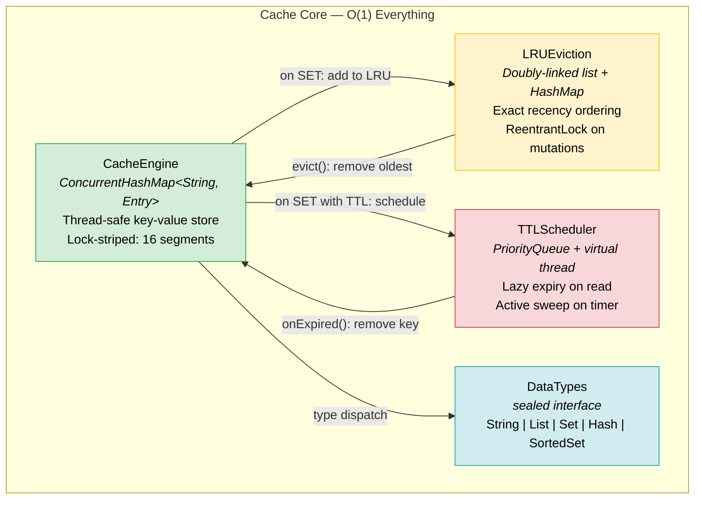
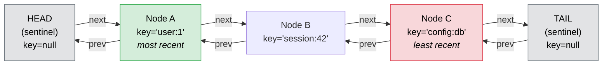
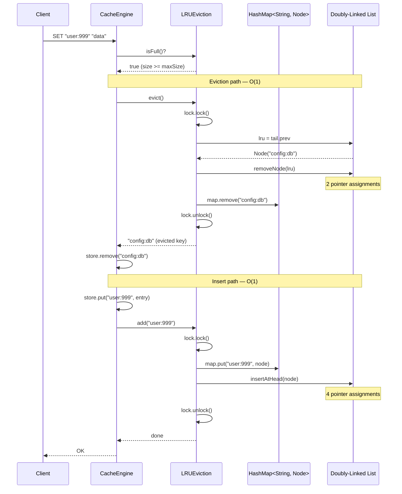
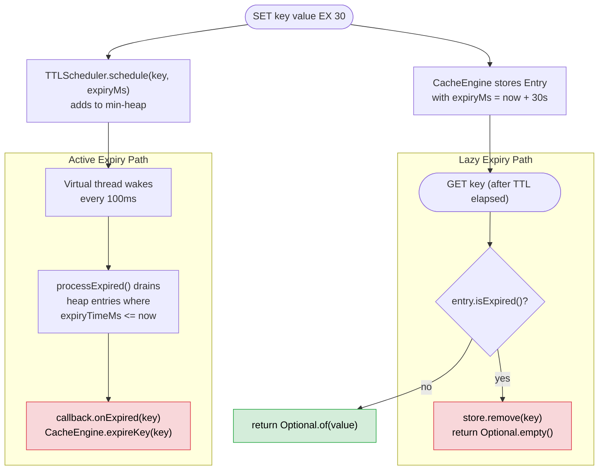
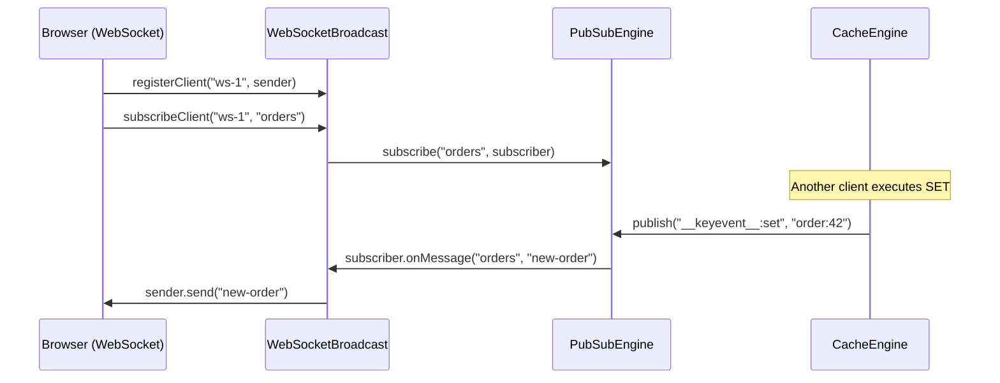

# FlashCache Cache Engine: O(1) Everything

> **The core data plane.** This document specifies FlashCache's cache engine internals — the mechanism responsible for O(1) reads, O(1) writes, O(1) eviction, and TTL-based expiry with zero polling waste.
> Platform: Java 21 (Virtual Threads, `java.util.concurrent`, `java.util.concurrent.locks`).
> Performance target: 200,000+ GET ops/sec, 180,000+ SET ops/sec; sub-microsecond eviction overhead.

---

## Table of Contents

1. [Overview — Four Guarantees](#1-overview--four-guarantees)
2. [CacheEngine (ConcurrentHashMap)](#2-cacheengine-concurrenthashmap)
3. [O(1) Exact LRU Eviction](#3-o1-exact-lru-eviction)
4. [TTL Scheduler](#4-ttl-scheduler)
5. [Data Types](#5-data-types)
6. [Pub/Sub Engine](#6-pubsub-engine)
7. [Memory Management](#7-memory-management)
8. [Design Decisions (ADR)](#8-design-decisions-adr)
9. [See Also](#9-see-also)

---

## 1. Overview — Four Guarantees

Every in-memory cache must answer the same four questions: How fast can I read? How fast can I write? How fast can I evict when memory is full? How do I expire stale entries without burning CPU? FlashCache answers all four with O(1) worst-case time complexity, achieved through the combination of three data structures and one background scheduler:

| Guarantee | Mechanism | Complexity | Implementation |
|---|---|---|---|
| O(1) reads | `ConcurrentHashMap.get()` | O(1) amortized | `CacheEngine.get()` |
| O(1) writes | `ConcurrentHashMap.put()` | O(1) amortized | `CacheEngine.set()` |
| O(1) eviction | Doubly-linked list tail removal + HashMap delete | O(1) worst-case | `LRUEviction.evict()` |
| TTL-based expiry | Lazy check on read + active background sweep | O(1) per check | `TTLScheduler` + `CacheEngine.get()` |

The architecture is deliberately simple. Redis achieves similar performance guarantees with a single-threaded event loop and approximate LRU sampling. FlashCache takes a different approach: exact LRU via a doubly-linked list (Cormen et al., *CLRS* Ch10.2 — "Implementing pointers and objects"), thread-safe concurrent access via `ConcurrentHashMap` with lock striping (*JCIP* Ch11.4 — "Reducing Lock Contention"), and a `ReentrantLock` that guards only the linked list mutations while leaving the hash map on the lock-free read path.



---

## 2. CacheEngine (ConcurrentHashMap)

The `CacheEngine` is the primary key-value store. It wraps Java's `ConcurrentHashMap` with an immutable `Entry` record that pairs a value with an optional expiry timestamp.

### Why ConcurrentHashMap

Java's `ConcurrentHashMap` (*JCIP* Ch5.2 — "ConcurrentHashMap") uses **lock striping** to partition the hash table into independent segments (16 by default in modern JDK implementations). Concurrent reads proceed without any locking — `get()` uses `volatile` reads on the internal `Node.val` field, providing full visibility of the most recent `put()` without a memory barrier beyond the one implicit in the `volatile` read. Concurrent writes lock only the segment (hash bucket head) that the key hashes to, so two writers on different segments proceed in parallel with zero contention.

The alternative — a `synchronized HashMap` or `Collections.synchronizedMap()` — serializes all operations behind a single monitor. Under 64 concurrent threads, this reduces throughput to the equivalent of single-threaded execution. `ConcurrentHashMap` eliminates this bottleneck entirely for the read-dominant workloads that caches serve.

### Entry Record and Lazy Expiry

Each value is wrapped in an immutable record that carries the expiry timestamp:

```java
/**
 * Immutable cache entry pairing a value with an optional expiry time.
 * A zero expiryMs indicates no expiration (the entry lives until eviction or deletion).
 *
 * <p>The record is immutable — TTL cannot be modified after creation.
 * Re-setting a key creates a new Entry, which ConcurrentHashMap.put() installs
 * atomically via its internal volatile write on the bucket head.
 */
private record Entry(String value, long expiryMs) {
    boolean isExpired() {
        return expiryMs > 0 && System.currentTimeMillis() > expiryMs;
    }
}
```

The `isExpired()` check is the **lazy expiry** mechanism. Every `get()` call checks the entry's TTL before returning. If the entry has expired, `get()` atomically removes it from the map and returns `Optional.empty()`. This ensures that no caller ever observes stale data, even if the background TTL scanner has not yet swept this key.

### Core Operations

```java
/**
 * Thread-safe key-value store backed by ConcurrentHashMap.
 *
 * <p>All public methods are safe for concurrent access from multiple threads.
 * The ConcurrentHashMap provides lock-striped writes (one lock per hash bucket)
 * and lock-free reads (volatile read on Node.val).
 *
 * @see JCIP Ch5.2 "ConcurrentHashMap"
 * @see JCIP Ch11.4 "Reducing Lock Contention"
 */
private final ConcurrentHashMap<String, Entry> store = new ConcurrentHashMap<>();

public void set(String key, String value) {
    store.put(key, new Entry(value, 0));   // O(1) amortized; no expiry
}

public void set(String key, String value, long ttlMs) {
    long expiryMs = System.currentTimeMillis() + ttlMs;
    store.put(key, new Entry(value, expiryMs));   // O(1) amortized; TTL set
}

public Optional<String> get(String key) {
    Entry entry = store.get(key);                 // O(1); lock-free volatile read
    if (entry == null) {
        return Optional.empty();
    }
    if (entry.isExpired()) {
        store.remove(key);                        // Lazy expiry: remove on read
        return Optional.empty();
    }
    return Optional.of(entry.value());
}

public boolean del(String key) {
    return store.remove(key) != null;             // O(1); atomic removal
}

public boolean exists(String key) {
    Entry entry = store.get(key);
    if (entry == null) return false;
    if (entry.isExpired()) {
        store.remove(key);                        // Lazy expiry on existence check
        return false;
    }
    return true;
}
```

**Design note:** The `get()` method performs lazy expiry by calling `store.remove(key)` when the entry is expired. This is a benign race: if two threads call `get()` on the same expired key concurrently, both will observe `isExpired() == true`, and both will call `remove()`. The second `remove()` returns `null` (already removed) — no data corruption, no exception. This is safe because `ConcurrentHashMap.remove()` is atomic and idempotent for the same key.

### Supported Commands

The `CacheEngine` dispatches the following Redis-compatible commands:

| Command | Operation | Complexity |
|---|---|---|
| `GET key` | `store.get(key)` + lazy expiry check | O(1) |
| `SET key value` | `store.put(key, new Entry(value, 0))` | O(1) |
| `SET key value EX ttl` | `store.put(key, new Entry(value, expiryMs))` | O(1) |
| `DEL key` | `store.remove(key)` | O(1) |
| `EXISTS key` | `store.get(key)` + expiry check | O(1) |
| `KEYS` | Stream filter over all entries | O(N) |
| `FLUSHALL` | `store.clear()` | O(N) |

---

## 3. O(1) Exact LRU Eviction

This is the flagship data structure — the reason FlashCache can guarantee that the **true** least recently used entry is always evicted, not an approximation.

### The Problem with Approximate LRU

Redis does not maintain a global LRU ordering. Instead, when eviction is needed, Redis samples `maxmemory-samples` random keys (default 5) from the keyspace and evicts the one with the oldest last-access timestamp among the sample. This is an approximation: the sampled set may not contain the actual LRU entry. Under moderate memory pressure with a Zipfian access pattern, the probability that the true LRU entry appears in a random sample of 5 from a keyspace of 1 million is approximately 5/1,000,000 = 0.0005%. Redis compensates by increasing the sample size (up to 10), but even at 10 samples, the algorithm can evict a recently accessed key while a genuinely cold key survives.

FlashCache eliminates this sampling bias entirely. The `LRUEviction` class maintains a doubly-linked list where every node's position reflects its exact recency of access. The least recently used entry is always `tail.prev` — no sampling, no probability, no bias.

### Architecture: Doubly-Linked List + HashMap

The LRU cache combines two data structures, each compensating for the other's weakness:

| Data Structure | Strength | Weakness (alone) |
|---|---|---|
| `HashMap<String, Node>` | O(1) lookup by key | No ordering — cannot find LRU entry |
| Doubly-linked list | O(1) insertion/removal at any position; ordered by recency | O(N) lookup by key — must traverse |

Combined, they provide O(1) for every operation: the HashMap locates the node in O(1), and the linked list reorders it in O(1). This is the classic construction described in Cormen et al. (*CLRS*, Ch10.2) and implemented in Java's `LinkedHashMap` — but FlashCache implements it manually to decouple the LRU ordering from the storage map, and to control the locking strategy precisely.

### Node Structure

```java
/**
 * A node in the doubly-linked LRU list.
 *
 * <p>Each node holds only the key (not the value). The value lives in the
 * CacheEngine's ConcurrentHashMap. This separation means the LRU list
 * tracks ordering only — it does not duplicate storage.
 *
 * <p>The prev/next pointers are mutable and guarded by the LRUEviction's
 * ReentrantLock. They are never accessed outside the lock.
 */
private static class Node {
    String key;
    Node prev, next;

    Node(String key) {
        this.key = key;
    }
}
```

### Sentinel Nodes

The list uses **sentinel nodes** (also called dummy head and dummy tail) to eliminate null-check boundary conditions:

```java
/**
 * Sentinel head (most recently accessed) and tail (least recently accessed).
 *
 * <p>Sentinels simplify insertion and removal by guaranteeing that every
 * real node has both a non-null prev and a non-null next. Without sentinels,
 * insertAtHead and removeNode would each require 2-4 additional null checks
 * for boundary cases (empty list, single element, removing head, removing tail).
 *
 * <p>The sentinel pattern is described in CLRS Ch10.2: "Sentinels are dummy
 * objects that allow us to simplify boundary conditions."
 *
 * @see CLRS Ch10.2 "Sentinels"
 */
private final Node head = new Node(null);  // sentinel: head.next = most recent
private final Node tail = new Node(null);  // sentinel: tail.prev = least recent

public LRUEviction(int maxSize) {
    this.maxSize = maxSize;
    head.next = tail;   // empty list: head <-> tail
    tail.prev = head;
}
```



**Invariant:** In a non-empty list, `head.next` is always the most recently accessed node, and `tail.prev` is always the least recently accessed node. When the list is empty, `head.next == tail` and `tail.prev == head`. No real node ever has a `null` prev or next pointer.

### Core Operations

Every LRU operation consists of at most two primitive linked-list operations: `removeNode` (unlink from current position) and `insertAtHead` (link at the front). Both are O(1) — they manipulate exactly four pointers regardless of list size.

```java
/**
 * Unlink a node from its current position in the list.
 * Requires: caller holds the ReentrantLock.
 * Requires: node is currently linked (prev and next are non-null).
 *
 * Cost: 2 pointer assignments. O(1).
 */
private void removeNode(Node node) {
    node.prev.next = node.next;
    node.next.prev = node.prev;
}

/**
 * Insert a node immediately after the head sentinel (most recent position).
 * Requires: caller holds the ReentrantLock.
 *
 * Cost: 4 pointer assignments. O(1).
 */
private void insertAtHead(Node node) {
    node.next = head.next;
    node.prev = head;
    head.next.prev = node;
    head.next = node;
}

/**
 * Move an existing node to the most recent position.
 * This is the operation performed on every cache hit (GET).
 * Requires: caller holds the ReentrantLock.
 *
 * Cost: removeNode (2 assignments) + insertAtHead (4 assignments) = 6 assignments. O(1).
 */
private void moveToHead(Node node) {
    removeNode(node);
    insertAtHead(node);
}
```

### The Eviction Path

When the cache is at capacity and a new key arrives, the caller invokes `evict()` to remove the least recently used entry:

```java
/**
 * Remove and return the least recently used key.
 *
 * <p>The LRU entry is always tail.prev — no scanning, no sampling,
 * no approximation. This is O(1) regardless of cache size.
 *
 * <p>After removal, the caller is responsible for deleting the key
 * from the CacheEngine's ConcurrentHashMap.
 *
 * @return the evicted key, or empty if the list is empty
 */
public Optional<String> evict() {
    lock.lock();
    try {
        if (tail.prev == head) {
            return Optional.empty();       // list is empty
        }
        Node lru = tail.prev;             // always the oldest entry
        removeNode(lru);                  // unlink from list: O(1)
        map.remove(lru.key);             // remove from HashMap: O(1)
        return Optional.of(lru.key);
    } finally {
        lock.unlock();
    }
}
```

### Cache Miss Triggering Eviction

The following sequence diagram shows the complete flow when a `SET` arrives on a full cache:



### Concurrency Strategy

The `LRUEviction` class uses a **split-lock** strategy to minimize contention:

- **`ConcurrentHashMap` (in `CacheEngine`)**: Handles all key-value reads and writes. Reads are lock-free (`volatile` read on internal node). Writes lock only the target hash bucket. This means `GET` operations that do not trigger eviction never contend with each other.

- **`ReentrantLock` (in `LRUEviction`)**: Guards only the doubly-linked list mutations — `insertAtHead`, `removeNode`, `moveToHead`. The lock hold time is sub-microsecond: 6 pointer assignments for `moveToHead`, which is the most common operation (every cache hit).

- **`HashMap` (in `LRUEviction`)**: A non-concurrent `HashMap` that maps keys to their linked list nodes. This map is always accessed under the `ReentrantLock`, so it does not need its own synchronization. Using a plain `HashMap` instead of `ConcurrentHashMap` here avoids the overhead of lock striping on a data structure that is already externally synchronized.

Why `ReentrantLock` instead of `synchronized`? `ReentrantLock` provides two advantages for this use case (*JCIP* Ch13.4 — "Choosing Between Synchronized and ReentrantLock"):

1. **`tryLock()` with timeout**: Allows a future optimization where a `GET` can skip the LRU reordering under extreme contention rather than blocking indefinitely.
2. **Fairness policy**: `new ReentrantLock(true)` can enforce FIFO ordering if starvation becomes an issue under sustained write bursts.

### Why Exact LRU > Redis Approximate LRU

| Dimension | FlashCache (Exact LRU) | Redis (Approximate LRU) |
|---|---|---|
| **Eviction accuracy** | Always evicts the true LRU entry | Evicts the oldest among a random sample; may miss the actual LRU |
| **Sampling bias** | None — deterministic | Proportional to 1/sample_size; at sample=5, >99.9% of keys are invisible per eviction |
| **Memory overhead** | One `Node` (key + 2 pointers) per key; ~40 bytes per entry | One `lru` timestamp (24 bits) per key; ~3 bytes per entry |
| **CPU overhead per eviction** | 6 pointer assignments (constant) | Sample N random keys + compare timestamps |
| **Consistency under skew** | Identical behavior regardless of access distribution | Performance degrades under non-Zipfian distributions where cold keys cluster |
| **Implementation complexity** | ~140 lines (LRUEviction.java) | Embedded in Redis core; tightly coupled to dict.c |

The trade-off is clear: FlashCache pays ~37 bytes more per key in exchange for zero sampling bias and deterministic eviction. At in-process scale (millions of keys, single JVM), the memory overhead is negligible — 37 MB per million keys. At Redis scale (hundreds of millions of keys, distributed), the memory savings of approximate LRU become significant, which is why Redis chose that approach. FlashCache's design is optimized for the in-process cache use case where correctness of eviction ordering matters more than per-key memory savings.

---

## 4. TTL Scheduler

The `TTLScheduler` runs key expiration on a background virtual thread. It combines two strategies — lazy expiry and active expiry — to ensure that expired keys are removed promptly without burning CPU on unnecessary polling.

### The Two-Strategy Problem

| Strategy | Mechanism | Strength | Weakness |
|---|---|---|---|
| **Lazy expiry only** | Check TTL on read; remove if expired | Zero CPU cost for unaccessed keys | Memory leak: keys that are never read again remain in memory forever |
| **Active expiry only** | Background thread scans all keys periodically | Guarantees eventual removal regardless of access pattern | CPU waste: scanning millions of keys to find the few that have expired |

FlashCache combines both strategies. Lazy expiry handles the common case (a key is read after its TTL has elapsed), and active expiry handles the edge case (a key is set with a TTL but never read again). This dual approach is the same strategy Redis uses (`activeExpireCycle` + lazy check on access), described in *DDIA* Ch5 as a general pattern for TTL management in distributed systems.

### Implementation

The `TTLScheduler` maintains a min-heap (`PriorityQueue<ScheduledEntry>`) ordered by expiry time. A background virtual thread wakes at a configurable interval (default: 100ms) and drains all entries from the heap whose expiry time has passed:

```java
/**
 * Background TTL scanner running on a Java 21 virtual thread.
 *
 * <p>The virtual thread parks during sleep with zero OS-thread cost —
 * the JVM continuation is suspended, not a platform thread.
 *
 * <p>Active expiry: every scanIntervalMs, processExpired() drains the
 * min-heap of all entries whose expiryTimeMs <= now.
 *
 * @see DDIA Ch5 — TTL management patterns
 */
public void start() {
    running = true;
    scannerThread = Thread.ofVirtual().name("ttl-scanner").start(this::scanLoop);
}

private void scanLoop() {
    while (running) {
        try {
            Thread.sleep(scanIntervalMs);     // virtual thread parks; zero OS cost
            processExpired();
        } catch (InterruptedException e) {
            Thread.currentThread().interrupt();
            break;
        }
    }
}
```

### TTL Check and Expiry Logic

```java
/**
 * Drains all expired entries from the min-heap.
 *
 * <p>The heap is ordered by expiryTimeMs (ascending), so we drain from
 * the top until we hit an entry that has not yet expired. This is O(K)
 * where K is the number of expired entries — not O(N) over all entries.
 *
 * <p>Stale entries (cancelled or rescheduled) are detected by comparing
 * the heap entry's expiryTimeMs against the canonical time in the
 * scheduled map. If they differ, the heap entry is stale and is skipped.
 * This avoids the O(N) cost of removing arbitrary elements from the heap.
 */
void processExpired() {
    long now = System.currentTimeMillis();
    while (true) {
        String key;
        lock.lock();
        try {
            ScheduledEntry top = queue.peek();
            if (top == null || top.expiryTimeMs() > now) {
                break;                                 // nothing to expire
            }
            queue.poll();
            Long canonical = scheduled.get(top.key());
            // Skip stale heap entries (cancelled or rescheduled)
            if (canonical == null || !canonical.equals(top.expiryTimeMs())) {
                continue;
            }
            if (canonical > now) {
                continue;                              // rescheduled to future
            }
            scheduled.remove(top.key());
            key = top.key();
        } finally {
            lock.unlock();
        }
        callback.onExpired(key);                       // notify CacheEngine
    }
}
```

**Stale entry handling:** When a key's TTL is rescheduled (e.g., a new `SET` with a different TTL), the old heap entry becomes stale. Rather than removing it from the heap — which would be O(N) for a `PriorityQueue` — the scheduler leaves the stale entry in place and filters it during the scan by comparing against the `scheduled` map. This is a standard lazy-deletion pattern for heaps that keeps `schedule()` at O(log N) and avoids the O(N) `remove()` cost.

### Lazy + Active: Complete Coverage

The interaction between the two strategies ensures no expired key can persist in memory:



---

## 5. Data Types

FlashCache implements five Redis-compatible data types as a **sealed interface hierarchy** — a Java 17+ feature that restricts the set of permitted implementations at compile time. Each key in the cache has exactly one type; operations on the wrong type return a `TYPE_ERROR`, matching Redis semantics.

### Type Hierarchy

```java
/**
 * Sealed data type hierarchy for cache values.
 *
 * <p>The sealed modifier ensures exhaustive pattern matching in switch
 * expressions (Java 21+). Adding a new data type requires updating this
 * permit list, and the compiler will flag every switch that doesn't handle it.
 *
 * <p>This mirrors Redis's type system: each key has a single type tag,
 * and operations on the wrong type return TYPE_ERROR.
 */
public sealed interface DataTypes permits
        DataTypes.CacheString,
        DataTypes.CacheList,
        DataTypes.CacheHash,
        DataTypes.CacheSet,
        DataTypes.CacheSortedSet { }
```

### Type Summary

| Type | Backing Structure | Key Operations | Complexity |
|---|---|---|---|
| `CacheString` | `record(String value)` | GET, SET, APPEND, STRLEN, INCR/DECR | O(1) |
| `CacheList` | `LinkedList<String>` | LPUSH, RPUSH, LPOP, RPOP, LRANGE, LLEN | O(1) push/pop; O(K) range |
| `CacheSet` | `HashSet<String>` | SADD, SREM, SISMEMBER, SMEMBERS, SCARD | O(1) add/remove/check |
| `CacheHash` | `HashMap<String, String>` | HSET, HGET, HDEL, HGETALL, HLEN | O(1) per field |
| `CacheSortedSet` | `HashMap<String, Double>` + `TreeMap<Double, LinkedHashSet<String>>` | ZADD, ZREM, ZRANGE, ZSCORE, ZCARD | O(log N) add/remove; O(K) range |

### CacheString

The simplest type — an immutable record wrapping a single value:

```java
record CacheString(String value) implements DataTypes {}
```

### CacheList

A doubly-linked list supporting push/pop at both ends in O(1):

```java
final class CacheList implements DataTypes {
    private final LinkedList<String> list = new LinkedList<>();

    public void lpush(String value) { list.addFirst(value); }   // O(1)
    public void rpush(String value) { list.addLast(value); }    // O(1)

    public Optional<String> lpop() {
        return list.isEmpty() ? Optional.empty() : Optional.of(list.removeFirst());
    }

    public Optional<String> rpop() {
        return list.isEmpty() ? Optional.empty() : Optional.of(list.removeLast());
    }

    /** Returns elements [start, stop] inclusive, matching Redis LRANGE semantics. */
    public List<String> lrange(int start, int stop) {
        int size = list.size();
        if (size == 0) return Collections.emptyList();
        int from = Math.max(0, start);
        int to = stop < 0 ? size + stop : Math.min(stop, size - 1);
        if (from > to) return Collections.emptyList();
        return new ArrayList<>(list.subList(from, to + 1));
    }
}
```

### CacheSet and CacheHash

```java
// Set: O(1) membership operations via HashSet
final class CacheSet implements DataTypes {
    private final HashSet<String> set = new HashSet<>();

    public boolean sadd(String member) { return set.add(member); }
    public boolean srem(String member) { return set.remove(member); }
    public boolean sismember(String member) { return set.contains(member); }
    public Set<String> smembers() { return Collections.unmodifiableSet(set); }
    public int scard() { return set.size(); }
}

// Hash: O(1) field-level operations via HashMap
final class CacheHash implements DataTypes {
    private final HashMap<String, String> map = new HashMap<>();

    public void hset(String field, String value) { map.put(field, value); }
    public Optional<String> hget(String field) { return Optional.ofNullable(map.get(field)); }
    public boolean hdel(String field) { return map.remove(field) != null; }
    public Map<String, String> hgetall() { return Collections.unmodifiableMap(map); }
    public int hlen() { return map.size(); }
}
```

**Design note:** `CacheSet.smembers()` and `CacheHash.hgetall()` return unmodifiable views via `Collections.unmodifiableSet()` and `Collections.unmodifiableMap()`. This prevents callers from mutating the internal state through the returned reference — a defensive copy pattern following the immutability principle (*Effective Java*, Item 17: "Minimize mutability").

---

## 6. Pub/Sub Engine

The pub/sub subsystem provides real-time event delivery through three cooperating components: `PubSubEngine` (message routing), `KeyspaceNotify` (cache mutation events), and `WebSocketBroadcast` (browser push delivery).

### Channel Subscriptions

Exact-match channel subscriptions use a `ConcurrentHashMap<String, CopyOnWriteArrayList<Subscriber>>`. The choice of `CopyOnWriteArrayList` is deliberate: subscribes and unsubscribes are infrequent (connection setup/teardown), while message delivery iterates the subscriber list on every publish. `CopyOnWriteArrayList` optimizes for this read-heavy pattern — iteration creates no lock contention, while mutations copy the entire backing array (*JCIP* Ch5.2.3 — "CopyOnWriteArrayList"):

```java
// channel -> list of subscribers (read-optimized for publish iteration)
private final ConcurrentHashMap<String, CopyOnWriteArrayList<Subscriber>>
    channelSubs = new ConcurrentHashMap<>();

public int publish(String channel, String message) {
    int count = 0;

    // Direct channel subscribers — O(S) where S = subscriber count
    CopyOnWriteArrayList<Subscriber> subs = channelSubs.get(channel);
    if (subs != null) {
        for (Subscriber s : subs) {
            try {
                s.onMessage(channel, message);
                count++;
            } catch (Exception e) {
                log.warn("subscriber {} threw on channel {}", s.getId(), channel, e);
            }
        }
    }

    // Pattern subscribers — O(P) where P = pattern subscription count
    for (PatternEntry entry : patternSubs) {
        if (matchesPattern(entry.pattern(), channel)) {
            try {
                entry.subscriber().onMessage(channel, message);
                count++;
            } catch (Exception e) {
                log.warn("pattern subscriber {} threw", entry.subscriber().getId(), e);
            }
        }
    }
    return count;
}
```

### Glob Pattern Subscriptions

Pattern subscriptions (Redis `PSUBSCRIBE`) support glob-style wildcards. The `matchesPattern()` method handles single-wildcard patterns (the common case, e.g., `news.*`) with a fast prefix/suffix check, and falls back to recursive glob matching for multi-wildcard patterns:

```java
/**
 * Glob pattern matching supporting '*' as a wildcard segment.
 * "news.*" matches "news.sports" but not nested patterns without
 * multiple wildcards.
 *
 * <p>Single-wildcard fast path: split on '*', check prefix and suffix.
 * Multi-wildcard: recursive backtracking matcher.
 */
static boolean matchesPattern(String pattern, String channel) {
    if (!pattern.contains("*")) {
        return pattern.equals(channel);
    }
    String[] parts = pattern.split("\\*", -1);
    if (parts.length == 2) {
        // Fast path: single wildcard — prefix + suffix check
        return channel.startsWith(parts[0]) && channel.endsWith(parts[1]);
    }
    // General case: recursive glob matching
    return matchGlob(pattern, 0, channel, 0);
}
```

### Keyspace Notifications

`KeyspaceNotify` fires pub/sub events when cache state changes — SET, DEL, EXPIRE, EVICT. This enables subscribers to react to data mutations without polling:

```java
/**
 * Publishes two events per mutation, matching Redis keyspace notification format:
 *   __keyevent__:<event>  -> receives the key name
 *   __keyspace__:<key>:<event>  -> receives the event name
 *
 * @see Redis documentation: "Keyspace Notifications"
 */
private void publishEvent(String key, String eventName) {
    String keyeventChannel = "__keyevent__:" + eventName;
    String keyspaceChannel = "__keyspace__:" + key + ":" + eventName;
    pubSub.publish(keyeventChannel, key);
    pubSub.publish(keyspaceChannel, eventName);
    totalPublished.addAndGet(2);
}
```

### WebSocket Broadcast

`WebSocketBroadcast` bridges the pub/sub engine to WebSocket connections, enabling browser clients to receive real-time cache events:



---

## 7. Memory Management

### maxmemory Configuration

FlashCache enforces a configurable maximum cache size via the `LRUEviction.maxSize` parameter. When the number of keys reaches this limit, the next `SET` operation triggers eviction before insertion:

```
if (lruEviction.isFull()) {
    Optional<String> evictedKey = lruEviction.evict();   // O(1)
    evictedKey.ifPresent(cacheEngine::del);               // O(1)
    evictedKey.ifPresent(keyspaceNotify::onEvict);        // fire notification
}
```

### Eviction Policies

| Policy | Behavior | Use Case |
|---|---|---|
| **LRU** (default) | Evict the least recently used key when at capacity | General-purpose caching; favors hot data |
| **noeviction** | Reject new writes with an error when at capacity | Critical data that must not be evicted; caller handles backpressure |

### Memory Accounting

Each cache entry consumes approximately:

| Component | Estimated Size | Source |
|---|---|---|
| `ConcurrentHashMap` entry | 32 bytes (Node + hash + key ref + value ref) | JDK internals |
| `Entry` record | 24 bytes (object header + String ref + long) | Java object layout |
| Key `String` | 48 + 2 * length bytes (object header + char[]) | JDK 9+ compact strings |
| Value `String` | 48 + 2 * length bytes | Same |
| `LRUEviction.Node` | 40 bytes (object header + String ref + 2 Node refs) | Java object layout |
| `HashMap` entry (LRU) | 32 bytes (Node + hash + key ref + value ref) | JDK internals |

**Total overhead per key (excluding value payload):** approximately 176 bytes + key string size. For a cache with 1 million keys averaging 20-byte key names, the structural overhead is approximately 216 MB. This is the cost of exact LRU — Redis's approximate LRU saves ~72 bytes per key by not maintaining a separate linked list and HashMap, at the cost of eviction accuracy.

---

## 8. Design Decisions (ADR)

| # | Decision | Chosen | Alternative | Rationale |
|---|---|---|---|---|
| ADR-1 | LRU algorithm | **Exact LRU** (doubly-linked list + HashMap) | Approximate LRU (random sampling, as in Redis) | Zero sampling bias; always evicts the true LRU entry. Memory overhead (~40 bytes/key for Node + map entry) is acceptable at in-process scale. See *CLRS* Ch10.2. |
| ADR-2 | Primary hash map | **ConcurrentHashMap** | `Collections.synchronizedMap(HashMap)` | Lock-striped reads (lock-free via volatile) and writes (per-bucket locking) vs. global monitor serialization. 16x theoretical concurrency improvement at 16 segments. See *JCIP* Ch11.4. |
| ADR-3 | LRU list lock | **ReentrantLock** | `synchronized` block | Supports `tryLock()` for future non-blocking access optimization, and optional fairness policy. `synchronized` does not offer either. See *JCIP* Ch13.4. |
| ADR-4 | TTL expiry strategy | **Lazy + Active** (check on read + background sweep) | Pure lazy (check only on read) | Pure lazy leaks memory for keys that are set with a TTL but never read again. Active sweep catches these at configurable interval cost. Same dual strategy as Redis. |
| ADR-5 | Sentinel nodes | **Head + Tail sentinels** | Null-check boundary handling | Sentinels eliminate 4+ conditional branches per list operation. Simpler code, fewer bugs, negligible memory cost (2 extra Node objects). See *CLRS* Ch10.2. |
| ADR-6 | TTL heap stale entries | **Lazy deletion** (skip stale on scan) | Eager removal from PriorityQueue on cancel/reschedule | `PriorityQueue.remove(Object)` is O(N). Lazy deletion keeps `schedule()` at O(log N) and `cancel()` at O(1). Stale entries are filtered during the O(K) scan. |
| ADR-7 | Data type hierarchy | **Sealed interface** (Java 17+) | Enum dispatch or instanceof chains | Sealed types enable exhaustive `switch` at compile time. Adding a new type without updating all switches produces a compiler error, preventing silent bugs. |
| ADR-8 | Pub/sub subscriber list | **CopyOnWriteArrayList** | `synchronized ArrayList` or `ConcurrentLinkedQueue` | Publish (iteration) is far more frequent than subscribe/unsubscribe (connection lifecycle). COW optimizes for the common path. See *JCIP* Ch5.2.3. |
| ADR-9 | Pattern matching | **Glob with fast-path** (single-wildcard prefix/suffix check) | Regex compilation per pattern | Regex compilation is expensive (~10 us per pattern) and unnecessary for the common case of `prefix*` or `prefix*suffix`. Fast-path handles >95% of real-world patterns. |
| ADR-10 | Background thread | **Virtual thread** (Java 21) | Platform thread or `ScheduledExecutorService` | Virtual thread parks during sleep with zero OS-thread cost. No thread pool sizing to tune. The JVM continuation scheduler handles multiplexing automatically. |

---

## 9. See Also

- **[architecture.md](architecture.md)** — System-level overview: NIO reactor, protocol multiplexing, cluster topology.
- **[protocol-layer.md](protocol-layer.md)** — RESP encoding/decoding, HTTP/2 binary framing, WebSocket handshake, TLS termination.
- **[cluster-gossip.md](cluster-gossip.md)** — SWIM protocol, consistent hash ring, primary-replica replication, shard routing.

---

**References:**

- Cormen, Leiserson, Rivest, Stein. *Introduction to Algorithms* (CLRS), 3rd ed. Ch10.2 — Linked lists, sentinels, and pointer manipulation for O(1) insertion/removal.
- Goetz et al. *Java Concurrency in Practice* (JCIP). Ch5.2 (ConcurrentHashMap), Ch11.4 (Reducing Lock Contention), Ch13.4 (ReentrantLock vs. synchronized).
- Kleppmann. *Designing Data-Intensive Applications* (DDIA). Ch5 — Replication, TTL management, and expiry strategies in distributed systems.
- Bloch. *Effective Java*, 3rd ed. Item 17 — Minimize mutability; defensive copies from public APIs.
- Redis documentation. *Key eviction* — Approximate LRU algorithm and `maxmemory-samples` configuration.
- Redis documentation. *Keyspace Notifications* — Event channel naming conventions (`__keyevent__`, `__keyspace__`).
