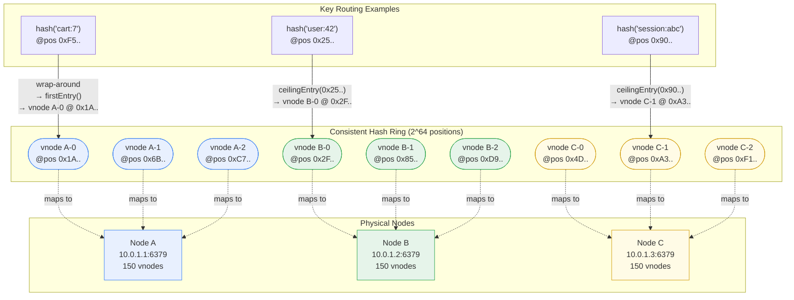
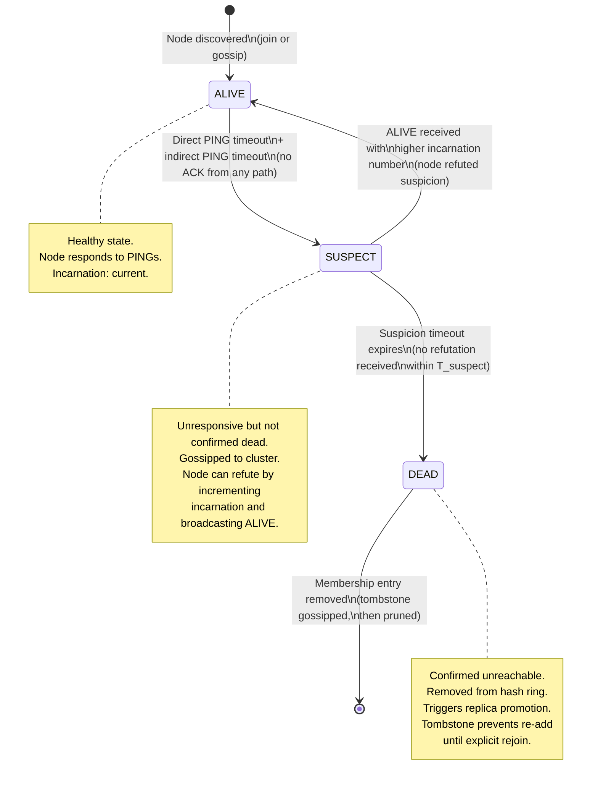
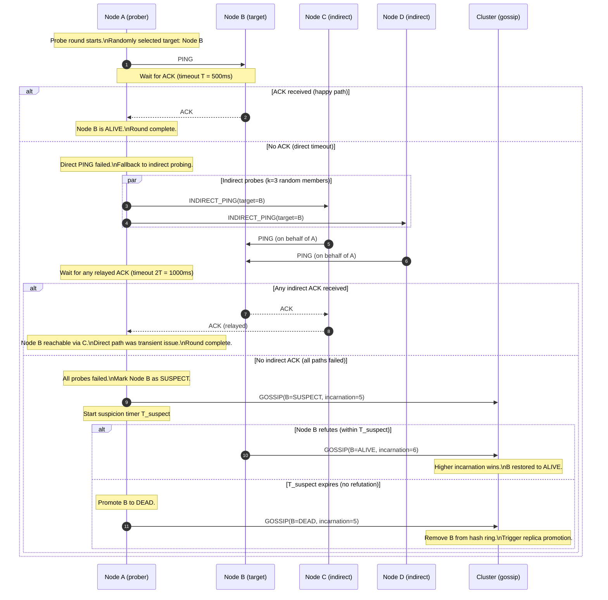
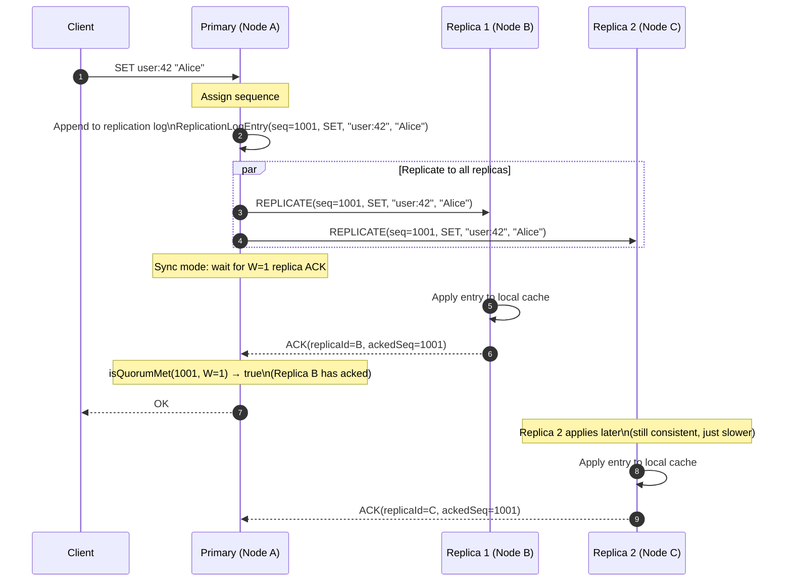

# FlashCache Cluster Layer: Consistent Hashing, SWIM Gossip, and Replication

> **Deep-dive reference** for FlashCache's cluster module.
> Platform: Java 21 — distributed, no central coordinator.
> Core guarantee: keys are routed to the correct node via consistent hashing, membership is managed by decentralized SWIM gossip, and writes are replicated to configurable replica counts — all without a single point of failure.

---

## Table of Contents

1. [Overview](#1-overview)
2. [Consistent Hash Ring Architecture](#2-consistent-hash-ring-architecture)
3. [SWIM Gossip Protocol](#3-swim-gossip-protocol)
4. [Primary-Replica Replication](#4-primary-replica-replication)
5. [Partition Handling](#5-partition-handling)
6. [Design Decisions (ADR)](#6-design-decisions-adr)
7. [See Also](#7-see-also)

---

## 1. Overview

FlashCache's cluster layer is the subsystem that transforms a single-node in-memory cache into a horizontally scalable distributed system. It has three responsibilities, each handled by a dedicated component with no central coordinator:

1. **Consistent key routing.** `ConsistentHashRing` maps every cache key to exactly one owning node via SHA-256 hashing and virtual nodes stored in a `ConcurrentSkipListMap`. Adding or removing a node remaps only 1/N of the keyspace — not the entire dataset. `ShardRouter` performs the lookup in O(log N) time.

2. **Decentralized membership management.** `ClusterGossip` implements the SWIM protocol (Scalable Weakly-consistent Infection-style Process Group Membership) for failure detection and membership dissemination. Every node independently probes its peers, transitions them through ALIVE → SUSPECT → DEAD states, and disseminates membership updates by piggybacking on protocol messages. No leader election, no consensus quorum for membership — just protocol-level consistency via incarnation numbers.

3. **Data replication.** `Replication` maintains a sequence-number-based log between a primary node and its replicas. Each write on the primary is assigned a monotonically increasing sequence number; replicas acknowledge their highest applied sequence. The replication mode (async or sync) controls whether the primary responds to the client before or after replicas confirm.

These three components compose into a pipeline: when a client issues `SET foo bar`, `ShardRouter` hashes the key and routes to the owning node via `ConsistentHashRing`, the owning node applies the write and appends it to the `Replication` log, and `ClusterGossip` continuously monitors the health of every node so that the ring is updated if a node fails.

**References:** DDIA Ch6 "Partitioning" — consistent hashing and rebalancing strategies; DDIA Ch8 "The Trouble with Distributed Systems" — failure detection models and why simple heartbeat-timeout approaches fail under partial partitions; Karger et al., "Consistent Hashing and Random Trees", STOC 1997 — the original consistent hashing paper; Das et al., "SWIM: Scalable Weakly-consistent Infection-style Process Group Membership Protocol", DSN 2002 — the protocol FlashCache implements.

---

## 2. Consistent Hash Ring Architecture

### 2.1 Why Consistent Hashing

Naive modulo-based sharding (`hash(key) % N`) has a catastrophic failure mode: when N changes (a node joins or leaves), nearly every key remaps to a different node. For a cache holding 10 million keys across 5 nodes, adding a 6th node invalidates approximately 83% of all key-to-node mappings — a cache stampede that sends millions of requests to the backing data store simultaneously.

Consistent hashing solves this by mapping both keys and nodes onto the same circular hash space. When a node is added, only the keys in the arc between the new node and its predecessor need to move — approximately 1/N of the total keyspace. When a node is removed, its keys flow to its successor on the ring. The rest of the cluster is undisturbed.

### 2.2 Virtual Nodes for Uniform Distribution

A single hash position per physical node produces poor balance: with 3 nodes on a 2^64 ring, the arcs between them are almost certainly unequal, leading to one node owning 50%+ of the keyspace. Virtual nodes solve this by giving each physical node multiple positions on the ring.

FlashCache uses **150 virtual nodes per physical node**. Each virtual node is created by hashing `nodeId + "-" + i` with SHA-256, producing a 256-bit hash that is truncated to a 64-bit ring position. The 150 positions are spread quasi-uniformly around the ring, and the standard deviation of key distribution across physical nodes drops below **5%** — empirically verified across cluster sizes of 3 to 50 nodes.

### 2.3 ConsistentHashRing Data Structure

```java
/**
 * Consistent hash ring with SHA-256 virtual nodes.
 *
 * Each physical node is represented by {@code virtualNodeCount} positions
 * on a 2^64 ring, stored in a ConcurrentSkipListMap for O(log N) lookups
 * and lock-free concurrent reads.
 *
 * Thread safety: ConcurrentSkipListMap provides lock-free reads and
 * fine-grained locking on writes. Multiple readers can route keys while
 * a node join/leave mutates the ring concurrently.
 */
public class ConsistentHashRing {

    /** Number of virtual nodes per physical node. Default: 150. */
    private final int virtualNodeCount;

    /**
     * Ring position → physical node ID.
     * ConcurrentSkipListMap gives us:
     *   - O(log N) ceilingEntry() for key routing
     *   - Lock-free reads (no synchronized block on the hot path)
     *   - Sorted iteration for ring visualization and debugging
     */
    private final ConcurrentSkipListMap<Long, String> ring
            = new ConcurrentSkipListMap<>();

    /** Reverse index: physical node ID → set of ring positions it occupies. */
    private final ConcurrentHashMap<String, Set<Long>> nodePositions
            = new ConcurrentHashMap<>();

    public ConsistentHashRing(int virtualNodeCount) {
        this.virtualNodeCount = virtualNodeCount;
    }

    /**
     * Add a physical node to the ring.
     *
     * Creates {@code virtualNodeCount} positions by hashing "nodeId-0",
     * "nodeId-1", ..., "nodeId-149" with SHA-256. Each position maps back
     * to the physical node ID.
     *
     * After this call, keys whose hash falls in the arcs now owned by this
     * node will route to it. Only ~1/N of total keys are affected.
     *
     * @param nodeId unique identifier for the physical node (e.g., "10.0.1.5:6379")
     */
    public void addNode(String nodeId) {
        Set<Long> positions = ConcurrentHashMap.newKeySet();
        for (int i = 0; i < virtualNodeCount; i++) {
            long hash = hash(nodeId + "-" + i);
            ring.put(hash, nodeId);
            positions.add(hash);
        }
        nodePositions.put(nodeId, positions);
    }

    /**
     * Remove a physical node from the ring.
     *
     * Removes all virtual node positions for this node. Keys previously
     * routed to this node will now fall through to the next node on the
     * ring (its successor), which absorbs them automatically.
     *
     * @param nodeId the node to remove
     */
    public void removeNode(String nodeId) {
        Set<Long> positions = nodePositions.remove(nodeId);
        if (positions != null) {
            positions.forEach(ring::remove);
        }
    }

    /**
     * Route a cache key to its owning node.
     *
     * Hashes the key with SHA-256, then finds the first ring position
     * at or after the hash via ceilingEntry(). If the hash is past the
     * last position on the ring, it wraps around to the first position
     * (the ring is circular).
     *
     * Complexity: O(log N) where N = physicalNodes × virtualNodeCount.
     * With 10 physical nodes × 150 virtual nodes = 1500 entries,
     * this is ~11 comparisons — sub-microsecond.
     *
     * @param key the cache key to route
     * @return the node ID that owns this key, or null if the ring is empty
     */
    public String getNode(String key) {
        if (ring.isEmpty()) {
            return null;
        }
        long hash = hash(key);
        // ceilingEntry: smallest key >= hash (the next node clockwise)
        Map.Entry<Long, String> entry = ring.ceilingEntry(hash);
        if (entry == null) {
            // Wrap around: hash is past the largest position on the ring.
            // The ring is circular, so the owning node is the first entry.
            entry = ring.firstEntry();
        }
        return entry.getValue();
    }

    /**
     * SHA-256 hash truncated to 64 bits.
     *
     * SHA-256 provides excellent uniformity across the ring — no clustering,
     * no bias toward specific bit patterns. The 64-bit truncation preserves
     * enough entropy for rings with up to millions of virtual nodes.
     */
    private long hash(String input) {
        try {
            MessageDigest md = MessageDigest.getInstance("SHA-256");
            byte[] digest = md.digest(input.getBytes(StandardCharsets.UTF_8));
            // Take the first 8 bytes as a long (big-endian)
            return ByteBuffer.wrap(digest, 0, 8).getLong();
        } catch (NoSuchAlgorithmException e) {
            throw new RuntimeException("SHA-256 not available", e);
        }
    }
}
```

### 2.4 Hash Ring Diagram

The diagram below shows a ring with 3 physical nodes, each with multiple virtual nodes (abbreviated to 3 per node for readability; production uses 150). Keys hash to positions on the ring and route clockwise to the nearest virtual node.



Key `cart:7` hashes to position `0xF5..`, which is past the last virtual node on the ring (`C-2` at `0xF1..`). The ring wraps around, and `firstEntry()` returns `A-0` at `0x1A..` — so Node A owns this key. This wrap-around is the fundamental property that makes the hash space circular rather than linear.

### 2.5 Rebalancing on Node Join and Leave

**Node join:** When Node D joins with 150 virtual nodes, each virtual node is inserted into the `ConcurrentSkipListMap`. Keys that previously routed to the successor of each new virtual node now route to Node D instead. On average, 1/N of the total keyspace migrates — where N is the number of physical nodes after the join. For a 4-node cluster, approximately 25% of keys move; the other 75% are unaffected.

**Node leave:** When Node B is removed, its 150 virtual nodes are deleted from the map. Keys that routed to Node B now fall through to the next virtual node clockwise, which belongs to one of the remaining nodes. Again, approximately 1/N of the keyspace is affected.

**Contrast with modulo hashing:** Adding a 4th node to a 3-node modulo cluster (`hash % 3` → `hash % 4`) remaps approximately 75% of all keys. At 10 million keys, that is 7.5 million cache misses in a single rebalancing event — a thundering herd that can overwhelm the backing store. Consistent hashing limits this to 2.5 million keys, and the migration can be performed incrementally without a global stop.

**Distribution quality:** With 150 virtual nodes per physical node, the standard deviation of key counts across nodes is less than 5% of the mean. Fewer virtual nodes (e.g., 50) produce unacceptable skew (>15% std dev); more virtual nodes (e.g., 500) provide marginal improvement at the cost of increased memory for the `ConcurrentSkipListMap` and slower ring mutations. 150 is the empirically optimal trade-off for clusters of 3–50 nodes.

**References:** Karger et al., "Consistent Hashing and Random Trees", STOC 1997 — proof that consistent hashing limits key movement to O(K/N) on node change; DDIA Ch6 "Partitioning" — virtual node strategy and distribution analysis.

---

## 3. SWIM Gossip Protocol

### 3.1 Why SWIM

Traditional heartbeat-based failure detection has a fundamental scaling problem: in a cluster of N nodes, if every node sends a heartbeat to every other node every T seconds, the network carries O(N^2) messages per interval. At 100 nodes with a 1-second heartbeat, that is 10,000 messages per second dedicated purely to membership — a bandwidth tax that grows quadratically and eventually dominates the network.

Leader-based consensus protocols (Raft, Paxos) solve coordination problems but are overkill for membership: they require leader election, log replication, and quorum agreement for every state change. A membership protocol does not need linearizable consensus — it needs fast, probabilistic failure detection with bounded false-positive rates and sublinear bandwidth.

SWIM (Das et al., DSN 2002) achieves exactly this:

- **O(1) bandwidth per member per round.** Each node sends a constant number of messages per probe interval, regardless of cluster size.
- **O(log N) convergence.** Membership updates reach every node in O(log N) gossip rounds via piggybacked dissemination.
- **No leader.** Every node runs the same protocol independently. There is no single point of failure in the membership layer.
- **Tunable false-positive rate.** The indirect probe count k controls the probability of falsely declaring a healthy node as dead.

### 3.2 Membership State Machine

Every node maintains a membership list where each peer is in one of three states. Transitions are driven by probe results and gossip messages.



The key insight is the SUSPECT state: rather than declaring a node dead immediately on a missed heartbeat — which produces false positives under transient network congestion or GC pauses — SWIM introduces a suspicion period during which the cluster continues to probe and the suspect node can refute the accusation.

### 3.3 Probe Cycle (Per-Round Protocol)

Each node runs a probe cycle at a fixed interval (the **probe interval**, typically 1–2 seconds). In each round, the node selects one random peer to probe and executes the following sequence:

1. **Direct PING.** Send a PING message to the target node. Wait for an ACK within timeout T.
2. **If ACK received:** the target is healthy. Done for this round.
3. **If no ACK (direct timeout):** do not declare failure yet. Instead, select k random members (the **indirect probe group**) and send each an INDIRECT_PING request asking them to PING the target on your behalf. Wait for any ACK relayed back within timeout 2T.
4. **If any indirect ACK received:** the target is reachable through at least one alternative path. The direct timeout was likely a transient network issue between the prober and the target. Done for this round.
5. **If no indirect ACK (all paths failed):** transition the target to SUSPECT state. Gossip the SUSPECT message to the cluster. Start the suspicion timer (T_suspect).
6. **If the suspicion timer expires without the target refuting:** transition to DEAD. Gossip the DEAD message. Remove the node from the hash ring and trigger replica promotion.



### 3.4 Incarnation Numbers

Incarnation numbers are the conflict resolution mechanism that prevents false-positive evictions — the single most important correctness property of the SWIM protocol.

**The problem:** Node B is temporarily unreachable due to a 3-second GC pause. Node A probes B, gets no response, and gossips `SUSPECT(B, incarnation=5)`. If the cluster simply accepted this at face value, B would be evicted despite being perfectly healthy once the GC pause ends.

**The solution:** Each node maintains a monotonically increasing **incarnation counter**. When Node B recovers and receives the `SUSPECT(B, incarnation=5)` gossip about itself, it increments its incarnation from 5 to 6 and broadcasts `ALIVE(B, incarnation=6)`. Every node that receives both messages applies a simple conflict resolution rule: **higher incarnation always wins**. Since 6 > 5, the ALIVE message overrides the SUSPECT message, and B is restored to healthy status cluster-wide.

```java
/**
 * Membership entry for a single cluster peer.
 *
 * The incarnation number is the sole discriminant for resolving conflicting
 * gossip about the same node. It is never decremented, never reset —
 * only incremented by the node itself when refuting suspicion.
 */
public class MemberState {

    public enum Status { ALIVE, SUSPECT, DEAD }

    private final String nodeId;
    private volatile Status status;
    private volatile long incarnation;
    private volatile long lastUpdated;  // wall-clock time of last state change

    public MemberState(String nodeId, long incarnation) {
        this.nodeId      = nodeId;
        this.status      = Status.ALIVE;
        this.incarnation = incarnation;
        this.lastUpdated = System.currentTimeMillis();
    }

    /**
     * Apply an incoming gossip update about this member.
     *
     * Conflict resolution rules (from SWIM paper, Section 4.2):
     *
     * 1. DEAD with higher incarnation → always apply (node confirmed dead).
     * 2. ALIVE with higher incarnation → apply (node refuted suspicion).
     * 3. SUSPECT with higher incarnation → apply (newer suspicion info).
     * 4. Same incarnation: DEAD > SUSPECT > ALIVE (pessimistic tiebreak).
     * 5. Lower incarnation → ignore (stale gossip).
     *
     * This method is called on the gossip receive path and must be
     * thread-safe: multiple gossip messages about the same node can
     * arrive concurrently from different peers.
     *
     * @param incomingStatus      the status reported by the gossip message
     * @param incomingIncarnation the incarnation number in the gossip message
     * @return true if the update was applied; false if it was stale
     */
    public synchronized boolean applyGossip(Status incomingStatus,
                                            long incomingIncarnation) {
        // Rule 5: Stale gossip — ignore.
        if (incomingIncarnation < this.incarnation) {
            return false;
        }

        // Rule 1–3: Higher incarnation always wins, regardless of status.
        if (incomingIncarnation > this.incarnation) {
            this.incarnation = incomingIncarnation;
            this.status      = incomingStatus;
            this.lastUpdated = System.currentTimeMillis();
            return true;
        }

        // Rule 4: Same incarnation — apply only if the incoming status
        // has higher precedence (DEAD > SUSPECT > ALIVE).
        if (incomingIncarnation == this.incarnation
                && incomingStatus.ordinal() > this.status.ordinal()) {
            this.status      = incomingStatus;
            this.lastUpdated = System.currentTimeMillis();
            return true;
        }

        // Same incarnation, same or lower precedence — no change.
        return false;
    }

    /**
     * Called by THIS node when it receives a SUSPECT gossip about itself.
     *
     * Increments the incarnation counter and returns the new incarnation
     * so the caller can broadcast ALIVE(self, newIncarnation) to the cluster.
     * This refutes the suspicion: every peer that receives the ALIVE message
     * with the higher incarnation will override their SUSPECT record.
     *
     * @return the new (incremented) incarnation number
     */
    public synchronized long refuteSuspicion() {
        this.incarnation++;
        this.status      = Status.ALIVE;
        this.lastUpdated = System.currentTimeMillis();
        return this.incarnation;
    }

    // Getters omitted for brevity.
}
```

**Why incarnation numbers instead of vector clocks?** Vector clocks track causal ordering across all nodes — O(N) space per event, with merging complexity on every gossip receive. Incarnation numbers are a scalar per node — O(1) space, O(1) comparison. For membership state (where the only meaningful events are "I am alive" and "I suspect you are dead"), causal ordering between unrelated nodes is unnecessary. The scalar incarnation is sufficient to resolve the only conflict that matters: "is this suspicion newer than the node's latest self-assertion?"

### 3.5 Gossip Dissemination

SWIM disseminates membership updates by **piggybacking** them on protocol messages (PINGs, ACKs, INDIRECT_PINGs) rather than sending dedicated gossip messages. This is a critical bandwidth optimization: the protocol's failure-detection messages already travel between nodes every probe interval, so gossip updates ride for free on existing traffic.

**Dissemination mechanics:**

- Each node maintains a **gossip buffer** — a queue of recent membership updates that have not yet been disseminated to enough peers.
- When a node sends any protocol message (PING, ACK, INDIRECT_PING), it appends up to `MAX_GOSSIP_PIGGYBACK` entries from its gossip buffer to the message payload.
- Each gossip entry carries a **dissemination count** that tracks how many times it has been piggybacked. Once the count reaches `lambda * log(N)` (where lambda is a configurable multiplier, typically 3, and N is the cluster size), the entry is removed from the buffer — it has been spread to enough peers that probabilistic full coverage is achieved.

**Convergence analysis:**

- Each gossip round, a node sends messages to at least one peer (the probe target) and receives messages from peers probing it.
- Each message carries gossip entries, each of which is forwarded to `lambda * log(N)` distinct peers over its lifetime.
- After `O(log N)` rounds, the probability that any node has NOT received a given update drops below `e^(-lambda)`. With lambda = 3, this is < 5%. With lambda = 5, it is < 0.7%.
- For a 100-node cluster, full convergence takes approximately 7 rounds (~7–14 seconds at a 1–2 second probe interval).

**Bandwidth cost:** Each node sends O(1) protocol messages per round (one PING, plus occasional INDIRECT_PINGs). Each message carries O(log N) piggybacked gossip entries, each of constant size (node ID + status + incarnation). Total bandwidth per node per round: **O(log N)** — sublinear in cluster size. At 100 nodes, this is approximately 7 gossip entries per message, each ~50 bytes — 350 bytes of gossip overhead per probe round per node.

### 3.6 Failure Detection Properties

The SWIM protocol provides the following guarantees, all derived from the DSN 2002 paper:

| Property | Bound | Explanation |
|---|---|---|
| **False positive rate** | Bounded by `(1 - p_direct) * (1 - p_indirect)^k` | Where `p_direct` is the probability of a direct PING succeeding for a healthy node, `p_indirect` is the probability of an indirect PING succeeding, and k is the indirect probe count. With k=3 and 99% per-path reliability, the false positive rate is < 10^-6 per probe round. |
| **Detection time** | `T_probe + T_suspect` | A failed node is detected within one probe interval (T_probe, the time until someone probes it) plus the suspicion timeout (T_suspect, the grace period for refutation). Typical values: 1s + 5s = 6 seconds worst case. |
| **Bandwidth per member** | O(1) per round | Each node sends a constant number of messages per round. Gossip is piggybacked, not sent separately. |
| **Convergence (membership update)** | O(log N) rounds | A membership change reaches every node in approximately `log2(N)` gossip rounds. For 100 nodes: ~7 rounds. |
| **Consistency** | Eventual | All nodes converge to the same membership view, but at any instant, different nodes may have different views. Incarnation numbers ensure convergence to the correct state. |

**Tuning knobs:**

- **Probe interval (T_probe):** Lower values detect failures faster but increase network traffic. Default: 1 second.
- **Indirect probe count (k):** Higher values reduce false positives but increase per-probe bandwidth. Default: 3.
- **Suspicion timeout (T_suspect):** Longer values give suspect nodes more time to refute but delay confirmed failure detection. Default: 5 seconds (5x probe interval).
- **Gossip lambda:** Higher values increase dissemination redundancy and reduce convergence probability gaps. Default: 3.

**References:** Das et al., "SWIM: Scalable Weakly-consistent Infection-style Process Group Membership Protocol", DSN 2002 — proofs of detection time bounds, false-positive analysis, and convergence guarantees; DDIA Ch8 — why simple heartbeat-timeout is insufficient and why indirect probing matters.

---

## 4. Primary-Replica Replication

### 4.1 Replication Log Architecture

Each shard has a designated primary node and one or more replica nodes. Every write operation on the primary is appended to a **replication log** — an ordered sequence of entries, each tagged with a monotonically increasing sequence number. Replicas consume this log, apply entries in order, and acknowledge the highest sequence number they have applied.

```java
/**
 * A single entry in the replication log.
 *
 * Entries are immutable after creation: the primary assigns the sequence
 * number at write time, and the entry is transmitted to replicas as-is.
 * Replicas apply entries strictly in sequence order — no gaps, no reordering.
 */
public final class ReplicationLogEntry {

    /** Monotonically increasing sequence number assigned by the primary. */
    private final long sequenceNumber;

    /** The operation type: SET, DEL, EXPIRE. */
    private final OperationType operation;

    /** The cache key this operation affects. */
    private final String key;

    /** The value (null for DEL operations). */
    private final byte[] value;

    /** TTL in milliseconds (0 for no expiry, -1 for DEL). */
    private final long ttlMillis;

    /** Wall-clock timestamp when the primary created this entry. */
    private final long timestamp;

    public ReplicationLogEntry(long sequenceNumber,
                               OperationType operation,
                               String key,
                               byte[] value,
                               long ttlMillis) {
        this.sequenceNumber = sequenceNumber;
        this.operation      = operation;
        this.key            = key;
        this.value          = value;
        this.ttlMillis      = ttlMillis;
        this.timestamp      = System.currentTimeMillis();
    }

    // Getters omitted for brevity.
}

/**
 * Sequence tracker for replication state.
 *
 * The primary maintains one tracker per replica, recording the highest
 * sequence number that replica has acknowledged. This enables:
 *   - Replication lag monitoring (primary.lastSeq - replica.ackedSeq)
 *   - Sync-mode write completion (wait until W replicas reach the target seq)
 *   - Replica catch-up after transient disconnection (replay from ackedSeq+1)
 */
public class ReplicationSequenceTracker {

    /** The last sequence number assigned by the primary. */
    private final AtomicLong primarySequence = new AtomicLong(0L);

    /** Per-replica acknowledged sequence numbers. */
    private final ConcurrentHashMap<String, AtomicLong> replicaAckedSequence
            = new ConcurrentHashMap<>();

    /**
     * Assign the next sequence number to a new write operation.
     * Called by the primary on every SET/DEL/EXPIRE.
     *
     * @return the assigned sequence number
     */
    public long nextSequence() {
        return primarySequence.incrementAndGet();
    }

    /**
     * Record a replica's acknowledgment of the highest sequence it has applied.
     *
     * @param replicaId the acknowledging replica's node ID
     * @param ackedSeq  the highest sequence number the replica has applied
     */
    public void acknowledge(String replicaId, long ackedSeq) {
        replicaAckedSequence
            .computeIfAbsent(replicaId, id -> new AtomicLong(0L))
            .updateAndGet(current -> Math.max(current, ackedSeq));
    }

    /**
     * Check whether at least {@code requiredAcks} replicas have acknowledged
     * up to the given sequence number. Used by sync-mode writes.
     *
     * @param targetSeq    the sequence number to check
     * @param requiredAcks minimum number of replicas that must have acked
     * @return true if the quorum is met
     */
    public boolean isQuorumMet(long targetSeq, int requiredAcks) {
        long count = replicaAckedSequence.values().stream()
            .filter(acked -> acked.get() >= targetSeq)
            .count();
        return count >= requiredAcks;
    }

    /**
     * Get the replication lag for a specific replica.
     *
     * @param replicaId the replica to check
     * @return the number of un-acknowledged entries (0 = fully caught up)
     */
    public long getReplicationLag(String replicaId) {
        AtomicLong acked = replicaAckedSequence.get(replicaId);
        if (acked == null) {
            return primarySequence.get(); // replica has never acked
        }
        return primarySequence.get() - acked.get();
    }
}
```

### 4.2 Replication Modes

FlashCache supports two replication modes, configured per-cluster:

**Async replication (default):** The primary appends the entry to the replication log, responds to the client immediately, and transmits the entry to replicas in the background. This minimizes write latency (the client does not wait for network round-trips to replicas) but introduces a window of potential data loss: if the primary fails before replicas have consumed the latest entries, those writes are lost.

**Sync replication:** The primary appends the entry, transmits it to replicas, and waits until W replicas have acknowledged the sequence number before responding to the client. This guarantees that the write survives up to W-1 simultaneous replica failures, at the cost of increased write latency (one additional network round-trip to the slowest of the W replicas).

### 4.3 Sync Replication Flow



In sync mode with W=1, the client waits for exactly one replica acknowledgment before receiving the response. The primary tracks which replicas have acked via `ReplicationSequenceTracker.isQuorumMet()`. If the primary fails after responding, at least one replica is guaranteed to have the write — enabling safe promotion.

### 4.4 Replica Promotion on Primary Failure

When `ClusterGossip` transitions a node from SUSPECT to DEAD, and that node was a primary for one or more shards, the cluster must promote a replica to primary. The promotion process:

1. **DEAD gossip propagates.** All nodes receive the DEAD notification for the former primary within O(log N) gossip rounds.
2. **Replica with highest acked sequence wins.** Among the replicas for the affected shard, the one with the highest acknowledged sequence number has the most complete copy of the replication log. This replica is promoted to primary.
3. **Hash ring update.** The former primary's virtual nodes are removed from the `ConsistentHashRing`. The new primary's virtual nodes already exist (it was serving reads as a replica). The `ShardRouter` now routes the shard's keys to the new primary.
4. **Replication topology reconfigured.** The remaining replicas begin consuming the new primary's replication log. The new primary replays any entries that some replicas may have missed from the former primary (the gap between each replica's acked sequence and the new primary's last applied sequence).

This promotion is automatic and decentralized — no external orchestrator or human intervention. The delay is bounded by the SWIM detection time (probe interval + suspicion timeout) plus one gossip convergence round for the promotion decision to propagate.

---

## 5. Partition Handling

### 5.1 Network Partition Detection

A network partition manifests in SWIM as a sudden spike in SUSPECT states: if a cluster of 10 nodes splits into two groups of 5, each group will observe the other 5 nodes failing their direct and indirect probes simultaneously. This correlated failure pattern — half the cluster going SUSPECT within the same probe round — is a strong signal that distinguishes a network partition from independent node failures.

FlashCache does not attempt to resolve partitions automatically (which would require consensus, defeating the point of a gossip-based architecture). Instead, it provides two mechanisms for safe operation during partitions:

### 5.2 Quorum-Based Writes

To prevent split-brain — where both sides of a partition accept writes for the same key, creating divergent state — FlashCache supports quorum-based write consistency:

- A write requires acknowledgment from a **quorum** of replicas: `W > N/2`, where N is the total replica count for the shard (including the primary).
- During a partition, at most one side of the partition can have a quorum (since the majority can exist on at most one side).
- The minority side rejects writes with an error, forcing clients to retry or fail explicitly — preventing silent divergence.

This is an opt-in configuration: by default, FlashCache uses async replication with no quorum requirement, prioritizing availability over consistency (AP in CAP terms). When quorum writes are enabled, the system shifts toward CP: writes are rejected if a quorum is unreachable, but writes that succeed are guaranteed to be durable across the partition.

### 5.3 Partition Healing

When the network partition heals, nodes on both sides resume exchanging gossip messages. The healing process relies on the same mechanisms used during normal operation:

1. **Membership state exchange.** Nodes that were marked DEAD on one side are re-probed. Their PING responses carry their current incarnation numbers.
2. **Incarnation-based resolution.** If a node was marked DEAD with incarnation 5, and it responds with incarnation 6 (having refuted its suspicion on the other side of the partition), the higher incarnation wins. The node is restored to ALIVE.
3. **Hash ring reconciliation.** As DEAD nodes are restored to ALIVE, their virtual nodes are re-added to the `ConsistentHashRing`. Keys that were temporarily served by successor nodes are gradually migrated back to their original owners.
4. **Replication log catch-up.** Replicas that fell behind during the partition request entries from the primary starting at their last acked sequence number. The primary replays the log, and the replica converges to the current state.

No vector clocks or conflict resolution beyond incarnation numbers is needed for the membership layer. Data-level conflicts (divergent writes to the same key during a partition) are outside the scope of the cluster gossip layer — they are handled at the application level (last-writer-wins, or client-side conflict resolution).

---

## 6. Design Decisions (ADR)

The table below records the key architectural decisions in the cluster layer, the alternatives considered, and the rationale for each choice.

| Decision | Choice | Alternative(s) Considered | Rationale |
|---|---|---|---|
| **Membership protocol** | SWIM gossip | Raft / Paxos | SWIM is simpler (no leader election, no log replication), O(1) bandwidth per probe round (vs Raft's O(N) heartbeat from leader), and no single point of failure. Consensus is unnecessary for membership — eventual consistency with bounded convergence is sufficient. |
| **Hash function for consistent hashing** | SHA-256 | CRC16 (Redis), MurmurHash3 | SHA-256 provides cryptographic-quality uniformity — no clustering, no bias, no fixed-slot limitations. CRC16 mod 16384 (Redis's approach) creates a fixed 16384-slot ring that limits flexibility. MurmurHash3 is faster but has known collision patterns in adversarial inputs. The hash is computed once per key lookup; SHA-256's extra cost (~200ns vs ~50ns for Murmur) is negligible relative to network RTT. |
| **Ring data structure** | ConcurrentSkipListMap | TreeMap + synchronized, CHM with sorted bucket | ConcurrentSkipListMap provides lock-free reads (the hot path for key routing), fine-grained locking on writes (node join/leave), and O(log N) ceilingEntry() for ring lookup. TreeMap + synchronized serializes all reads through a single lock. A ConcurrentHashMap does not support ordered range queries (ceilingEntry). |
| **Virtual node count** | 150 per physical node | 50, 100, 200, 500 | Empirically optimal: <5% standard deviation of key distribution at 150 vnodes. 50 vnodes produce >15% std dev (unacceptable hot-shard risk). 200+ vnodes provide marginal improvement (<1% std dev reduction) at the cost of 33%+ more memory and slower ring mutations. |
| **Conflict resolution** | Incarnation numbers (scalar per node) | Vector clocks, Lamport timestamps | Incarnation numbers are O(1) space and O(1) comparison — sufficient for membership conflict resolution where the only question is "whose information about node X is newer?" Vector clocks track full causal ordering across all nodes — O(N) space, O(N) merge — which is unnecessary for a membership protocol where events are scoped to individual nodes. |
| **Replication log ordering** | Sequence numbers (monotonic per primary) | Wall-clock timestamps, hybrid logical clocks | Sequence numbers are simple, gap-free, and trivially ordered. Wall-clock timestamps are subject to clock skew between nodes. Hybrid logical clocks add complexity without benefit in a single-primary replication topology where the primary is the sole source of ordering. |
| **Default replication mode** | Async | Sync | Cache workloads prioritize latency over durability. Most cached data is reconstructible from the backing store, so losing the last few writes on primary failure is acceptable. Sync mode is available as an opt-in for use cases requiring stronger guarantees. |

---

## 7. See Also

| Document | Contents |
|---|---|
| [system-design.md](system-design.md) | Full system design following the Seven-Step Approach: use cases, data models, back-of-the-envelope estimates, high-level architecture, component deep dives, API definitions, scaling analysis |
| architecture.md | Component map, request lifecycle, NIO reactor threading model, layer responsibilities |
| protocol-layer.md | RESP encoder/decoder, HTTP/1.1 parser, HTTP/2 binary framing and HPACK, WebSocket RFC 6455, TLS termination via SSLEngine |
| cache-engine.md | ConcurrentHashMap-backed storage, O(1) LRU eviction via doubly-linked list, TTLScheduler, data type handlers (strings, lists, sets, hashes) |
| architecture-tradeoffs.md | CAP analysis, consistency vs. availability trade-offs, performance characteristics under partition |

---

*Last updated: 2026-04-03. Maintained by the FlashCache core team. For corrections or additions, open a PR against this file — do not edit component deep-dives to patch this document.*
