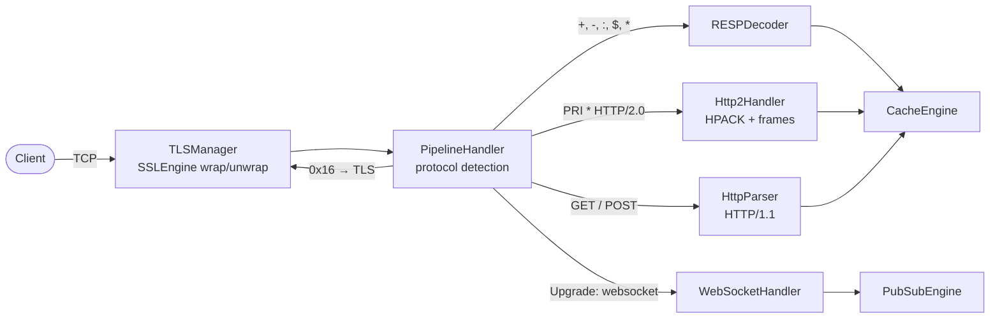
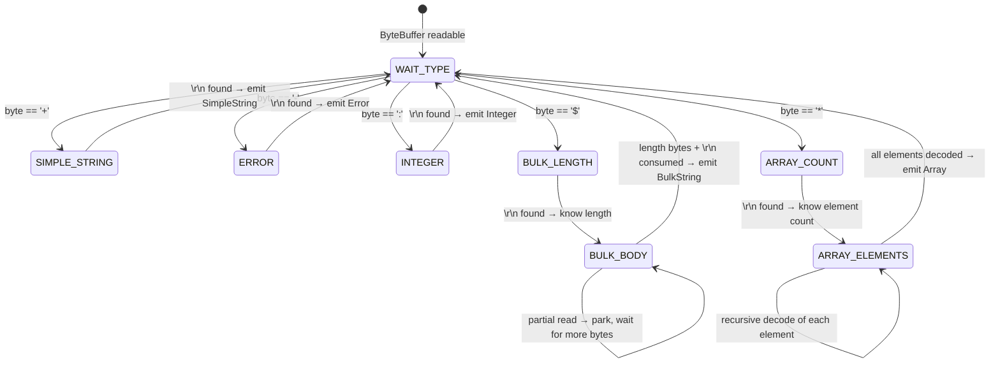
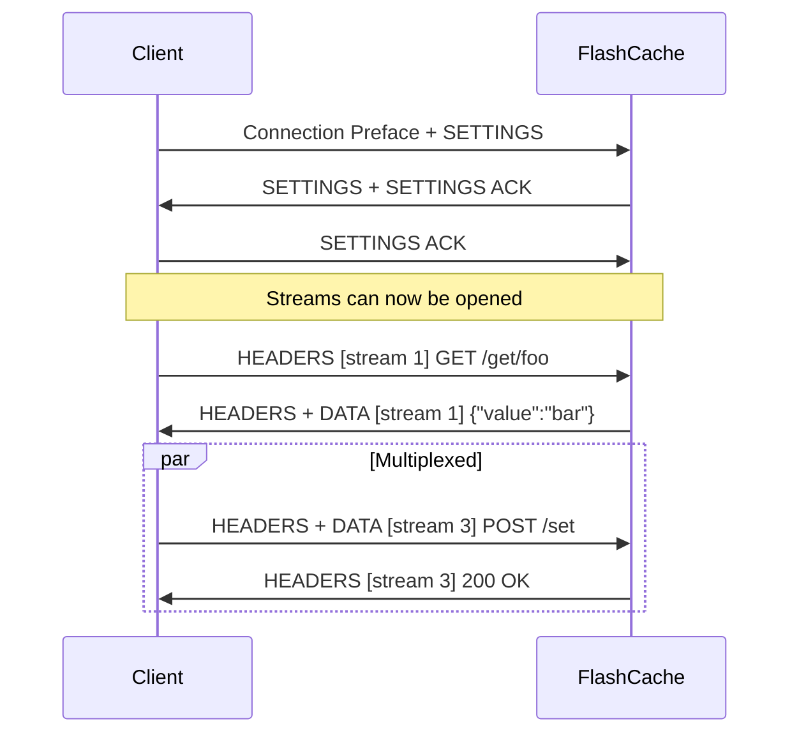
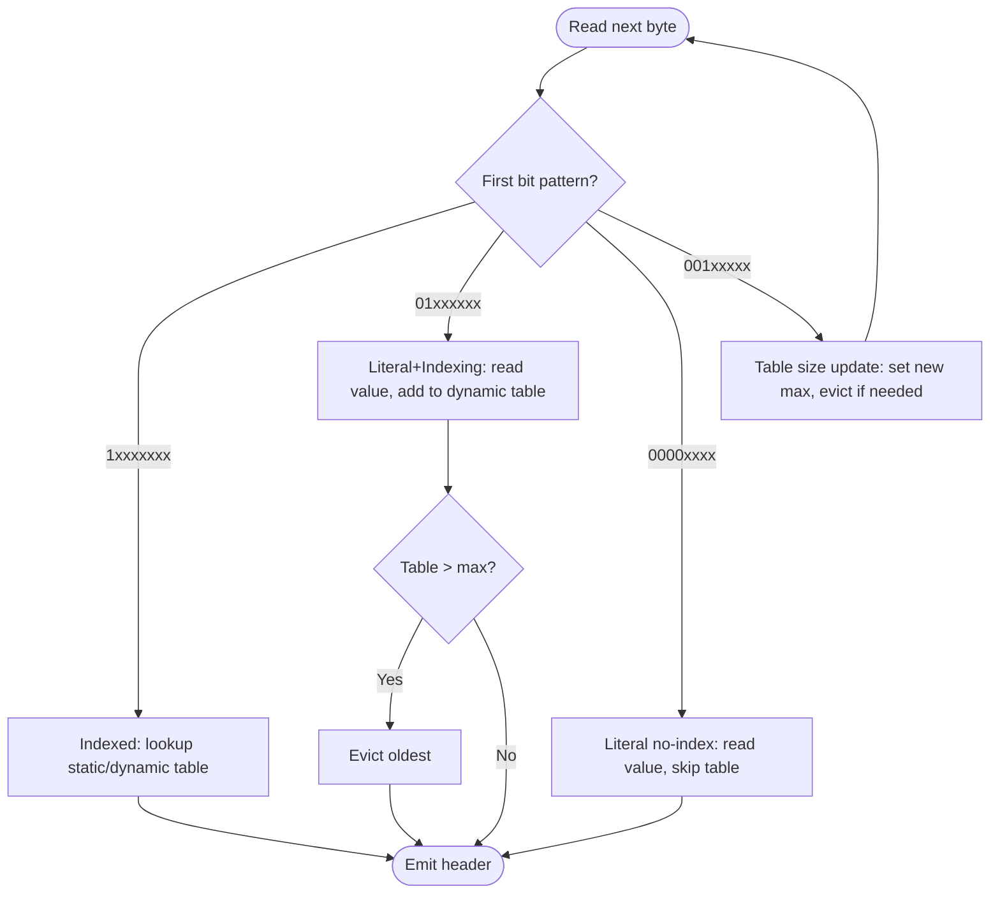
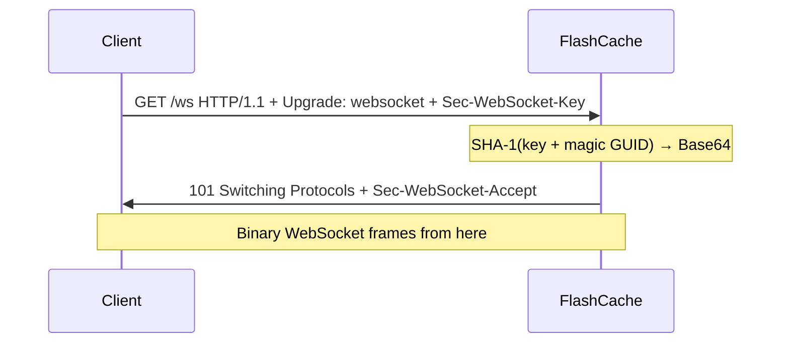
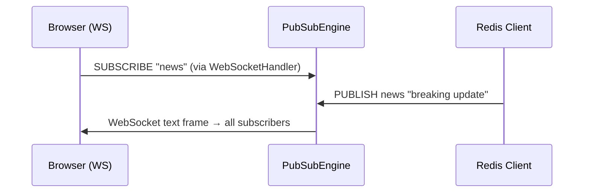
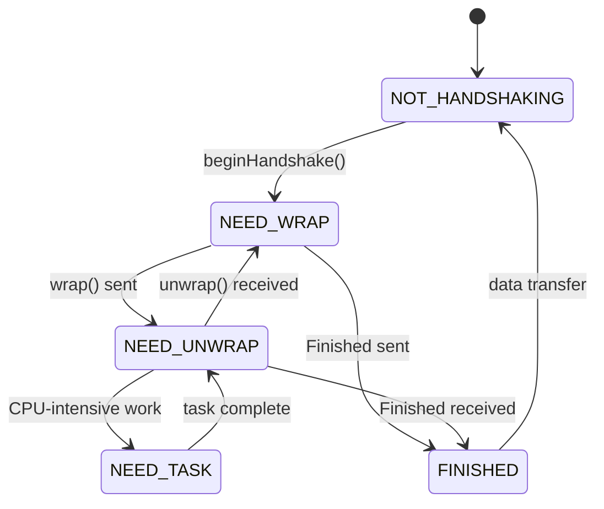
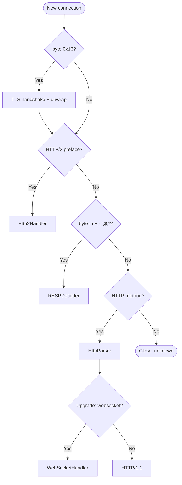

# FlashCache Protocol Layer

> **Audience**: Staff-level engineers evaluating FlashCache's protocol internals or contributing to the networking layer.
> **Scope**: All five wire protocols implemented from scratch — RESP, HTTP/1.1, HTTP/2 (HPACK), WebSocket, TLS — and the protocol detection router that multiplexes them onto a single NIO Selector event loop.

---

## 1. Overview

FlashCache implements five wire protocols without any third-party networking library:

| Protocol | RFC / Spec | Entry Point | Purpose |
|---|---|---|---|
| RESP | Redis Serialization Protocol | `RESPDecoder` / `RESPEncoder` | Drop-in compatibility with Redis clients (Jedis, Lettuce, redis-py) |
| HTTP/1.1 | RFC 7230-7235 | `HttpParser` | RESTful cache access via `curl` and browsers |
| HTTP/2 | RFC 7540 | `Http2Handler` | Multiplexed binary framing with stream concurrency |
| HPACK | RFC 7541 | `Http2Handler` (inline) | Header compression for HTTP/2 — static table, dynamic table, Huffman |
| WebSocket | RFC 6455 | `WebSocketHandler` | Real-time pub/sub delivery to browser clients |
| TLS | JSSE `SSLEngine` | `TLSManager` | Encryption termination inline on the NIO path |

All protocols share one `java.nio.channels.Selector` event loop running on a single Java 21 virtual thread. `PipelineHandler` detects the inbound protocol from the first bytes of a connection and routes to the appropriate handler chain. No Netty, no Jetty, no Undertow — every frame parser is a hand-rolled state machine over `ByteBuffer`.



---

## 2. RESP (Redis Serialization Protocol)

### 2.1 Wire Format

RESP defines five data types, each identified by its first byte:

| Prefix | Type | Example | Terminated by |
|---|---|---|---|
| `+` | Simple String | `+OK\r\n` | `\r\n` |
| `-` | Error | `-ERR unknown command\r\n` | `\r\n` |
| `:` | Integer | `:1000\r\n` | `\r\n` |
| `$` | Bulk String | `$3\r\nfoo\r\n` | Length-prefixed + `\r\n` |
| `*` | Array | `*2\r\n$3\r\nGET\r\n$3\r\nfoo\r\n` | Count-prefixed, recursive |

A typical `SET foo bar` command arrives as:

```
*3\r\n$3\r\nSET\r\n$3\r\nfoo\r\n$3\r\nbar\r\n
```

### 2.2 RESPDecoder — State Machine

The decoder must handle **partial reads**: a single `OP_READ` event from the NIO selector may deliver half a bulk string or split an array across two reads. The decoder is a state machine that suspends at any byte boundary and resumes when more data arrives.



**Key design decision**: the decoder compares bytes directly in the `ByteBuffer` against known command signatures (`GET`, `SET`, `DEL`, etc.) before extracting string arguments, avoiding `String` allocation on the hot path.

### 2.3 RESPDecoder — Java Implementation

```java
/**
 * Incremental RESP decoder. Returns null when the buffer contains a partial
 * frame; the caller re-invokes on the next OP_READ with the same buffer.
 */
public final class RESPDecoder {
    private enum State { WAIT_TYPE, SIMPLE_STRING, ERROR, INTEGER,
                         BULK_LENGTH, BULK_BODY, ARRAY_COUNT, ARRAY_ELEMENTS }
    private State state = State.WAIT_TYPE;
    private int bulkLength = -1;
    private int arrayRemaining = -1;
    private final List<Object> arrayAccumulator = new ArrayList<>();

    public Object decode(ByteBuffer buffer) {
        while (buffer.hasRemaining()) {
            switch (state) {
                case WAIT_TYPE -> {
                    byte prefix = buffer.get();
                    state = switch (prefix) {
                        case '+' -> State.SIMPLE_STRING;
                        case '-' -> State.ERROR;
                        case ':' -> State.INTEGER;
                        case '$' -> State.BULK_LENGTH;
                        case '*' -> State.ARRAY_COUNT;
                        default  -> throw new RESPException("Unknown prefix: " + (char) prefix);
                    };
                }
                case SIMPLE_STRING, ERROR, INTEGER -> {
                    String line = readLine(buffer);
                    if (line == null) return null;  // partial — need more bytes
                    state = State.WAIT_TYPE;
                    return switch (state) {
                        case ERROR -> new RESPError(line);  case INTEGER -> Long.parseLong(line);
                        default -> line;
                    };
                }
                case BULK_LENGTH -> {
                    String line = readLine(buffer);
                    if (line == null) return null;
                    bulkLength = Integer.parseInt(line);
                    if (bulkLength == -1) { state = State.WAIT_TYPE; return null; }
                    state = State.BULK_BODY;
                }
                case BULK_BODY -> {
                    if (buffer.remaining() < bulkLength + 2) return null;
                    byte[] data = new byte[bulkLength];
                    buffer.get(data);
                    buffer.get(); buffer.get();  // consume \r\n
                    state = State.WAIT_TYPE;
                    return new String(data, StandardCharsets.UTF_8);
                }
                case ARRAY_COUNT -> {
                    String line = readLine(buffer);
                    if (line == null) return null;
                    arrayRemaining = Integer.parseInt(line);
                    arrayAccumulator.clear();
                    state = State.ARRAY_ELEMENTS;
                }
                case ARRAY_ELEMENTS -> {
                    state = State.WAIT_TYPE;
                    Object element = decode(buffer);  // recursive child decode
                    if (element == null) { state = State.ARRAY_ELEMENTS; return null; }
                    arrayAccumulator.add(element);
                    if (--arrayRemaining > 0) state = State.ARRAY_ELEMENTS;
                    else return List.copyOf(arrayAccumulator);
                }
            }
        }
        return null;  // buffer exhausted
    }
}
```

### 2.4 RESPEncoder and Command Dispatch

`RESPEncoder` is stateless — it maps Java types to wire format: `String` → `+...\r\n`, `RESPError` → `-...\r\n`, `Long` → `:...\r\n`, `byte[]` → `$len\r\n...\r\n`, `List` → `*count\r\n` + recursive, `null` → `$-1\r\n`.

After decoding a RESP array, the first element is the command name. `PipelineHandler` routes to `CacheEngine`:

```
*3\r\n$3\r\nSET\r\n$3\r\nfoo\r\n$3\r\nbar\r\n → ["SET","foo","bar"] → CacheEngine.set("foo","bar") → +OK\r\n
```

---

## 3. HTTP/2 Binary Framing (RFC 7540)

### 3.1 Frame Format

Every HTTP/2 frame begins with a fixed 9-byte header: `[Length:3][Type:1][Flags:1][R+StreamID:4]` followed by the payload.

| Field | Size | Description |
|---|---|---|
| Length | 3 bytes | Payload length (max 16,384 default, adjustable via SETTINGS) |
| Type | 1 byte | DATA=0x0, HEADERS=0x1, SETTINGS=0x4, WINDOW_UPDATE=0x8, PING=0x6, GOAWAY=0x7 |
| Flags | 1 byte | Frame-type-specific (END_STREAM, END_HEADERS, ACK, etc.) |
| Stream ID | 4 bytes | 31-bit identifier. Stream 0 = connection control. |

### 3.2 Connection Setup — SETTINGS Exchange

The HTTP/2 connection begins with a 24-byte client preface (`PRI * HTTP/2.0\r\n\r\nSM\r\n\r\n`), followed by a mandatory SETTINGS exchange:



### 3.4 Stream Multiplexing

Multiple request-response exchanges run concurrently on a single TCP connection, identified by stream IDs. Client-initiated streams use odd IDs (1, 3, 5, ...). `Http2Handler` tracks active streams in a `ConcurrentHashMap<Integer, StreamState>`. Unlike HTTP/1.1 pipelining, streams are fully independent — a slow response on stream 1 does not block stream 3 (though TCP-level head-of-line blocking remains).

### 3.5 Flow Control

HTTP/2 uses per-stream and connection-level flow control via WINDOW_UPDATE frames. Both levels start with a 65,535-byte window. When a receiver consumes DATA, it sends WINDOW_UPDATE to replenish; if the sender's window hits zero, it stops sending until replenished. HEADERS, SETTINGS, PING, and GOAWAY are exempt.

FlashCache sends WINDOW_UPDATE immediately after consuming each DATA frame, replenishing the full consumed amount — simple, avoids back-pressure complexity.

---

## 4. HPACK Header Compression (RFC 7541)

### 4.1 Why HPACK

HTTP headers are highly repetitive across requests (`:method: GET`, `:path: /`). HTTP/1.1 transmits them as full ASCII on every request. HPACK eliminates this redundancy via table-based indexing and Huffman coding.

### 4.2 Static Table

HPACK defines 61 predefined header entries (index 1-61) known to both sides without prior exchange — e.g., index 2 = `:method: GET`, index 4 = `:path: /`, index 8 = `:status: 200`. A header matching a static entry encodes as a single byte, saving 20-50 bytes.

### 4.3 Dynamic Table

Headers not found in the static table can be added to a dynamic table — a FIFO ring buffer shared between encoder and decoder. The dynamic table starts at index 62 and grows with each indexed insertion. When the table exceeds the maximum size (negotiated via SETTINGS_HEADER_TABLE_SIZE, default 4,096 bytes), the oldest entries are evicted.

Each entry's size is calculated as: `name.length + value.length + 32` (the 32 bytes account for the entry's overhead in the table data structure, per RFC 7541 Section 4.1).

### 4.4 Encoding Modes

HPACK supports three encoding modes for each header:

| Mode | First Byte Pattern | Table Impact | When Used |
|---|---|---|---|
| Indexed | `1xxxxxxx` (7-bit index) | Lookup only | Header exists in static or dynamic table |
| Literal with Indexing | `01xxxxxx` | Adds entry to dynamic table | New header worth caching for future requests |
| Literal without Indexing | `0000xxxx` | No table change | One-off header (e.g., `Date`, `Set-Cookie` with unique value) |

### 4.5 Huffman Decoding

String values can optionally be Huffman-encoded using the fixed Huffman table defined in RFC 7541 Appendix B. The Huffman flag is signaled by the high bit of the string length byte. FlashCache's Huffman decoder walks a 256-entry lookup tree built at class-load time from the RFC's code table.

### 4.6 HPACK Decode Decision Flowchart



---

## 5. WebSocket (RFC 6455)

### 5.1 HTTP Upgrade Handshake

A WebSocket connection begins as an HTTP/1.1 request with an `Upgrade` header. The server validates the request and responds with a `101 Switching Protocols`:



The `Sec-WebSocket-Accept` value is computed as:

```java
String acceptKey = Base64.getEncoder().encodeToString(
    MessageDigest.getInstance("SHA-1").digest(
        (clientKey + "258EAFA5-E914-47DA-95CA-C5AB0DC85B11")
            .getBytes(StandardCharsets.UTF_8)
    )
);
```

The magic GUID `258EAFA5-E914-47DA-95CA-C5AB0DC85B11` is defined by RFC 6455 Section 4.2.2. It serves as proof that the server understands the WebSocket protocol, not as a security mechanism.

### 5.2 Frame Format

After the handshake, all communication uses binary WebSocket frames:

| Field | Bits | Description |
|---|---|---|
| FIN | 1 | `1` = final fragment. FlashCache requires FIN=1 (no fragmentation support). |
| Opcode | 4 | `0x1`=text, `0x2`=binary, `0x8`=close, `0x9`=ping, `0xA`=pong |
| MASK | 1 | `1` = payload is XOR-masked. **Client-to-server frames must be masked** (RFC 6455 Section 5.1). |
| Payload length | 7 | 0-125: literal length. 126: next 2 bytes are length. 127: next 8 bytes are length. |
| Masking key | 0 or 32 | Four-byte XOR key, present only when MASK=1. `payload[i] ^= key[i % 4]`. |

### 5.3 Masking

RFC 6455 mandates client-to-server masking to prevent cache poisoning attacks against intermediary proxies. The mask is not for confidentiality:

```java
/** Unmask a WebSocket payload in-place (RFC 6455 §5.3). */
private void unmask(byte[] payload, byte[] maskKey) {
    for (int i = 0; i < payload.length; i++) {
        payload[i] ^= maskKey[i & 0x3];
    }
}
```

Server-to-client frames are **not** masked. FlashCache rejects unmasked client frames with close code 1002 (Protocol Error).

### 5.4 Integration with PubSubEngine

WebSocket's persistent full-duplex connection is the natural transport for pub/sub. A browser sends a `SUBSCRIBE` JSON text frame; `WebSocketHandler` registers the connection with `PubSubEngine`. Published messages are pushed via `WebSocketBroadcast` — the client never polls.



---

## 6. TLS Termination (SSLEngine)

### 6.1 Non-Blocking TLS on NIO

Java's `SSLEngine` provides a non-blocking TLS implementation that integrates with NIO selectors. Unlike `SSLSocket` (which blocks), `SSLEngine` operates as a state machine driven by two operations:

| Operation | Direction | Description |
|---|---|---|
| `wrap()` | Application → Network | Encrypts plaintext into TLS records for sending |
| `unwrap()` | Network → Application | Decrypts received TLS records into plaintext |

Both operations return an `SSLEngineResult` containing a `HandshakeStatus` that tells the caller what to do next.

### 6.2 Handshake State Machine



`NEED_TASK` fires when SSLEngine offloads CPU-intensive work (certificate validation, key exchange). FlashCache runs delegated tasks on a virtual thread to avoid blocking the selector:

```java
/**
 * Process SSLEngine delegated tasks without blocking the NIO selector.
 * Each task runs on a virtual thread — the selector continues processing
 * other connections while certificate validation or key exchange completes.
 */
private void runDelegatedTasks(SSLEngine engine) {
    Runnable task;
    while ((task = engine.getDelegatedTask()) != null) {
        Thread.startVirtualThread(task).join();
    }
}
```

### 6.3 Buffer Management

TLS requires two buffer pairs per connection (each ~16 KB, sized from `SSLSession`):

| Buffer | Content |
|---|---|
| `networkInBuffer` / `networkOutBuffer` | Encrypted bytes (socket side) |
| `appInBuffer` / `appOutBuffer` | Plaintext (protocol handler side) |

```
Read path:  Socket → read() → networkInBuffer → unwrap() → appInBuffer → RESPDecoder / Http2Handler / ...
Write path: RESPEncoder / ... → appOutBuffer → wrap() → networkOutBuffer → write() → Socket
```

`BUFFER_OVERFLOW` and `BUFFER_UNDERFLOW` from `SSLEngineResult.Status` signal when buffers need enlargement or when more network bytes are needed before a complete TLS record can be unwrapped.

### 6.4 Certificate and Cipher Suite Configuration

`TLSManager` loads certificates from a Java KeyStore (JKS or PKCS12):

```java
SSLContext sslContext = SSLContext.getInstance("TLS");
KeyManagerFactory kmf = KeyManagerFactory.getInstance("SunX509");
kmf.init(keyStore, password);
sslContext.init(kmf.getKeyManagers(), null, new SecureRandom());

SSLEngine engine = sslContext.createSSLEngine();
engine.setUseClientMode(false);
engine.setEnabledProtocols(new String[]{"TLSv1.3", "TLSv1.2"});
```

TLS 1.3 is preferred (`TLS_AES_256_GCM_SHA384`, `TLS_AES_128_GCM_SHA256`). TLS 1.2 with ECDHE key exchange is the fallback floor. No CBC-mode ciphers are enabled.

---

## 7. Protocol Detection and Routing

`PipelineHandler` inspects the first bytes of each new connection to determine which protocol the client is speaking. This detection happens exactly once per connection — subsequent reads are dispatched directly to the identified handler.

### 7.1 Detection Order

The algorithm peeks (without consuming) the first bytes and matches signatures in priority order:

| # | Signature | Protocol | Action |
|---|---|---|---|
| 1 | Byte `0x16` | TLS | Handshake + decrypt, then re-detect inner protocol |
| 2 | 24-byte `PRI * HTTP/2.0\r\n\r\nSM\r\n\r\n` | HTTP/2 | Route to `Http2Handler` |
| 3 | Byte in `{+, -, :, $, *}` | RESP | Route to `RESPDecoder` |
| 4 | ASCII `GET`/`POST`/`PUT`/`DELETE`/`HEAD` | HTTP/1.1 | Parse; if `Upgrade: websocket`, hand off to WebSocket |
| 5 | (none matched) | — | Close connection |

### 7.2 Detection Flow



### 7.3 TLS-First Architecture

When TLS is enabled, all connections first pass through `TLSManager`. After the handshake, decrypted plaintext is fed back into the same detection logic — the detector does not need to know whether bytes were encrypted. This transparently supports RESP over TLS (`redis-cli --tls`), HTTP/2 over TLS (h2 via ALPN), and WebSocket over TLS (wss://).

---

## 8. Design Decisions (ADR)

| Decision | Choice | Trade-off | Reference |
|---|---|---|---|
| Single NIO Selector vs thread-per-connection | One `Selector` on a virtual thread | Simplicity + 10K connections; CPU-bound work must be offloaded | Lea, *Scalable I/O in Java* |
| Hand-rolled parsers vs Netty/Jetty | State-machine decoders over `ByteBuffer` | Zero dependencies + full control; higher implementation effort | — |
| RESP vs custom binary protocol | Full RESP v2 | Drop-in Redis client compatibility; higher per-byte overhead | Redis Protocol Spec |
| HPACK dynamic table vs stateless | Static + dynamic table + Huffman | 85-95% compression; statefulness requires GOAWAY on desync | RFC 7541 |
| WebSocket vs HTTP long-polling | RFC 6455 upgrade from HTTP/1.1 | Full-duplex push; per-client connection state tracking | RFC 6455 |
| SSLEngine vs SSLSocket | `wrap()`/`unwrap()` state machine | Non-blocking TLS on NIO; complex buffer + handshake management | JSSE Reference Guide |
| Byte-level detection vs port-per-protocol | Inspect first bytes to route | Single port for all protocols; microsecond detection overhead | — |

---

## 9. See Also

- [`system-design.md`](./system-design.md) — Seven-step system design walkthrough covering use cases, data models, and scaling.
- `architecture.md` — Component diagram and full request lifecycle from client to cache engine.
- `cache-engine.md` — CacheEngine internals: LRU eviction, TTL scheduling, data type handlers.
- `cluster-gossip.md` — SWIM gossip protocol deep dive: failure detection, incarnation numbers, and dissemination.

---

*Last updated: 2026-04-03*
