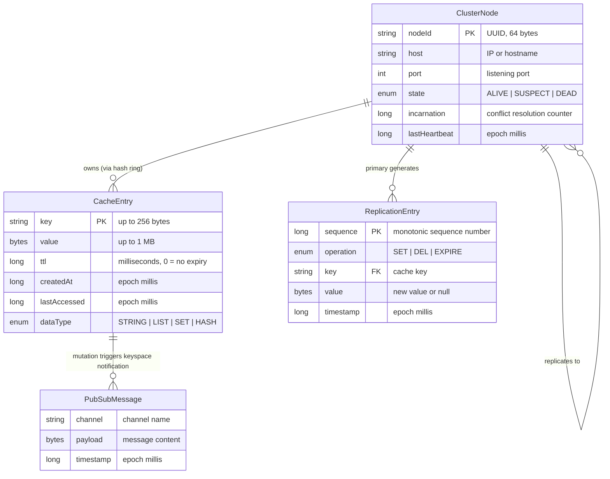
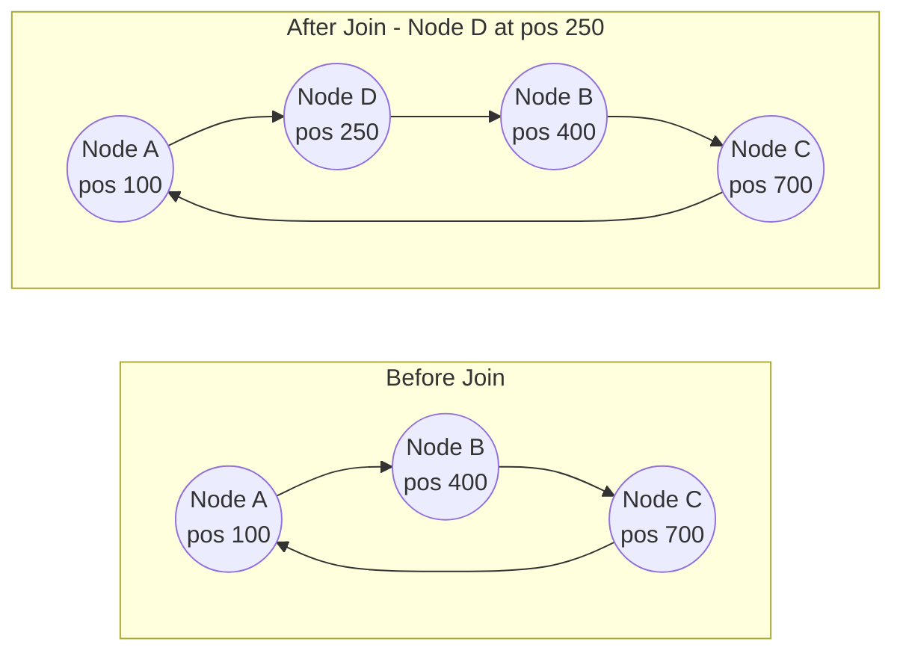
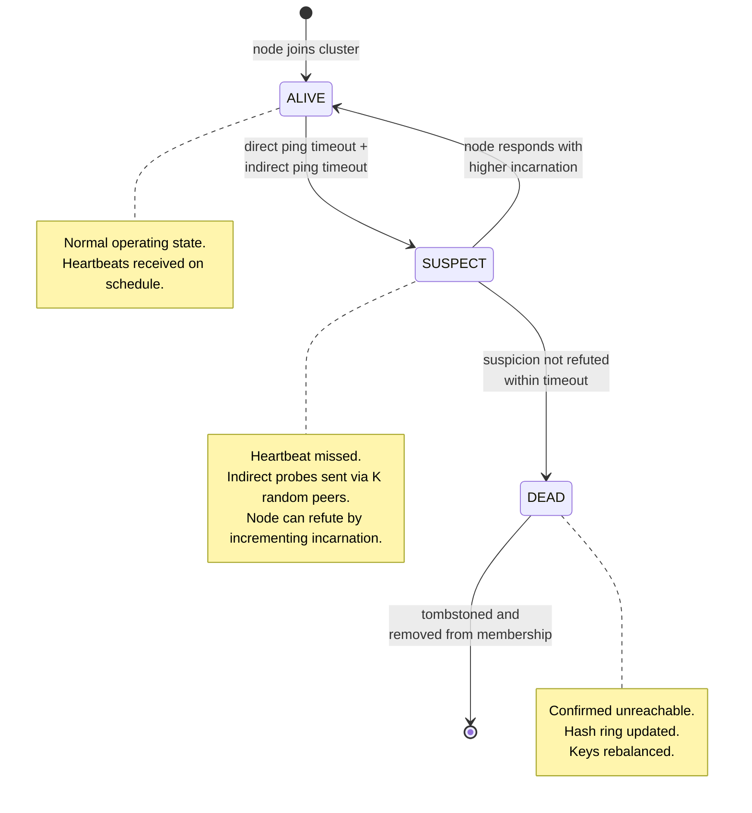
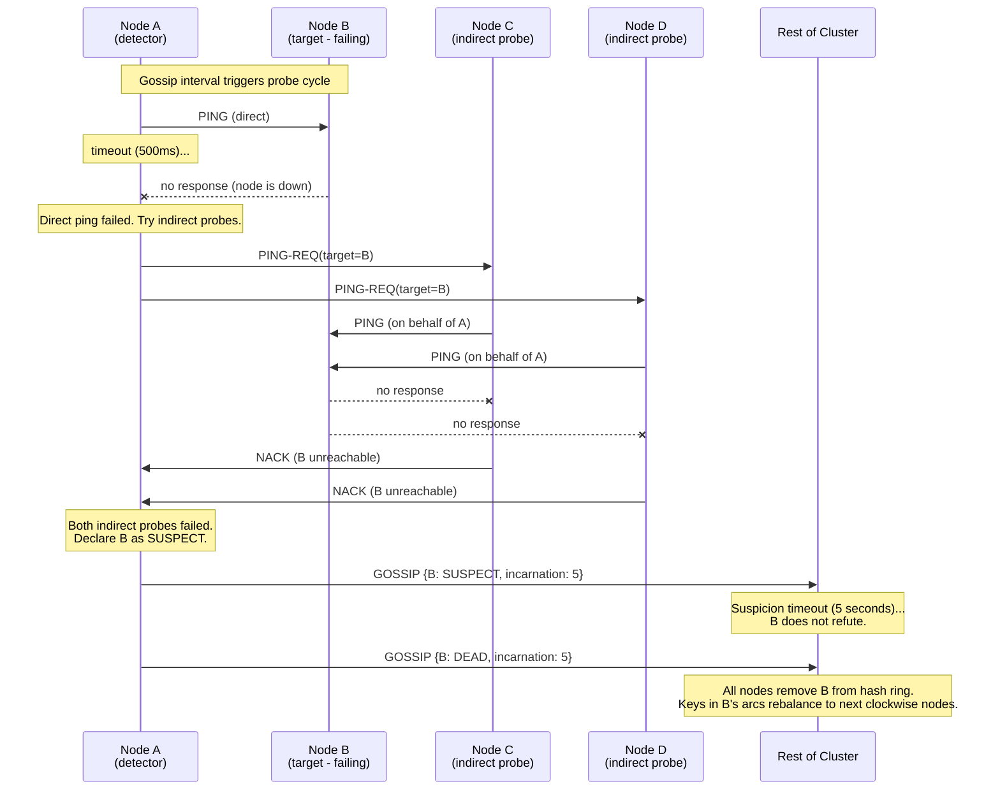
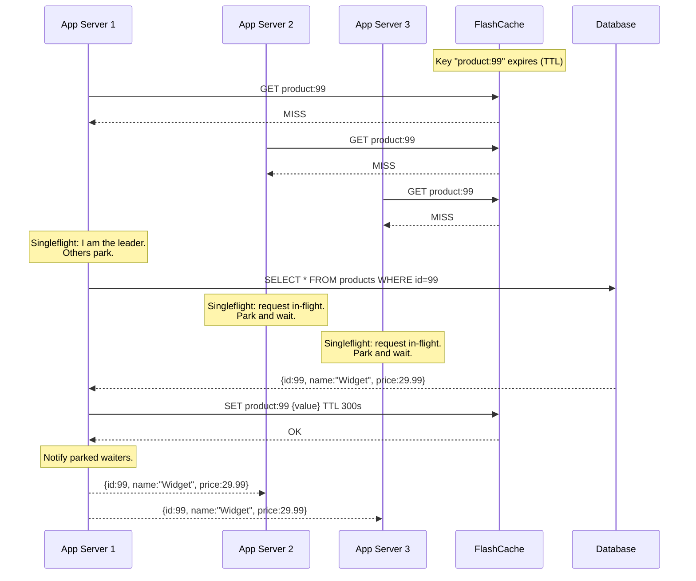

# FlashCache System Design

> A Redis-compatible distributed in-memory cache built from scratch in Java 21.
> This document follows the **Seven-Step Approach** from
> *Hacking the System Design Interview* by Stanley Chiang.

---

## Table of Contents

1. [Step 1: Clarify the Problem and Scope the Use Cases](#step-1-clarify-the-problem-and-scope-the-use-cases)
2. [Step 2: Define the Data Models](#step-2-define-the-data-models)
3. [Step 3: Back-of-the-Envelope Estimates](#step-3-back-of-the-envelope-estimates)
4. [Step 4: High-Level System Design](#step-4-high-level-system-design)
5. [Step 5: Design Components in Detail](#step-5-design-components-in-detail--deep-dive-consistent-hash-ring--swim-gossip-cluster)
6. [Step 6: Service Definitions, APIs, Interfaces](#step-6-service-definitions-apis-interfaces)
7. [Step 7: Scaling Problems and Bottlenecks](#step-7-scaling-problems-and-bottlenecks)

---

## Step 1: Clarify the Problem and Scope the Use Cases

### Problem Statement

> *"Design a distributed in-memory cache system similar to Redis that supports
> multiple wire protocols, horizontal sharding, automatic failure detection,
> and real-time pub/sub -- all implemented from first principles with zero
> framework dependencies."*

Modern web applications depend on a low-latency caching tier between the
application layer and the persistent data store. Redis is the de-facto standard,
but it is a black box: teams deploy it without understanding the protocol
parsing, the eviction mechanics, the cluster gossip, or the replication log
beneath. FlashCache exists to answer the question *"What does it actually take
to build this from scratch?"* while remaining wire-compatible with existing
Redis clients.

### Use Cases

| # | Use Case | Priority |
|---|----------|----------|
| UC-1 | **GET / SET with sub-millisecond latency** -- Application servers read and write cached key-value pairs over RESP, HTTP/1.1, HTTP/2, or WebSocket. | P0 |
| UC-2 | **TTL-based expiry** -- Keys expire automatically after a configurable time-to-live; the cache reclaims memory without client intervention. | P0 |
| UC-3 | **LRU eviction under memory pressure** -- When the cache reaches its configured maximum size, the least-recently-used entry is evicted in O(1) time. | P0 |
| UC-4 | **Pub/Sub with channel and glob-pattern subscriptions** -- Publishers push messages to named channels; subscribers receive them in real time, including over WebSocket for browser clients. | P1 |
| UC-5 | **Keyspace notifications** -- Subscribers are notified when specific cache mutations occur (set, delete, expire, evict) without polling. | P1 |
| UC-6 | **Cluster mode with consistent-hash sharding** -- Data is partitioned across N nodes using a consistent hash ring with virtual nodes; adding or removing a node rebalances only 1/N of the keys. | P1 |
| UC-7 | **Automatic failure detection via SWIM gossip** -- Nodes detect peer failures through a protocol that distinguishes ALIVE, SUSPECT, and DEAD states without a central coordinator. | P1 |
| UC-8 | **Primary-replica replication** -- Each shard has one or more replicas that receive a sequence-numbered replication log for fault tolerance. | P2 |
| UC-9 | **Multi-protocol access** -- The same cache is accessible over RESP (redis-cli, Jedis, Lettuce), HTTP/1.1 (curl), HTTP/2 (binary framing + HPACK), and WebSocket (browser push). | P0 |
| UC-10 | **TLS termination** -- All protocols support TLS encryption inline on the NIO path via SSLEngine, with no external TLS proxy required. | P2 |

### Functional Requirements

- **FR-1**: Parse and respond to the RESP wire protocol so that any standard
  Redis client (Jedis, Lettuce, redis-py, redis-cli) can connect without
  modification.
- **FR-2**: Support four data types: strings, lists, sets, and hashes, with
  the standard Redis command subset for each (GET, SET, DEL, EXPIRE, LPUSH,
  LPOP, SADD, SMEMBERS, HSET, HGET, HGETALL).
- **FR-3**: Implement HTTP/1.1 REST endpoints for GET/SET/DEL operations as a
  secondary access path.
- **FR-4**: Implement HTTP/2 binary framing and HPACK header compression per
  RFC 7540 / RFC 7541 for high-performance HTTP access.
- **FR-5**: Implement WebSocket (RFC 6455) upgrade handshake and frame
  parsing for real-time pub/sub delivery to browser clients.
- **FR-6**: Support TTL on any key; expired keys are reaped by a background
  scheduler and fire keyspace notifications.
- **FR-7**: Implement pub/sub with both exact channel matching and glob-pattern
  matching (e.g., `news.*`, `user:*:events`).
- **FR-8**: In cluster mode, route keys to the correct shard via a consistent
  hash ring with configurable virtual nodes.
- **FR-9**: Detect node failures via SWIM gossip and rebalance the hash ring
  automatically.
- **FR-10**: Replicate writes from primary to replica nodes with
  sequence-based acknowledgment.

### Non-Functional Requirements

| Requirement | Target | Rationale |
|---|---|---|
| **Latency** | < 1 ms p99 for single-key GET/SET | Caching is only useful if it is faster than the backing store by orders of magnitude. |
| **Throughput** | 200K+ GET ops/sec, 180K+ SET ops/sec per node | Must handle high-QPS microservice traffic without becoming the bottleneck. |
| **Connections** | 10K+ concurrent connections per node | A single cache node may serve hundreds of application servers, each with connection pools. |
| **Fault tolerance** | Detect node failure within 3 gossip rounds (~seconds) | Stale routing to a dead node causes cascading timeouts in the application layer. |
| **Eviction overhead** | < 1 microsecond per eviction | Eviction is on the write path; if it blocks, write latency spikes under memory pressure. |
| **Zero external dependencies** | No Netty, no Jetty, no Spring, no Guava | The goal is to demonstrate first-principles implementation of every layer. |
| **Consistency** | Eventual consistency by default; tunable quorum for strong consistency | Most cache use cases tolerate stale reads; strong consistency is opt-in for critical paths. |

### Clarifying Questions (and Answers)

These are the questions an interviewer would expect a candidate to ask before
diving into the design:

1. **Single node or multi-node?**
   Both. The system starts as a standalone cache and scales horizontally via
   cluster mode with consistent-hash sharding.

2. **What consistency model?**
   Eventual consistency by default (async replication). Strong consistency is
   available via configurable write quorum (wait for K replica acks before
   responding).

3. **Which eviction policy?**
   LRU (Least Recently Used), implemented as exact O(1) LRU via doubly-linked
   list + HashMap, not the approximate sampling approach Redis uses.

4. **Which protocols must be supported?**
   RESP (for Redis client compatibility), HTTP/1.1 (for REST access), HTTP/2
   (for binary-frame performance), and WebSocket (for real-time pub/sub push).

5. **Is persistence required?**
   No. FlashCache is a pure in-memory cache. Durability is the responsibility
   of the backing data store. This simplifies the design and keeps the focus
   on the networking and distributed systems layers.

6. **What is the expected cluster size?**
   Tens to low hundreds of nodes. The SWIM gossip protocol scales to this
   range with O(log N) convergence.

7. **How are clients routed to the correct shard?**
   Client-side routing (smart client) or server-side routing via ShardRouter.
   The consistent hash ring is exposed to clients that support cluster-aware
   mode (like Redis Cluster clients).

---

## Step 2: Define the Data Models

### Core Entities

The following models represent the primary data structures that FlashCache
operates on. Size estimates assume worst-case field sizes and are used for
the capacity calculations in Step 3.

#### CacheEntry

The fundamental unit of storage. One CacheEntry exists per cached key.

| Field | Type | Size | Description |
|---|---|---|---|
| `key` | String | up to 256 bytes | The cache key. Clients use this to GET/SET values. |
| `value` | byte[] | variable, up to 1 MB | The cached value. Stored as raw bytes; type interpretation is done at the DataTypes layer. |
| `ttl` | long | 8 bytes | Time-to-live in milliseconds. 0 means no expiry. |
| `createdAt` | long | 8 bytes | Epoch millis when the entry was first written. |
| `lastAccessed` | long | 8 bytes | Epoch millis of the last read or write; updated on every GET to drive LRU ordering. |
| `dataType` | enum | 1 byte | One of: STRING, LIST, SET, HASH. Determines which DataTypes handler interprets the value bytes. |

**Per-entry overhead:** ~289 bytes (key + metadata) + value size. For a typical
1 KB value, total entry size is ~1,313 bytes including object header and
pointer overhead in the JVM.

#### ClusterNode

Represents a peer in the cluster membership list, maintained by ClusterGossip.

| Field | Type | Size | Description |
|---|---|---|---|
| `nodeId` | String | 64 bytes | Unique identifier (UUID) for the node. |
| `host` | String | 64 bytes | IP address or hostname. |
| `port` | int | 4 bytes | Listening port for RESP and inter-node communication. |
| `state` | enum | 1 byte | ALIVE, SUSPECT, or DEAD. Drives the SWIM protocol state machine. |
| `incarnation` | long | 8 bytes | Monotonically increasing counter. A node increments its own incarnation to refute SUSPECT gossip. |
| `lastHeartbeat` | long | 8 bytes | Epoch millis of the last successful heartbeat from this node. |

**Per-node overhead:** ~149 bytes. A 100-node cluster's membership list fits
in ~15 KB of memory -- negligible.

#### ReplicationEntry

A single entry in the primary-to-replica replication log.

| Field | Type | Size | Description |
|---|---|---|---|
| `sequence` | long | 8 bytes | Monotonically increasing sequence number. Replicas track their high-water mark. |
| `operation` | enum | 1 byte | SET, DEL, or EXPIRE. The mutation type to replay on the replica. |
| `key` | String | up to 256 bytes | The cache key that was mutated. |
| `value` | byte[] | variable | The new value (null for DEL operations). |
| `timestamp` | long | 8 bytes | Epoch millis when the mutation occurred on the primary. |

**Per-entry overhead:** ~273 bytes + value. The replication log is bounded;
entries are garbage-collected after all replicas have acknowledged them.

#### PubSubMessage

A message published to a channel and delivered to all matching subscribers.

| Field | Type | Size | Description |
|---|---|---|---|
| `channel` | String | up to 128 bytes | The channel name (exact or glob pattern for matching). |
| `payload` | byte[] | variable | The message content. |
| `timestamp` | long | 8 bytes | Epoch millis when the message was published. |

### Entity Relationship Diagram



### Data Type Internals

FlashCache supports four Redis-compatible data types. Each is stored as the
`value` bytes in a CacheEntry and interpreted by the DataTypes handler:

| Type | Internal Representation | Key Operations |
|---|---|---|
| **STRING** | Raw byte array | GET, SET, APPEND, INCR, DECR |
| **LIST** | Java `LinkedList<byte[]>` serialized | LPUSH, RPUSH, LPOP, RPOP, LRANGE, LLEN |
| **SET** | Java `HashSet<byte[]>` serialized | SADD, SREM, SMEMBERS, SISMEMBER, SCARD |
| **HASH** | Java `HashMap<byte[], byte[]>` serialized | HSET, HGET, HDEL, HGETALL, HLEN |

---

## Step 3: Back-of-the-Envelope Estimates

### Scenario

A large-scale web application cache layer, comparable to Redis deployed at a
mid-size technology company. The cache sits between hundreds of application
servers and a relational database, absorbing the read-heavy workload.

### Traffic Estimates

| Metric | Per Node | Cluster (100 nodes) |
|---|---|---|
| Application server connections | 100 | 10,000 servers total |
| Concurrent connections per node | 10,000 | 1,000,000 |
| Operations per second | 200,000 | 20,000,000 |
| Read:Write ratio | 10:1 | 10:1 |
| Read ops/sec | ~182,000 | ~18,200,000 |
| Write ops/sec | ~18,000 | ~1,800,000 |

**Derivation:** Each of 10,000 application servers maintains a connection pool
of 100 connections. Load is distributed across 100 cache nodes via consistent
hashing, so each node handles ~100 connections from ~100 different application
servers = 10,000 concurrent connections. At 200K ops/sec per node (measured
benchmark), the cluster handles 20M ops/sec aggregate.

### Storage Estimates

| Metric | Per Node | Cluster (100 nodes) |
|---|---|---|
| Number of cached keys | 100,000,000 | 10,000,000,000 |
| Average value size | 1 KB | 1 KB |
| Raw data volume | 100 GB | 10 TB |
| Metadata overhead (~30%) | 30 GB | 3 TB |
| **Total RAM required** | **~130 GB** | **~13 TB** |

**Derivation of 30% overhead:**
- LRU doubly-linked list node: 2 pointers (16 bytes) + key reference (8 bytes) = 24 bytes per entry
- ConcurrentHashMap entry: hash (4 bytes) + key ref (8 bytes) + value ref (8 bytes) + next pointer (8 bytes) = 28 bytes per entry
- JVM object header: 16 bytes per CacheEntry object
- Total overhead per entry: ~68 bytes on a 1 KB value = ~6.8%. With the key
  (256 bytes worst case) included in overhead, the ratio rises to ~30%.

### Bandwidth Estimates

| Metric | Per Node | Cluster (100 nodes) |
|---|---|---|
| Avg request + response size | ~1 KB | ~1 KB |
| Throughput | ~200 MB/sec | ~20 GB/sec |
| Peak (2x average) | ~400 MB/sec | ~40 GB/sec |

**Network card requirement:** 10 Gbps NIC per node (10 Gbps = 1.25 GB/sec)
provides 3x headroom over peak throughput. Standard for modern data centers.

### Gossip Protocol Bandwidth

| Metric | Value |
|---|---|
| Gossip message size | ~200 bytes (node state + piggyback list) |
| Gossip fan-out per round | 3 peers |
| Gossip interval | 1 second |
| Per-node gossip bandwidth | 3 x 200 bytes = 600 bytes/sec |
| Cluster gossip bandwidth (100 nodes) | 60 KB/sec |

Gossip bandwidth is negligible -- less than 0.00003% of data-plane throughput.

### Replication Bandwidth

| Metric | Value |
|---|---|
| Write ops/sec per node | ~18,000 |
| Average replication entry size | ~1.3 KB (273 bytes overhead + 1 KB value) |
| Replication throughput per primary | ~23 MB/sec |
| With 1 replica per shard | ~23 MB/sec additional per node |

Replication adds ~12% bandwidth overhead on top of client-facing throughput.
Acceptable within the 10 Gbps NIC budget.

### Latency Budget

| Operation | Target | Breakdown |
|---|---|---|
| RESP GET (cache hit) | < 0.5 ms | NIO read (50 us) + RESP decode (10 us) + HashMap lookup (0.1 us) + LRU update (0.5 us) + RESP encode (10 us) + NIO write (50 us) |
| RESP SET | < 0.8 ms | Same as GET + eviction check (0.5 us) + async replication enqueue (5 us) |
| Hash ring lookup | < 1 us | ConcurrentSkipListMap.ceilingEntry: O(log N) where N = 15,000 virtual nodes |
| LRU eviction | < 1 us | Unlink tail node + remove from HashMap: O(1) |
| TLS handshake (one-time) | < 2 ms | SSLEngine wrap/unwrap on NIO path; amortized to zero over connection lifetime |

---

## Step 4: High-Level System Design

### Unscaled Design (Single Node)

The simplest possible deployment: a single cache server between the
application tier and the database.

```mermaid
graph TD
    subgraph Application Tier
        A1[App Server 1]
        A2[App Server 2]
        A3[App Server N]
    end

    subgraph Cache Tier
        CS[Single FlashCache Node<br/>CacheEngine + LRU + TTL]
    end

    subgraph Data Tier
        DB[(Primary Database)]
    end

    A1 -->|GET/SET| CS
    A2 -->|GET/SET| CS
    A3 -->|GET/SET| CS
    CS -.->|cache miss fallback| DB

    style CS fill:#1a2235,stroke:#E67E22,stroke-width:2px
```



**Why this does not scale:**

1. **Memory ceiling.** A single JVM is limited to the RAM of one machine
   (typically 128-256 GB). With 100M keys at 1 KB each, a single node can
   hold ~100 GB of data. Exceeding this requires either larger (expensive)
   hardware or a different approach.

2. **Single point of failure.** If the cache node crashes, every application
   server simultaneously falls through to the database, causing a thundering
   herd that can overwhelm the data tier.

3. **No horizontal scaling.** Throughput is capped at ~200K ops/sec. If the
   application grows to require 2M ops/sec, there is no path forward without
   architectural change.

4. **No read scaling.** Every read hits the same node. There are no replicas
   to distribute read load.

### Scaled Design (Distributed Cluster)

The production architecture distributes data across multiple nodes using
consistent hashing, detects failures via SWIM gossip, replicates data to
replica nodes, and exposes the cache through multiple wire protocols.

```mermaid
graph TD
    subgraph Clients
        RC[Redis Clients<br/>RESP protocol]
        HC[HTTP/1.1 Clients<br/>REST API]
        H2[HTTP/2 Clients<br/>binary frames + HPACK]
        WS[WebSocket Clients<br/>real-time pub/sub]
    end

    subgraph Protocol Router
        TLS[TLSManager<br/>SSLEngine termination]
        RESP[RESPDecoder<br/>RESPEncoder]
        HTTP[HttpParser<br/>HTTP/1.1]
        HTTP2H[Http2Handler<br/>RFC 7540 + HPACK]
        WSH[WebSocketHandler<br/>RFC 6455]
    end

    subgraph NIO Server Layer
        NIO[NIOServer<br/>Java NIO Selector<br/>on virtual thread]
        PL[PipelineHandler<br/>protocol detection + routing]
        CM[ConnectionManager<br/>idle timeout + cleanup]
    end

    subgraph Shard Routing
        SR[ShardRouter<br/>key-to-node mapping]
        CHR[ConsistentHashRing<br/>SHA-256, 150 virtual nodes<br/>ConcurrentSkipListMap]
    end

    subgraph Node 1 - Primary
        CE1[CacheEngine<br/>ConcurrentHashMap]
        LRU1[LRUEviction<br/>O-1 doubly-linked list]
        TTL1[TTLScheduler]
        DT1[DataTypes<br/>string/list/set/hash]
    end

    subgraph Node 2 - Primary
        CE2[CacheEngine]
        LRU2[LRUEviction]
        TTL2[TTLScheduler]
        DT2[DataTypes]
    end

    subgraph Node 3 - Primary
        CE3[CacheEngine]
        LRU3[LRUEviction]
        TTL3[TTLScheduler]
        DT3[DataTypes]
    end

    subgraph Replicas
        R1A[Node 1 Replica A]
        R2A[Node 2 Replica A]
        R3A[Node 3 Replica A]
    end

    subgraph Cluster Coordination
        GS[ClusterGossip<br/>SWIM Protocol<br/>ALIVE / SUSPECT / DEAD]
        REP[Replication<br/>sequence-based log<br/>primary to replica]
    end

    subgraph Pub/Sub
        PSE[PubSubEngine<br/>channel + glob patterns]
        KN[KeyspaceNotify<br/>mutation events]
        WSB[WebSocketBroadcast<br/>push to browsers]
    end

    RC --> TLS
    HC --> TLS
    H2 --> TLS
    WS --> TLS

    TLS --> RESP
    TLS --> HTTP
    TLS --> HTTP2H
    TLS --> WSH

    RESP --> NIO
    HTTP --> NIO
    HTTP2H --> NIO
    WSH --> NIO

    NIO --> PL --> CM
    PL --> SR --> CHR

    CHR --> CE1
    CHR --> CE2
    CHR --> CE3

    CE1 --> LRU1
    CE1 --> TTL1
    CE1 --> DT1

    CE1 --> REP --> R1A
    CE2 --> REP
    REP --> R2A
    CE3 --> REP
    REP --> R3A

    GS -.->|heartbeat| CE1
    GS -.->|heartbeat| CE2
    GS -.->|heartbeat| CE3
    GS -.->|heartbeat| R1A
    GS -.->|heartbeat| R2A
    GS -.->|heartbeat| R3A

    CE1 --> PSE
    CE2 --> PSE
    CE3 --> PSE
    PSE --> KN
    PSE --> WSB

    style CHR fill:#1a2235,stroke:#E67E22,stroke-width:2px
    style GS fill:#1a2235,stroke:#E67E22,stroke-width:2px
    style NIO fill:#1a2235,stroke:#27ae60,stroke-width:2px
```



**How the scaled design addresses single-node limitations:**

| Single-Node Problem | Scaled Solution |
|---|---|
| Memory ceiling (100 GB) | Data sharded across N nodes; 100 nodes = 10 TB capacity |
| Single point of failure | Primary-replica replication; SWIM detects failures in < 3 rounds |
| Throughput cap (200K ops/sec) | Linear horizontal scaling; 100 nodes = 20M ops/sec |
| No read scaling | Replicas serve read traffic; read throughput multiplied by replica count |

### Request Flow (GET operation)

1. Client sends a RESP-encoded `GET foo` command over a TLS-encrypted TCP connection.
2. `TLSManager` decrypts the TLS record and passes plaintext bytes to `NIOServer`.
3. `PipelineHandler` detects the RESP protocol prefix and routes to `RESPDecoder`.
4. `RESPDecoder` parses the RESP array: `["GET", "foo"]`.
5. `ShardRouter` hashes `"foo"` with SHA-256 and calls `ConsistentHashRing.getNode("foo")`.
6. `ConsistentHashRing` does a `ceilingEntry()` lookup on the skip list map to find the owning node.
7. If the owning node is the local node, `CacheEngine.get("foo")` is called directly.
8. If the owning node is a remote node, the request is forwarded over the inter-node RESP connection.
9. `CacheEngine` looks up `"foo"` in `ConcurrentHashMap`, updates `lastAccessed`, and calls `LRUEviction.moveToHead()`.
10. `RESPEncoder` serializes the value into a RESP bulk string.
11. `TLSManager` encrypts the response and writes it to the NIO channel.

---

## Step 5: Design Components in Detail -- Deep Dive: Consistent Hash Ring + SWIM Gossip Cluster

This section dives deep into the two most complex components of the distributed
layer: the consistent hash ring that determines data placement, and the SWIM
gossip protocol that detects and disseminates membership changes.

### 5.1 Consistent Hash Ring

#### The Problem with Naive Sharding

The simplest approach to distributing keys across N nodes is modulo hashing:
`node = hash(key) % N`. This fails catastrophically when nodes are added or
removed: if N changes from 10 to 11, approximately 90% of keys remap to
different nodes, causing a near-total cache miss storm.

#### How Consistent Hashing Solves It

Consistent hashing maps both **nodes** and **keys** onto the same circular
hash space (a ring of positions from 0 to 2^64 - 1). A key is assigned to the
first node encountered when walking clockwise from the key's hash position.

When a node is added, only the keys in the arc between the new node and its
predecessor need to move -- approximately 1/N of the total keys. When a node
is removed, only its keys (also ~1/N) shift to the next clockwise node.

#### FlashCache's Implementation

`ConsistentHashRing` uses **SHA-256** to hash both node identifiers and cache
keys into 64-bit positions (the first 8 bytes of the SHA-256 digest). The ring
is stored in a `ConcurrentSkipListMap<Long, String>` where the key is the hash
position and the value is the node identifier.

**Virtual Nodes:** Each physical node is represented by 150 virtual nodes on
the ring. Virtual node `i` for node `N` is hashed as `SHA-256(N + "#" + i)`.
This serves two critical purposes:

1. **Load balancing.** Without virtual nodes, the distribution of keys across
   nodes depends on where the node identifiers happen to hash -- which can be
   extremely uneven (some nodes get 5x the traffic). With 150 virtual nodes
   per physical node, the standard deviation of key distribution drops below 5%.

2. **Smooth rebalancing.** When a node joins or leaves, its 150 virtual nodes
   are scattered across the ring. The keys that move are spread across many
   arcs rather than concentrated in one region, preventing any single node
   from absorbing a large burst of rebalancing traffic.

**Lookup Algorithm:**

```java
public String getNode(String key) {
    long hash = hash(key);                          // SHA-256 -> first 8 bytes -> long
    Map.Entry<Long, String> entry = ring.ceilingEntry(hash);  // O(log N)
    if (entry == null) {
        entry = ring.firstEntry();                  // wrap around the ring
    }
    return entry.getValue();                        // physical node ID
}
```

`ceilingEntry()` on a `ConcurrentSkipListMap` is O(log N) where N is the
number of virtual nodes. With 100 physical nodes x 150 virtual nodes = 15,000
entries, the lookup traverses at most ~14 levels of the skip list -- completing
in under 1 microsecond.

**Node Join (rebalancing):**



When Node D joins at position 250, only keys in the arc (100, 250] move from
Node B to Node D. Keys in arcs (250, 400], (400, 700], and (700, 100] are
unaffected. With 150 virtual nodes per physical node, this effect is
distributed across 150 small arcs.

**Concurrency Safety:**

`ConcurrentSkipListMap` provides lock-free reads and fine-grained locking for
writes. This means:
- GET operations (hash ring lookups) never block -- thousands of concurrent
  lookups proceed without contention.
- Node join/leave operations (ring mutations) are serialized per-entry but do
  not block ongoing lookups.
- No global lock is ever held on the ring.

#### Performance Characteristics

| Operation | Complexity | Measured Latency |
|---|---|---|
| Key lookup (`getNode`) | O(log N), N = virtual nodes | < 1 us |
| Node join (add 150 virtual nodes) | O(150 * log N) | < 500 us |
| Node leave (remove 150 virtual nodes) | O(150 * log N) | < 500 us |
| Key rebalancing on join/leave | O(K/N) keys moved, K = total keys | depends on data volume |

### 5.2 SWIM Gossip Protocol

#### Why Gossip Instead of a Central Coordinator

A central membership coordinator (like ZooKeeper or etcd) introduces a single
point of failure and a bottleneck for membership operations. The SWIM (Scalable
Weakly-consistent Infection-style Process Group Membership) protocol provides
decentralized failure detection with the following properties:

- **No single point of failure.** Every node participates in detection.
- **O(1) per-probe overhead.** Each probe cycle pings one target node.
- **O(log N) convergence.** Membership changes propagate to all nodes in
  O(log N) gossip rounds via piggybacked dissemination.
- **Bounded false-positive rate.** The SUSPECT intermediate state and
  indirect probing reduce false failure declarations.

#### State Machine

Each node in the membership list is in one of three states:



#### The Probe Cycle

Every gossip interval (default: 1 second), each node executes one probe cycle:

1. **Select target.** Pick a random peer from the membership list.
2. **Direct ping.** Send a PING message to the target. If the target responds
   with an ACK within the timeout, the target is confirmed ALIVE. Done.
3. **Indirect ping.** If the direct ping times out, select K random peers
   (default: 3) and ask each to ping the target on our behalf. If any of
   them receive an ACK from the target, the target is ALIVE. Done.
4. **Declare SUSPECT.** If both direct and indirect pings fail, mark the
   target as SUSPECT in the local membership list. Piggyback this state
   change on outgoing gossip messages.
5. **Declare DEAD.** If the target remains SUSPECT for a configurable timeout
   (default: 5 seconds) without refuting the suspicion, mark it DEAD.
   Piggyback the DEAD state on gossip messages. Update the consistent hash
   ring to remove the dead node.

#### Incarnation-Based Conflict Resolution

The incarnation number is the key mechanism that prevents false positives.
Consider this scenario:

- Node A suspects Node B (perhaps due to a transient network issue).
- Node A gossips `{B: SUSPECT, incarnation: 5}` to the cluster.
- Node B is actually alive. When Node B receives the SUSPECT gossip about
  itself, it increments its incarnation to 6 and broadcasts
  `{B: ALIVE, incarnation: 6}`.
- All nodes that receive both messages apply the rule: **higher incarnation
  wins**. Since 6 > 5, Node B's ALIVE message overrides the SUSPECT.

This mechanism ensures that a node can always defend itself against false
suspicion, as long as it is actually reachable by at least one peer that will
relay the gossip.

**Conflict Resolution Rules:**

| Received State | Local State | Received Incarnation vs. Local | Action |
|---|---|---|---|
| ALIVE | ALIVE | Higher | Update incarnation |
| ALIVE | SUSPECT | Higher | Override to ALIVE |
| ALIVE | SUSPECT | Equal or lower | Ignore (suspicion stands) |
| SUSPECT | ALIVE | Higher or equal | Override to SUSPECT |
| SUSPECT | ALIVE | Lower | Ignore |
| DEAD | Any | Any | Override to DEAD (permanent) |

#### Node Failure Detection Sequence



#### Dissemination via Piggybacking

SWIM does not use dedicated gossip messages for membership changes. Instead,
state changes are piggybacked on the PING/ACK messages that are already being
exchanged during probe cycles. Each node maintains a **dissemination queue**
of recent state changes. When sending a PING or ACK, the node attaches up to
`lambda * log(N)` entries from the queue (where lambda is a configurable
protocol parameter, typically 3).

This piggybacking approach means:
- **Zero additional network messages** for dissemination.
- **O(log N) rounds** to propagate a change to all nodes. With 100 nodes,
  a membership change reaches every node in ~7 rounds (7 seconds at 1-second
  intervals).
- **Bounded message size.** Each PING/ACK carries at most a small number of
  piggybacked entries, keeping message sizes under 1 KB.

### 5.3 Primary-Replica Replication

#### Replication Model

FlashCache uses **primary-replica** replication with a sequence-based
replication log. For each shard (determined by the consistent hash ring), one
node is the **primary** and one or more nodes are **replicas**.

| Aspect | Design Choice |
|---|---|
| Direction | Unidirectional: primary to replica |
| Ordering | Sequence-number-based; replicas apply entries in order |
| Acknowledgment | Replica sends ACK with its high-water-mark sequence number |
| Default mode | Async (primary responds to client before replicas ACK) |
| Strong mode | Sync (primary waits for K replica ACKs before responding) |

#### Replication Flow

1. Client sends `SET foo bar` to the primary.
2. Primary writes to its local `CacheEngine`.
3. Primary appends `{seq: 42, op: SET, key: "foo", value: "bar"}` to the
   replication log.
4. Primary sends the replication entry to all replicas.
5. **(Async mode):** Primary responds `OK` to the client immediately.
6. **(Sync mode):** Primary waits for ACK from K replicas, then responds `OK`.
7. Each replica applies the entry to its local `CacheEngine` and sends
   `ACK {seq: 42}` back to the primary.
8. Primary tracks per-replica lag: `primary.seq - replica.ackSeq`.

#### Replica Promotion

When SWIM gossip declares a primary node DEAD:

1. The consistent hash ring removes the dead node's virtual nodes.
2. Keys that were owned by the dead node are now mapped to the next clockwise
   node -- which is the replica (by design, replicas are placed at the next
   positions on the ring).
3. The replica promotes itself to primary for those key ranges.
4. The replica begins accepting writes and generating replication entries
   for its own replicas.

---

## Step 6: Service Definitions, APIs, Interfaces

### CacheService

The primary data-plane service for reading and writing cached values.

```java
public interface CacheService {

    /**
     * Retrieve a cached value by key.
     *
     * @param request contains the key to look up
     * @return the value and metadata, or a cache-miss indicator
     */
    GetResponse get(GetRequest request);

    /**
     * Store a key-value pair with optional TTL.
     *
     * @param request contains key, value, dataType, and optional TTL
     * @return acknowledgment with the assigned TTL
     */
    SetResponse set(SetRequest request);

    /**
     * Remove a key from the cache.
     *
     * @param request contains the key to delete
     * @return whether the key existed and was deleted
     */
    DeleteResponse delete(DeleteRequest request);

    /**
     * Set or update the TTL on an existing key.
     *
     * @param request contains the key and new TTL in milliseconds
     * @return whether the key exists and the TTL was applied
     */
    TTLResponse setTTL(TTLRequest request);

    /**
     * Retrieve multiple keys in a single round-trip.
     *
     * @param request contains a list of keys
     * @return a map of key to value for all keys that exist
     */
    MultiGetResponse multiGet(MultiGetRequest request);
}
```

**Request and Response Structures:**

```java
// --- GET ---
record GetRequest(
    String key                    // cache key, max 256 bytes
) {}

record GetResponse(
    boolean found,                // true if key exists and is not expired
    byte[] value,                 // null if not found
    DataType dataType,            // STRING, LIST, SET, or HASH
    long remainingTTL             // milliseconds until expiry, -1 if no TTL
) {}

// --- SET ---
record SetRequest(
    String key,                   // cache key, max 256 bytes
    byte[] value,                 // value payload, max 1 MB
    DataType dataType,            // STRING, LIST, SET, or HASH
    long ttlMillis,               // 0 = no expiry
    boolean ifNotExists           // NX flag: only set if key does not exist
) {}

record SetResponse(
    boolean written,              // false if NX was set and key already existed
    long assignedTTL              // the TTL that was applied
) {}

// --- DELETE ---
record DeleteRequest(
    String key                    // cache key to delete
) {}

record DeleteResponse(
    boolean existed               // true if the key was present and removed
) {}

// --- TTL ---
record TTLRequest(
    String key,                   // cache key
    long ttlMillis                // new TTL in milliseconds
) {}

record TTLResponse(
    boolean applied,              // true if key exists and TTL was set
    long previousTTL              // the old TTL, -1 if none
) {}

// --- MULTI GET ---
record MultiGetRequest(
    List<String> keys             // list of cache keys
) {}

record MultiGetResponse(
    Map<String, byte[]> values,   // key -> value for all found keys
    List<String> misses           // keys that were not found
) {}
```

### ClusterService

The control-plane service for cluster membership and rebalancing.

```java
public interface ClusterService {

    /**
     * Request to join the cluster. The joining node provides its identity
     * and receives the current membership list and hash ring state.
     *
     * @param request contains the joining node's identity
     * @return the current membership list and ring snapshot
     */
    JoinResponse join(JoinRequest request);

    /**
     * Process a heartbeat/gossip message from a peer.
     * Contains piggybacked membership state changes.
     *
     * @param request contains the sender's membership updates
     * @return this node's membership updates (bi-directional gossip)
     */
    HeartbeatResponse heartbeat(HeartbeatRequest request);

    /**
     * Trigger a rebalance operation. Called when the hash ring changes
     * (node join or leave) and keys need to migrate.
     *
     * @param request contains the old and new ring state
     * @return the number of keys migrated
     */
    RebalanceResponse rebalance(RebalanceRequest request);

    /**
     * Query the current state of a cluster node.
     *
     * @param nodeId the node to query
     * @return the node's state, incarnation, and last heartbeat time
     */
    NodeStateResponse getNodeState(String nodeId);
}
```

**Request and Response Structures:**

```java
// --- JOIN ---
record JoinRequest(
    String nodeId,                // UUID of the joining node
    String host,                  // IP or hostname
    int port                      // listening port
) {}

record JoinResponse(
    boolean accepted,             // false if cluster is in a state that rejects joins
    List<ClusterNode> members,    // current membership list
    Map<Long, String> ringState   // hash position -> node ID (the full ring)
) {}

// --- HEARTBEAT ---
record HeartbeatRequest(
    String senderNodeId,          // who is sending this heartbeat
    long senderIncarnation,       // sender's current incarnation number
    List<MembershipUpdate> updates // piggybacked state changes
) {}

record MembershipUpdate(
    String nodeId,                // the node this update is about
    NodeState state,              // ALIVE, SUSPECT, or DEAD
    long incarnation              // incarnation number for conflict resolution
) {}

record HeartbeatResponse(
    List<MembershipUpdate> updates // this node's piggybacked state changes
) {}

// --- REBALANCE ---
record RebalanceRequest(
    String triggerNodeId,         // node that triggered the rebalance (joined or left)
    RebalanceType type,           // JOIN or LEAVE
    Map<Long, String> oldRing,    // ring state before the change
    Map<Long, String> newRing     // ring state after the change
) {}

enum RebalanceType { JOIN, LEAVE }

record RebalanceResponse(
    long keysMigrated,            // number of keys moved
    long bytesTransferred,        // total bytes of migrated values
    long durationMillis           // how long the rebalance took
) {}

// --- NODE STATE ---
record NodeStateResponse(
    String nodeId,
    NodeState state,              // ALIVE, SUSPECT, or DEAD
    long incarnation,
    long lastHeartbeatMillis,
    long uptimeMillis
) {}
```

### PubSubService

The messaging service for publish/subscribe and keyspace notifications.

```java
public interface PubSubService {

    /**
     * Subscribe to one or more channels. Supports exact names and glob patterns.
     *
     * @param request contains channel names/patterns and the subscriber connection
     * @return confirmation with the number of active subscriptions
     */
    SubscribeResponse subscribe(SubscribeRequest request);

    /**
     * Unsubscribe from one or more channels.
     *
     * @param request contains channel names/patterns to unsubscribe from
     * @return confirmation with the remaining subscription count
     */
    UnsubscribeResponse unsubscribe(UnsubscribeRequest request);

    /**
     * Publish a message to a channel. All subscribers (exact and pattern match)
     * receive the message.
     *
     * @param request contains the channel name and message payload
     * @return the number of subscribers that received the message
     */
    PublishResponse publish(PublishRequest request);

    /**
     * Subscribe to keyspace notifications for specific mutation events.
     *
     * @param request contains the event types to listen for (SET, DEL, EXPIRE, EVICT)
     * @return confirmation of the keyspace subscription
     */
    KeyspaceSubscribeResponse subscribeKeyspace(KeyspaceSubscribeRequest request);
}
```

**Request and Response Structures:**

```java
// --- SUBSCRIBE ---
record SubscribeRequest(
    List<String> channels,        // channel names or glob patterns (e.g., "news.*")
    String connectionId           // the subscriber's connection identifier
) {}

record SubscribeResponse(
    int activeSubscriptions       // total active subscriptions for this connection
) {}

// --- UNSUBSCRIBE ---
record UnsubscribeRequest(
    List<String> channels,        // channels to unsubscribe from
    String connectionId
) {}

record UnsubscribeResponse(
    int remainingSubscriptions
) {}

// --- PUBLISH ---
record PublishRequest(
    String channel,               // target channel name
    byte[] payload                // message content
) {}

record PublishResponse(
    int recipientCount            // number of subscribers that received the message
) {}

// --- KEYSPACE SUBSCRIBE ---
record KeyspaceSubscribeRequest(
    List<KeyspaceEvent> events,   // SET, DEL, EXPIRE, EVICT
    String keyPattern,            // glob pattern for keys to watch (e.g., "user:*")
    String connectionId
) {}

enum KeyspaceEvent { SET, DEL, EXPIRE, EVICT }

record KeyspaceSubscribeResponse(
    int activeKeyspaceSubscriptions
) {}
```

### Protocol Detection and Routing

The `PipelineHandler` detects which protocol a client is using based on the
first bytes received, then routes to the appropriate decoder:

| First Bytes | Protocol | Handler |
|---|---|---|
| `*` (0x2A) or `$` (0x24) | RESP | RESPDecoder |
| `PRI * HTTP/2.0` (preface) | HTTP/2 | Http2Handler |
| `GET ` / `POST ` / `PUT ` / `DELETE ` | HTTP/1.1 | HttpParser |
| After HTTP/1.1 upgrade with `Sec-WebSocket-Key` | WebSocket | WebSocketHandler |

---

## Step 7: Scaling Problems and Bottlenecks

### Problem 1: Hot Key

**Scenario:** A single cache key becomes extremely popular. For example,
during a viral event, millions of users request the same session token or
trending content key. All requests for this key hash to the same shard,
overwhelming that node while other nodes sit idle.

**Impact:** The hot shard's CPU saturates at 100%. Latency spikes from < 1 ms
to 50+ ms. Connection queues fill up. Clients begin timing out. The problem
cannot be solved by adding more nodes -- the key always hashes to one shard.

**Solutions:**

| Solution | How It Works | Trade-off |
|---|---|---|
| **Read replicas for hot keys** | Detect hot keys (counter threshold) and promote their replicas to serve reads. Route read requests for hot keys to any replica, not just the primary. | Requires hot-key detection logic; replicas may serve slightly stale data. |
| **Client-side L1 cache** | Each application server maintains a small local cache (e.g., Caffeine with 1-second TTL). Hot keys are served from local memory without hitting the cache cluster. | Stale data window equals local TTL. Client must handle invalidation. |
| **Request coalescing (singleflight)** | When multiple concurrent requests arrive for the same key, the first request is executed and all others wait for its result. Only one request reaches the cache engine per deduplication window. | Adds latency for coalesced requests (they wait for the first to complete). Requires a concurrent map of in-flight keys. |

**Recommended approach:** Layer all three. Client-side L1 absorbs the vast
majority of hot-key reads. For the requests that reach the cache cluster,
singleflight deduplicates concurrent requests for the same key. Read replicas
provide additional capacity if the key is hot enough to overwhelm even
deduplicated traffic.

```mermaid
graph TD
    subgraph Application Server
        REQ[Incoming Request<br/>GET trending:post:123]
        L1[L1 Local Cache<br/>Caffeine, 1s TTL]
        SF[Singleflight<br/>deduplicate in-flight]
    end

    subgraph Cache Cluster
        P[Primary Shard<br/>Node 7]
        R1[Read Replica A<br/>Node 12]
        R2[Read Replica B<br/>Node 19]
    end

    REQ --> L1
    L1 -->|HIT| REQ
    L1 -->|MISS| SF
    SF -->|first request| P
    SF -->|read routing| R1
    SF -->|read routing| R2
    SF -->|coalesced requests wait| SF

    style L1 fill:#1a2235,stroke:#27ae60,stroke-width:2px
    style SF fill:#1a2235,stroke:#E67E22,stroke-width:2px
```



### Problem 2: Thundering Herd on Cache Miss

**Scenario:** A popular key expires (TTL runs out) or is evicted. Simultaneously,
hundreds of application servers discover the cache miss and all send requests
to the backing database to fetch the value. The database is overwhelmed by the
sudden burst of identical queries.

**Impact:** Database CPU spikes. Query latency increases by 10-100x. The
database connection pool is exhausted. Other queries (for different keys) are
blocked. In the worst case, the database goes down, causing a cascading failure.

**Solutions:**

| Solution | How It Works | Trade-off |
|---|---|---|
| **Singleflight pattern** | At the cache client layer, the first request for a missing key initiates a database fetch. All subsequent requests for the same key during the fetch window are parked and receive the same result when the fetch completes. | Slightly increased latency for parked requests. Requires distributed coordination if running across multiple application servers (or a per-server singleflight). |
| **Probabilistic early expiration** | Instead of expiring at exactly TTL, each access to a key computes: `if (now - fetchTime) > TTL * (1 - beta * ln(random()))` then refresh. This causes a small fraction of requests to trigger a refresh before the actual TTL, preventing a cliff. | Some wasted fetches (refreshing before necessary). beta parameter needs tuning. |
| **Lease-based cache miss** | When a cache miss occurs, the cache server issues a short-lived "lease" (token) to the first requester, granting permission to fetch from the database. Other requesters for the same key are told to wait or retry. Only the lease-holder can populate the cache. | Adds complexity to the cache protocol. Lease expiry must be short enough to avoid deadlocks if the lease-holder crashes. |

**Recommended approach:** Singleflight at the client SDK layer (per application
server) combined with probabilistic early expiration at the cache server layer.
This prevents the thundering herd without requiring lease coordination.



### Problem 3: Network Partition in Gossip (Split-Brain)

**Scenario:** A network partition divides the cluster into two halves.
Nodes in Partition A cannot communicate with nodes in Partition B. Each
half's SWIM gossip declares the other half DEAD. Both halves continue
operating independently, accepting reads and writes. When the partition
heals, the two halves have divergent data.

**Impact:** Data inconsistency. Writes to the same key in both partitions
create conflicting values. Clients connected to different partitions see
different state. After partition heals, there is no automatic conflict
resolution for divergent writes.

**Solutions:**

| Solution | How It Works | Trade-off |
|---|---|---|
| **Quorum-based writes** | Require W = floor(N/2) + 1 replica acknowledgments before confirming a write. During a partition, the minority side cannot achieve quorum and rejects writes. Only the majority side accepts writes, preventing divergence. | The minority side becomes read-only (or unavailable for writes). Increases write latency (must wait for quorum). |
| **Fencing tokens** | When a node becomes primary after a failover, it obtains a monotonically increasing fencing token from a shared counter. All writes include the token. The backing store or replicas reject writes with an older token, preventing stale primaries from corrupting data. | Requires a source of monotonic tokens (which itself must be partition-tolerant). Adds complexity to the write path. |
| **Partition detection via SUSPECT propagation** | Before declaring a node DEAD, require confirmation from nodes in multiple network segments. If all nodes in one segment simultaneously become SUSPECT, the detector infers a partition rather than mass failure and delays DEAD declarations. | Increases failure detection time during real mass failures. Heuristic-based; may not catch all partition topologies. |

**Recommended approach:** Quorum-based writes as the primary defense. When
the cluster detects that it cannot reach quorum (more than half the nodes
are SUSPECT/DEAD), it enters a **degraded mode** that rejects writes and
serves stale reads. This is the CAP theorem in practice: during a partition,
FlashCache chooses consistency over availability for writes.

```mermaid
graph TD
    subgraph Partition A - Majority 3 nodes
        N1[Node 1 - Primary]
        N2[Node 2 - Replica]
        N3[Node 3 - Replica]
    end

    subgraph Partition B - Minority 2 nodes
        N4[Node 4 - Primary]
        N5[Node 5 - Replica]
    end

    N1 <-->|ALIVE| N2
    N1 <-->|ALIVE| N3
    N2 <-->|ALIVE| N3

    N4 <-->|ALIVE| N5

    N1 -.->|PARTITION<br/>unreachable| N4
    N2 -.->|PARTITION<br/>unreachable| N5

    subgraph Behavior
        MA[Partition A: Quorum met<br/>3/5 nodes = majority<br/>Accepts reads + writes]
        MB[Partition B: Quorum NOT met<br/>2/5 nodes = minority<br/>Rejects writes, stale reads only]
    end

    style N1 fill:#1a2235,stroke:#27ae60,stroke-width:2px
    style N2 fill:#1a2235,stroke:#27ae60,stroke-width:2px
    style N3 fill:#1a2235,stroke:#27ae60,stroke-width:2px
    style N4 fill:#1a2235,stroke:#e74c3c,stroke-width:2px
    style N5 fill:#1a2235,stroke:#e74c3c,stroke-width:2px
```



### Problem 4: Memory Pressure Under Write Bursts

**Scenario:** A sudden burst of write traffic (e.g., a batch import, a
marketing event, a logging spike) overwhelms the cache. Incoming writes
arrive faster than the LRU eviction process can reclaim memory. The JVM
heap fills up, triggering aggressive GC cycles. Latency spikes from
sub-millisecond to hundreds of milliseconds.

**Impact:** GC pause times dominate. Even with ZGC (which targets sub-10ms
pauses), sustained memory pressure causes frequent GC cycles that consume
CPU. Write throughput collapses. The backlog of pending writes grows,
consuming more memory and worsening the problem in a feedback loop.

**Solutions:**

| Solution | How It Works | Trade-off |
|---|---|---|
| **Admission control with TinyLFU** | Before inserting a new key, check a Bloom filter-based frequency sketch (TinyLFU). Only admit the new key if its estimated access frequency exceeds the key it would evict. This prevents cache pollution by one-time-use keys that push out frequently accessed keys. | Additional CPU overhead per write (Bloom filter probe). May reject keys that would have become popular. |
| **Write batching** | Buffer incoming writes in a bounded queue. A background thread drains the queue and applies writes in batches. Batching amortizes the cost of eviction checks and reduces lock contention on the LRU list. | Adds write latency (writes are not immediately visible). Queue overflow requires backpressure to the client. |
| **Async eviction on dedicated virtual thread** | Decouple eviction from the write path. When memory usage exceeds a threshold (e.g., 85%), a dedicated virtual thread proactively evicts entries ahead of demand. Writes only block if memory exceeds a hard limit (e.g., 95%). | Eviction may lag behind writes during extreme bursts. Requires two thresholds (soft and hard) with different behaviors. |
| **Client-side backpressure** | When the cache detects memory pressure, it returns a `BUSY` response to write requests. Clients back off with exponential retry. This sheds load at the source rather than buffering it. | Clients must handle BUSY responses. Adds complexity to the client SDK. Write availability is reduced during pressure. |

**Recommended approach:** Combine admission control (TinyLFU) with async
eviction on a dedicated virtual thread. TinyLFU prevents low-value keys from
entering the cache in the first place, reducing eviction pressure.
Async eviction runs ahead of demand during memory pressure, keeping the
write path fast. Client-side backpressure is the last line of defense for
extreme bursts that exceed the eviction rate.

```mermaid
graph TD
    subgraph Write Path
        W[Incoming Write<br/>SET key value]
        AC[Admission Control<br/>TinyLFU Bloom Filter]
        CE[CacheEngine<br/>ConcurrentHashMap]
    end

    subgraph Memory Monitor
        MM[Memory Usage Monitor<br/>checks heap every 100ms]
        SOFT[Soft Threshold 85%<br/>trigger async eviction]
        HARD[Hard Threshold 95%<br/>block writes + backpressure]
    end

    subgraph Eviction
        AE[Async Eviction Thread<br/>virtual thread]
        LRU[LRU Tail Eviction<br/>O-1 per entry]
    end

    W --> AC
    AC -->|frequency > eviction victim| CE
    AC -->|frequency <= eviction victim| W
    AC -.->|rejected: low value key| W

    MM --> SOFT
    MM --> HARD

    SOFT -->|start| AE
    AE --> LRU --> CE

    HARD -->|BUSY response| W

    style AC fill:#1a2235,stroke:#E67E22,stroke-width:2px
    style AE fill:#1a2235,stroke:#27ae60,stroke-width:2px
    style HARD fill:#1a2235,stroke:#e74c3c,stroke-width:2px
```



**Eviction watermark behavior:**

| Heap Usage | Behavior |
|---|---|
| 0% - 85% | Normal operation. Eviction only on capacity limit (max keys reached). |
| 85% - 95% | Async eviction thread wakes up. Evicts LRU entries until heap drops below 80%. Write path is not blocked. |
| 95% - 100% | Hard limit. Writes return `BUSY`. Async eviction runs at maximum rate. Client SDK applies exponential backoff. |

---

## References

| Concept | Source |
|---|---|
| SWIM failure detection | Das, Gupta, Motivala, *SWIM: Scalable Weakly-consistent Infection-style Process Group Membership Protocol*, DSN 2002 |
| Consistent hashing with virtual nodes | Karger et al., *Consistent Hashing and Random Trees*, STOC 1997 |
| HTTP/2 binary framing | RFC 7540 -- Hypertext Transfer Protocol Version 2 (HTTP/2) |
| HPACK header compression | RFC 7541 -- HPACK: Header Compression for HTTP/2 |
| WebSocket framing | RFC 6455 -- The WebSocket Protocol |
| NIO reactor pattern | Doug Lea, *Scalable I/O in Java*, 2002 |
| LRU via doubly-linked list + HashMap | Cormen et al., *Introduction to Algorithms*, 3rd ed. |
| TinyLFU admission policy | Einziger, Friedman, Manes, *TinyLFU: A Highly Efficient Cache Admission Policy*, ACM ToS 2017 |
| Singleflight pattern | Go standard library `golang.org/x/sync/singleflight` -- adapted to Java |
| Probabilistic early expiration | Vattani, Beck, Zaezjev, *Optimal Probabilistic Cache Stampede Prevention*, VLDB 2015 |
| CAP theorem | Brewer, *Towards Robust Distributed Systems*, PODC 2000; Gilbert and Lynch, *Brewer's Conjecture and the Feasibility of Consistent, Available, Partition-Tolerant Web Services*, SIGACT 2002 |
| Partitioning and replication | Kleppmann, *Designing Data-Intensive Applications*, Ch. 5-6, O'Reilly 2017 |
